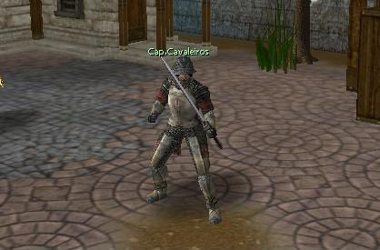
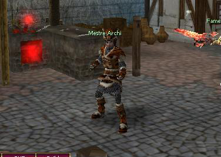
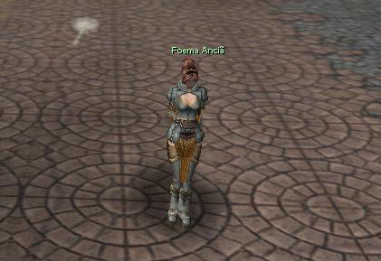
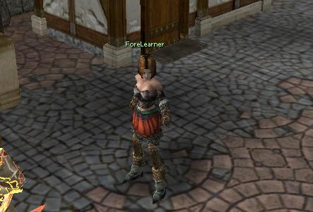
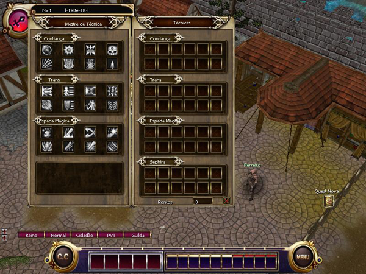
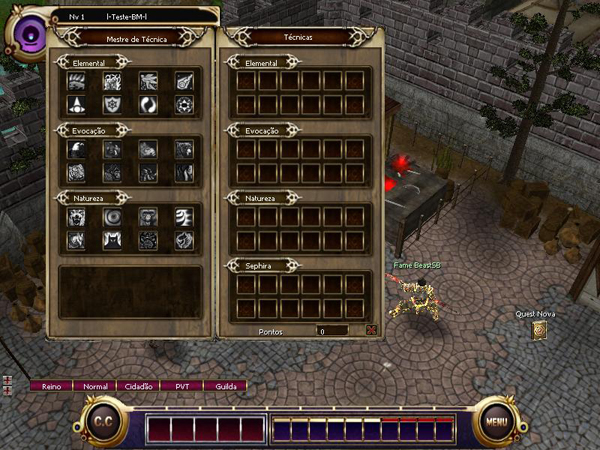
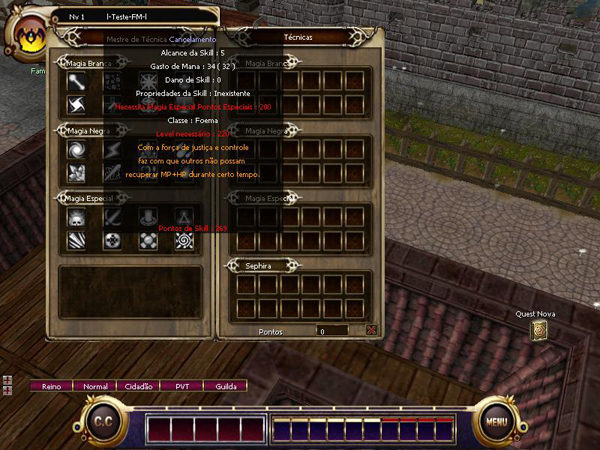
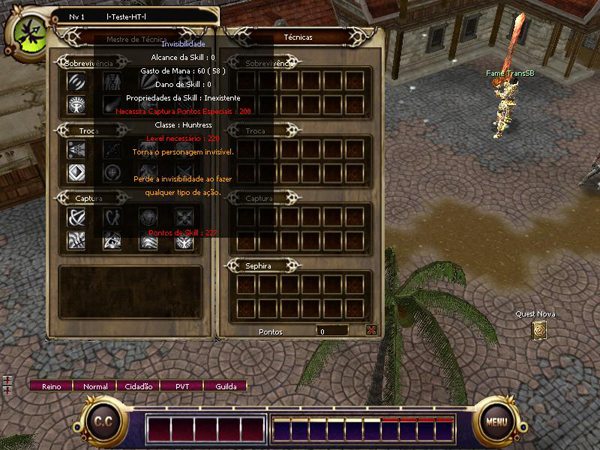
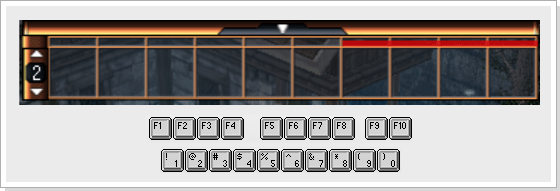

[WYD Raid Hut](/)

* PT-BR
  + [English (EN)](/en/knowledge-bases/21/articles/20366-skills)
  + [Português (Brasil) (PT-BR)](/pt-br/knowledge-bases/21/articles/20366-skills)
* Entrar / Registrar

* PT-BR
  + [English (EN)](/en/knowledge-bases/21/articles/20366-skills)
  + [Português (Brasil) (PT-BR)](/pt-br/knowledge-bases/21/articles/20366-skills)
* Entrar / Registrar

1. [FAQ WYD Global](/pt-br/knowledge-bases/21-faq-wyd-global)
2. [Guias do Jogo (PT-BR)](/pt-br/knowledge-bases/21-faq-wyd-global/categories/19-guias-do-jogo-pt-br/articles)
3. Artigos

# [Skills](/pt-br/knowledge-bases/21/articles/20366-skills)

Ao evoluir a personagem através da caça, o mesmo recebe pontos de aprendizagem e pontos em skill. Para aprender uma nova skill, simplesmente vá a Armia e localize o Mestre de Skill de sua classe e compre a(s) skill(s) que desejar. Skills básicas ou de nível baixo podem ser aprendidas por um baixo preço de Pontos de Skill. A Skill pode ser aprendida somente através do NPC Mestre de Skill de cada classe. A quantidade de Pontos de Skill gastas variam de acordo com a Skill que desejar comprar.

**Skillmaster dos TransKnight (Capitão Cavaleiros)**

**Skillmaster dos Beastmaster (Mestre Archi)**

**Skillmaster das Foemas (Foema Anciã)**

**Skillmaster d****as Huntress (ForeLearne)**

Antes de aprender alguma Skill, você deve primeiro entender os atributos que são melhores ao seu personagem dependendo da linhagem de skill escolhida incorretamente, pode ser reiniciado com o Círculo Divino, Benção de Deus e a QUEST balanço do poder.

---

**Linhagem de Skill**

Cada classe possui três tipos de linhagem. Cada linhagem possui uma 10ª skill e cada personagem pode ter o total de 24 skills. O poder da skill pode ser aumentado acrescentando pontos de aprendizagem na linhagem utilizada. Aprender Arma também pode aumentar o dano físico do personagem.

Pontos de aprendizagem nas linhagens e em Aprender Arma, pode ser aumentado e ajustado de acordo com as necessidades e especificações do seu personagem. Desta maneira você pode alcançar um maior poder ao personagem.

**TransKnight**

**Beastmaster**

**Foema**

**Huntress**

A skill adquirida será adicionada na janela de árvore de skill da direita.

Para utilizar a skill ela deve ser adicionada à barra rápida de skills.

|  |
| --- |
| Para utilizar a skill, selecione a skill e com o botão direito do mouse clique em um slot vazio. |
| Você pode selecionar as skill na barra rápida de skills usando o atalho (1 ~ 0 , F1 ~ F10), as skills passivas não precisa ser equipadas.  |

Para utilizar as skills de ataque, selecione a skill desejada, posicione o cursor do mouse sobre o alvo desejado e clique com o botão direito. Para apagar uma skill da barra rápida, basta pressionar a tecla

e adicionar uma nova skill.

This article was helpful for 227 people. Is this article helpful for you?

 Yes, helpful
 No, not for me

Why this article is not helpful?

Cancelar
Gravar

* Comentários 0
* Antigos primeiro
  + Mais recentes primeiro
  + Antigos primeiro

Ver mais

[Desenvolvido](https://userecho.com?pcode=pwbue_label_asgard&utm_source=pblv5&utm_medium=cportal&utm_campaign=pbue) por UserEcho

### Partilhar

### Article stats

* 6 anos atrás
   Criado
* 3 meses atrás
   Atualizado
* 227
   Helpful
* 39.832
   Visualizações

