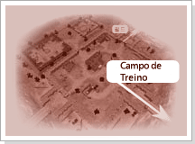
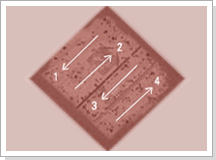
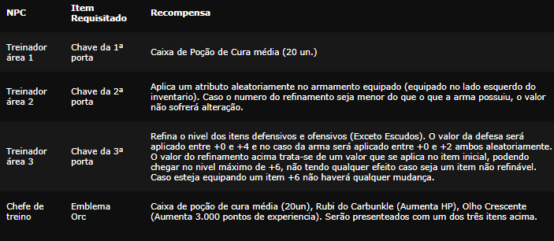

[WYD Raid Hut](/)

* PT-BR
  + [English (EN)](/en/knowledge-bases/21/articles/20369-campo-de-treinamento-lv-135)
  + [Português (Brasil) (PT-BR)](/pt-br/knowledge-bases/21/articles/20369-campo-de-treinamento-lv-135)
* Entrar / Registrar

* PT-BR
  + [English (EN)](/en/knowledge-bases/21/articles/20369-campo-de-treinamento-lv-135)
  + [Português (Brasil) (PT-BR)](/pt-br/knowledge-bases/21/articles/20369-campo-de-treinamento-lv-135)
* Entrar / Registrar

1. [FAQ WYD Global](/pt-br/knowledge-bases/21-faq-wyd-global)
2. [Guias do Jogo (PT-BR)](/pt-br/knowledge-bases/21-faq-wyd-global/categories/19-guias-do-jogo-pt-br/articles)
3. Artigos

# [Campo de Treinamento (Lv 1~35)](/pt-br/knowledge-bases/21/articles/20369-campo-de-treinamento-lv-135)

**Convite para o novo aventureiro...**

Agora que já tem idade suficiente para carregar uma espada, você deve ter idade suficiente para saber sobre suas responsabilidades. Essas terras podem parecer um paraiso para você, mas não são nada comparadas com a terra que nossos ancestrais viveram, e mesmo esse pouco que temos foi graças ao esforço de bravos e nobres homens que deram a vida para você ter um teto sobre sua cabeça. Agora é a sua vez de nos ajudar a reconstruir a nossa grandeza.

Além destas cercas existem criaturas malignas esperando por uma chance de ameaçar a nossa paz. Nós devemos enfrentá-las juntando as nossas forças em um grande clarão e iluminar este mundo mergulhado na escuridão. Sua força de vontade será o primeiro passo para formar esta única grande luz.

Mas se sair correndo acreditando apenas na sua força de vontade para provar a sua coragem você esta louco! A força de vontade lhe ajudará a juntar a coragem necessária, mas para combater essas criaturas você deve se armar e treinar muito, pois as garras e dentes dessas criaturas podem facilmente dilacerar seu corpo.

---

Não basta apenas ter vontade, você tem que ter conhecimento, saber como usar as suas armas, sejam elas quais forem. Recomendo que vá ao campo de treino antes mesmo de testar a sua coragem. O lugar foi construido principalmente para treinar os futuros guerreiros e exploradores que enfrentarão as criaturas. Para você, que não sabe absolutamente nada sobre a situção deste lugar, será como uma estrela brilhante que ilumina seu caminho numa noite envolta em trevas.

Para aqueles que derrotarem o 'Guerreiro Orc' no campo de treino, nos reconheceremos seu espirito de guerreiro fornecendo itens e equipamentos valiosos e necessários na sua jornada. As criaturas que você deve encontrar pelo caminho do campo de treino são aqueles que nós capturamos. O campo é dividido num total de 4 áreas e para cada área existe um monstro chefe de nivel cada vez mais alto. Em cada área subsequente o ataque e o terror que as criaturas exalam será maior.

Área 1: Javali de guerra, Aguia, Gremlin, Krill, Gremlin Decoy

Área 2: Gremlin, Krill, Rei Gremlin, Serpente, Krill Gigante

Área 3: Gremlin, Krill, Rei Gremlin, Chefe Krill, Orc Sniper

Área 4: Krill, Rei Gremlin, Chefe Krill, Arqueiro Orc, Guerreiro Orc

Para cada área nova, a dificuldade aumenta e as batalhas são mais ferozes, mas não fique desanimado. Cada área conta com um treinador que estão lá para ajudá-lo a evoluir suas técnicas de luta. Os treinadores tem a função de considerar todas as suas condições e necessidades.

Dentre todos os sofrimentos que tera pela frente neste mundo, chegou a hora de conhecer o seu primeiro. Tú és um covarde que foge dos sofrimentos que batem de frente aos teus olhos? Ou um bravo guerreiro que vence todos as adversidades e momentos críticos através do seu espirito de guerreiro?

****

**Recompensa do treinador**

Ao receberem os itens listados abaixo, cada treinador e oficial de treinamento recompensara seus esforcos com itens uteis para o jogo. O personagem tera apenas uma recompensa de cada NPC.

**Atenção**

Somente jogadores abaixo do level 35 podem acessar essa QUEST.

No fim da zona de iniciantes, existem monstros chefes que possuem as chaves dos portões que permitem seguir para a próxima área. A chave pode ser usada apenas uma vez e sumirá no instante do uso. O portão aberto com a chave fechará após algum tempo.

Os treinadores de cada área recompensarão apenas uma vez por personagem.

Caso esteja usando armas em ambas as mãos, o bônus será aplicado apenas na arma do lado esquerdo do inventário.

Quando o treinador da segunda etapa adicionar uma opção aleatoriamente na arma, essa opção será aplicada independentemente da opção original, podendo assim ser aplicada uma opção menor que a inicial.

O treinador da terceira etapa refina os itens de defesa e de ataque e seu valor máximo será de +6. Não terá qualquer efeito caso seu item não seja refinável.

This article was helpful for 93 people. Is this article helpful for you?

 Yes, helpful
 No, not for me

Why this article is not helpful?

Cancelar
Gravar

* Comentários 0
* Antigos primeiro
  + Mais recentes primeiro
  + Antigos primeiro

[Desenvolvido](https://userecho.com?pcode=pwbue_label_asgard&utm_source=pblv5&utm_medium=cportal&utm_campaign=pbue) por UserEcho

### Partilhar

### Article stats

* 6 anos atrás
   Criado
* 6 anos atrás
   Atualizado
* 93
   Helpful
* 9.818
   Visualizações

