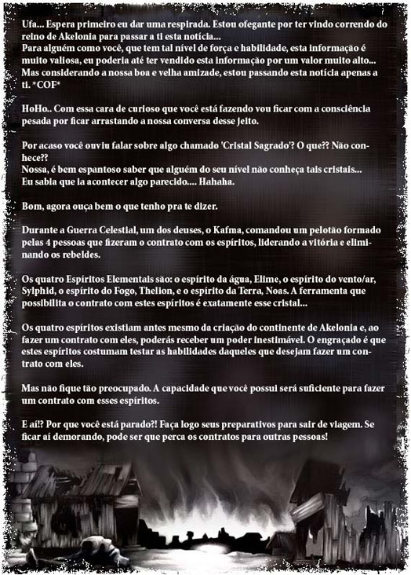
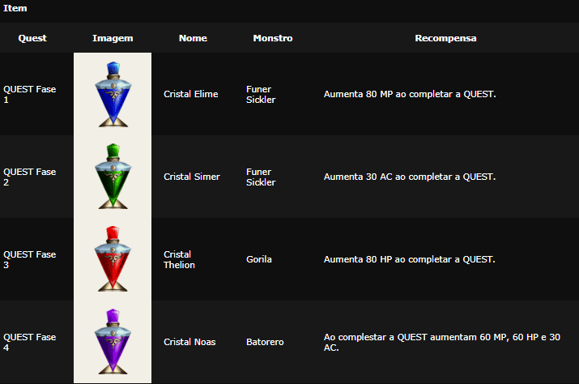
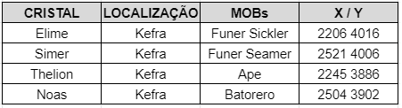

[WYD Raid Hut](/)

* PT-BR
  + [English (EN)](/en/knowledge-bases/21/articles/20374-quests-arch-contrato-dos-espiritos)
  + [Português (Brasil) (PT-BR)](/pt-br/knowledge-bases/21/articles/20374-quests-arch-contrato-dos-espiritos)
* Entrar / Registrar

* PT-BR
  + [English (EN)](/en/knowledge-bases/21/articles/20374-quests-arch-contrato-dos-espiritos)
  + [Português (Brasil) (PT-BR)](/pt-br/knowledge-bases/21/articles/20374-quests-arch-contrato-dos-espiritos)
* Entrar / Registrar

1. [FAQ WYD Global](/pt-br/knowledge-bases/21-faq-wyd-global)
2. [Guias do Jogo (PT-BR)](/pt-br/knowledge-bases/21-faq-wyd-global/categories/19-guias-do-jogo-pt-br/articles)
3. Artigos

# [(Quests Arch) Contrato dos espíritos](/pt-br/knowledge-bases/21/articles/20374-quests-arch-contrato-dos-espiritos)

**Formas de Procedimento**

* Quando o personagem alcancar o level 355, pressione a tecla 'X' para confirmar a quest na janela de informações.
* Adquira os itens relacionados a quest caçando os monstros que aparecem na Dugeon Kefra.
* Não importa a ordem de aquisicção dos itens, mas a ordem de utilização deverá ser de acordo com a quest, começando pela fase 1.
* Cada quest completada diminuirá 100 milhões de pontos de experiência e aumentará os valores de habilidade.
* Após completar a quest, passe para o level 355 novamente e inicie a nova etapa da quest.
* A Quest não poderá ser feita mais de uma vez, podendo ser realizada apenas 1 vez, da fase 1 até a fase 4. **Atenção**
* Apenas os personagens arch de level 355 com experiência superior a 1.950.000.000 poderão realizar a quest.
* Após ter completado cada quest, desconecte e conecte novamente para que possa obter a experiência conquistada.
* Coloque o comando /qst na janela de chat para confirmar a QUEST que está em processo de conclusão.

**Para mais informações [clique aqui](https://www.youtube.com/watch?v=KMbdRK4BpYc&t=286s) e acompanhe o Fafão na conclusão da quest!**

This article was helpful for 17 people. Is this article helpful for you?

 Yes, helpful
 No, not for me

Why this article is not helpful?

Cancelar
Gravar

* Comentários 0
* Antigos primeiro
  + Mais recentes primeiro
  + Antigos primeiro

Ver mais

[Desenvolvido](https://userecho.com?pcode=pwbue_label_asgard&utm_source=pblv5&utm_medium=cportal&utm_campaign=pbue) por UserEcho

### Partilhar

### Article stats

* 6 anos atrás
   Criado
* 1 ano atrás
   Atualizado
* 17
   Helpful
* 8.378
   Visualizações

