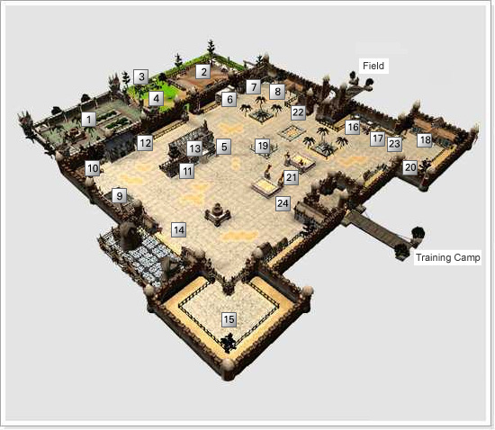
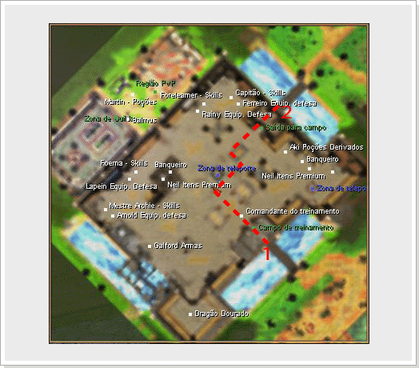

[WYD Raid Hut](/)

* PT-BR
  + [English (EN)](/en/knowledge-bases/21/articles/20375-mapa-armia)
  + [Português (Brasil) (PT-BR)](/pt-br/knowledge-bases/21/articles/20375-mapa-armia)
* Entrar / Registrar

* PT-BR
  + [English (EN)](/en/knowledge-bases/21/articles/20375-mapa-armia)
  + [Português (Brasil) (PT-BR)](/pt-br/knowledge-bases/21/articles/20375-mapa-armia)
* Entrar / Registrar

1. [FAQ WYD Global](/pt-br/knowledge-bases/21-faq-wyd-global)
2. [Guias do Jogo (PT-BR)](/pt-br/knowledge-bases/21-faq-wyd-global/categories/19-guias-do-jogo-pt-br/articles)
3. Artigos

# [(MAPA) ARMIA](/pt-br/knowledge-bases/21/articles/20375-mapa-armia)

A primeira cidade que conhecerá é a cidade de Armia, a cidade natal de todos os iniciantes do WYD. Ao criar um personagem, o jogo será iniciado dentro da cidade de Armia.

Este e o local onde os humanos começaram a se reunir novamente no mundo devastado pela guerra contra as criaturas malignas. Ainda existem muitas criaturas malignas fora desta cidade, e para proteger a cidade das criaturas, todos os moradores construiram uma grande muralha que é defendida 24 horas por dia pela cavalaria real. Os jogadores que iniciam pela primeira vez o WYD começam nesta cidade chamada Armia.

Dentro da cidade, existem comerciantes e artesãos que vendem equipamentos básicos, e também a guarda do banco, que possibilita aos aventureiros depositar os itens e ter acesso ao banco que pode ser usado por todos os personagens de uma mesma conta.

| Num. | Nome | Descrição |
| --- | --- | --- |
| 1 - | Zona de Guilda | Zona de Guilda da Guilda campeã da cidade de Armia. Entrada permitida apenas para membros da Guilda relacionada. |
| 2 - | Zona PvP | Local que permite combate entre jogadores. |
| 3 - | Martin | Vende itens de recuperação, pergaminhos, etc. |
| 4 - | Balmos | Recebe inscrição para Guerra de Guilda contra a Guilda campeã da cidade de Armia. |
| 5 - | Rainy | Vende itens de defesa para Huntress. |
| 6 - | ForeLearner | Mestre de Skill da Huntress. Permite aprender Skill de Huntress. |
| 7 - | Cap. Cavaleiros | Mentre de Skill do Transknight. Permite aprender Skill de Transknight |
| 8 - | Ferreiro | Vende itens de defesa para Transknight e Foema. |
| 9 - | Arnod | Vende itens de defesa para BeastMaster. |
| 10 - | Ferreiro | Mestre de Skill do BeastMaster. Permite aprender Skill de BeastMaster. Premium Neil Vende itens CASH. |
| 11 - | Premium Neil | Vende itens CASH. |
| 12 - | Foema Anciã | Mestre de Skill da Foema. Permite comprar Skill de Foema. |
| 13 - | Guarda Carga | NPC responsável por guardar itens do personagem. |
| 14 - | Galford | Vende vários tipos de armamentos. |
| 15 - | Dragão Dourado | Adiciona atributos na arma equipada caso leve os 7 cristais e/ou abre os baús do tesouro. |
| 16 - | Aki | Vende itens de poções, pergaminhos, etc. |
| 17 - | Guarda Carga | NPC responsável por guardar itens do personagem. |
| 18 - | Mestre de Habilidade | NPC responsável por reconfigurar parte dos pontos de status ao levar 30 Safiras a ele. |
| 19 - | Zona de Teleporte | Teleporta para o Castelo de Noatun. |
| 20 - | Zona de Teleport | Teleporta para a região de entrada para as Dungeons. |
| 21 - | Chefe de Treino | NPC responsável pelo treinamento dos iniciantes. recompensa o jogador que derrotar o Chefe final do Campo de Treinamento (Orc Guerreiro) e levar o emblema do Orc. |
| 22 - | Kibita | NPC responável pelo registro de cidadania de um canal em específico. |
| 23 - | Premium Neil | Vende itens CASH. |
| 24 - | Metre Grifo | Transporta os jogadores para a dungeon e áreas de QUEST. |

As linhas pontilhadas são os caminhos para os campos iniciantes.
**1 - Campo de Treinamento, 2 - Saída para o campo**

Caso aperte o botão

o mini mapa abrirá e poderá conferir os nomes dos NPCs existentes tanto na cidade quanto nos campos.

This article was helpful for 8 people. Is this article helpful for you?

 Yes, helpful
 No, not for me

Why this article is not helpful?

Cancelar
Gravar

* Comentários 0
* Antigos primeiro
  + Mais recentes primeiro
  + Antigos primeiro

[Desenvolvido](https://userecho.com?pcode=pwbue_label_asgard&utm_source=pblv5&utm_medium=cportal&utm_campaign=pbue) por UserEcho

### Partilhar

### Article stats

* 6 anos atrás
   Criado
* 4 anos atrás
   Atualizado
* 8
   Helpful
* 7.819
   Visualizações

