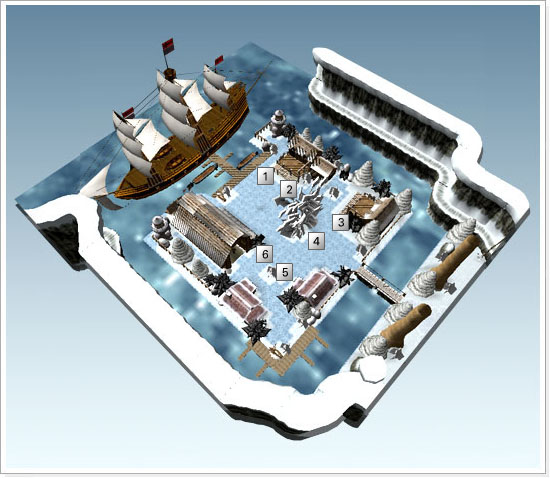

[WYD Raid Hut](/)

* PT-BR
  + [English (EN)](/en/knowledge-bases/21/articles/20376-mapa-nippleheim)
  + [Português (Brasil) (PT-BR)](/pt-br/knowledge-bases/21/articles/20376-mapa-nippleheim)
* Entrar / Registrar

* PT-BR
  + [English (EN)](/en/knowledge-bases/21/articles/20376-mapa-nippleheim)
  + [Português (Brasil) (PT-BR)](/pt-br/knowledge-bases/21/articles/20376-mapa-nippleheim)
* Entrar / Registrar

1. [FAQ WYD Global](/pt-br/knowledge-bases/21-faq-wyd-global)
2. [Guias do Jogo (PT-BR)](/pt-br/knowledge-bases/21-faq-wyd-global/categories/19-guias-do-jogo-pt-br/articles)
3. Artigos

# [(MAPA) Nippleheim](/pt-br/knowledge-bases/21/articles/20376-mapa-nippleheim)

| Num. | Nome | Descrição |
| --- | --- | --- |
| 1 - | July | Capitã do Navio de Guerra da cavalaria do reino, ajuda no transporte para a cidade de Azran. |
| 2 - | Guarda Carga | NPC responsável por guardar itens do personagem. |
| 3 - | Shany | Responsible for making high level of spirit stone by combining with +9 Spirit Stone. |
| 4 - | Tiny | Permite criar Armas Arch Ancient Combinando itens Classe D com itens +9 ou maiores a um custo de 100,000,000. |
| 5 - | Martin | Vende poções de HP, pergaminhos, comida, gema estelar, Poeira de Oriharucon. |
| 6 - | Premium Neil | Vende Itens CASH. |

As cicatrizes deixadas pela Guerra Celestial marcam ate hoje os humanos e deuses, trazendo consequencias devastadoras para ambos os mundos, mesmo seculos depois do acontecido.

Tzfah e seu braco direito Neses foram expulsos pela furia dos deuses para terra gelida localizada na ponta norte de Azran, Nippleheim; mas, pelo fato do encantamento que os deixariam inconscientes nao ter sido completado, os dois comecaram a influenciar os monstros que tinham feito morada naquele ambiente inospito, fazendo com que essas criaturas servissem de guarda para eles ate que um dia pudessem quebrar o encanto lancado pelos deuses.

Apos centenas de anos desde o momento em que Tzfah provocou a batalha Celestial, as pessoas comecaram aos poucos a esquecer sobre o fato. Alguns humanos nem mesmo acreditavam que isso realmente tinha acontecido, pois a tempestade de areia manchada com o sangue de monstros e humanos comecava a desaparecer...

Foi nessa epoca que o medo voltou ao coracao dos homens, pois o povo de Azran comecou a ouvir um som maligno nunca antes ouvido por qualquer mortal.

Num lugar nao muito longe de Armia, sempre que caia a escuridao e a lua se encontrava alta no ceu, ouvia-se os sons celestiais dos elfos. Muitas pessoas que sairam de barco para a procura da origem daqueles sons nunca mais retornaram.

Temendo pelo pior, os dois Reis dos reinos que comecaram a se sentir cada vez mais impelidos a investigar o fato. Para isso, juntaram os sabios para descobrir a origem destes sons. Nao passado muito tempo, os estudiosos suspeitaram que a origem desses sons vinham das terras gelidas onde estao Tzfah e Neses, O Continente inexplorado de Nipplheim.

Apos ouvir estas declaracoes, os reis lembraram-se da historia e sofrimento daquelas epocas, e para que aquilo nao acontecesse novamente, juntaram seus cavaleiros e mandaram a expedicao para o novo continente chamado Nippleheim...

A primeira providencia dos cavaleiros foi construir uma base avancada provisoria no local mais proximo da cidade de Azran para explorar o longo caminho das terras gelidas de Nippleheim.

Assim que a base foi construida, a batalha contra os elfos negros comecou e o Comando Karden se transformou em um ponto estrategico com duas funcoes: curar aqueles que foram feridos pelas criaturas malignas e dar abrigo aos cavaleiros reais que estavam cansados. Quando a situacao ficou sob controle varios comerciantes e os povos da cidade comecaram a migrar.

This article was helpful for 5 people. Is this article helpful for you?

 Yes, helpful
 No, not for me

Why this article is not helpful?

Cancelar
Gravar

* Comentários 0
* Antigos primeiro
  + Mais recentes primeiro
  + Antigos primeiro

[Desenvolvido](https://userecho.com?pcode=pwbue_label_asgard&utm_source=pblv5&utm_medium=cportal&utm_campaign=pbue) por UserEcho

### Partilhar

### Article stats

* 6 anos atrás
   Criado
* 5 anos atrás
   Atualizado
* 5
   Helpful
* 5.596
   Visualizações

