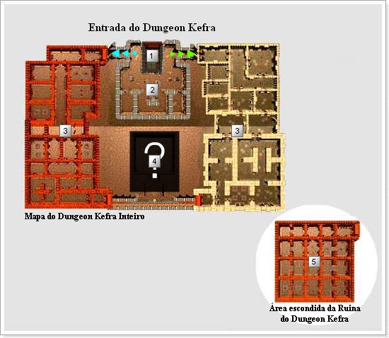

[WYD Raid Hut](/)

* PT-BR
  + [English (EN)](/en/knowledge-bases/21/articles/20378-mapa-dungeon-kefra)
  + [Português (Brasil) (PT-BR)](/pt-br/knowledge-bases/21/articles/20378-mapa-dungeon-kefra)
* Entrar / Registrar

* PT-BR
  + [English (EN)](/en/knowledge-bases/21/articles/20378-mapa-dungeon-kefra)
  + [Português (Brasil) (PT-BR)](/pt-br/knowledge-bases/21/articles/20378-mapa-dungeon-kefra)
* Entrar / Registrar

1. [FAQ WYD Global](/pt-br/knowledge-bases/21-faq-wyd-global)
2. [Guias do Jogo (PT-BR)](/pt-br/knowledge-bases/21-faq-wyd-global/categories/19-guias-do-jogo-pt-br/articles)
3. Artigos

# [(MAPA) Dungeon kefra](/pt-br/knowledge-bases/21/articles/20378-mapa-dungeon-kefra)

| Num. | Nome | Descrição |
| --- | --- | --- |
| 1 - | Entrada | - PvP não permitido.  - Teleporte/Convocação permitida entre membros de Grupo/Gruilda.  - Marco de posição através da Gema Estelar/Pergaminho do Retorno permitido.  - Existência do NPC comerciante Teron.  - Dentro do campo nomes do personagem, nome da guilda não aparecem.  - Impossível utilizar o chat normal (Apenas chat em guilda/grupo/mensagem privada permitido) |
| 2 - | Zona de Caça | - Monstros irão aparecer nessa área.  - Nomes dos personagens e guildas não aparecem.  - Impossível utilizar o chat normal (Apenas chat em guilda/grupo/mensagem privada permitido)  - Dano causado não a monstros e outros jogadores não irão aparecer.  - Não existe aumento de experiência no caso de praticar PK, mas existe uma Redução de experiência no caso de ter sido morto por outro jogador. |
| 3 - | Zona de Caça | - Monstros irão aparecer nessa área.  - Nomes dos personagens e guildas não aparecem.  - Impossível utilizar o chat normal (Apenas chat em guilda/grupo/mensagem privada permitido)  - Dano causado não a monstros e outros jogadores não irão aparecer.  - Não existe aumento de experiência no caso de praticar PK, mas existe uma Redução de experiência no caso de ter sido morto por outro jogador.  - Monstros são mais fortes nessa área comparado a monstros da área anterior. |
| 4 - | ? | ? |
| 5 - | Área escondida da ruina do Dungeon Kefra | Após completar as QUESTs necessárias, os jogadores poderão acessar a Área escondida do Dungeon Kefra. |

A violenta disputa pela de 'Coroa de Athila' entre os reinos de Hekalotia e Akelonia.

Para ter a certeza da vitória, os povos precisavam, a todo custo, de informações sobre a nova área descoberta, chamada Deserto de Kult.

Os dois reinos concentraram-se totalmente em coletar as informações do deserto, formando, numa especie de competição, um grande grupo de exploradores composto pelos cavaleiros de elite. A ambição dos humanos era imensa. Através da coragem dos exploradores e de investigações detalhadas, o Deserto de Kult, que parecia insondável, começou lentamente a mostrar sua forma.

Todos os tipos de informação foram reportados, como características do terreno, sua extensão e as criaturas existentes. Quando os Magos veteranos do reino decidiram que não haveria mais informações novas sobre o Deserto de Kult, um grupo de exploradores do reino de Akelonia descobriu uma enorme construção no fim do Deserto. De tamanho colossal, era difícil acreditar que tudo aquilo havia sido construído sobre pura areia: era o Dungeon Kefra.

This article was helpful for 5 people. Is this article helpful for you?

 Yes, helpful
 No, not for me

Why this article is not helpful?

Cancelar
Gravar

* Comentários 0
* Antigos primeiro
  + Mais recentes primeiro
  + Antigos primeiro

[Desenvolvido](https://userecho.com?pcode=pwbue_label_asgard&utm_source=pblv5&utm_medium=cportal&utm_campaign=pbue) por UserEcho

### Partilhar

### Article stats

* 6 anos atrás
   Criado
* 5
   Helpful
* 5.412
   Visualizações

