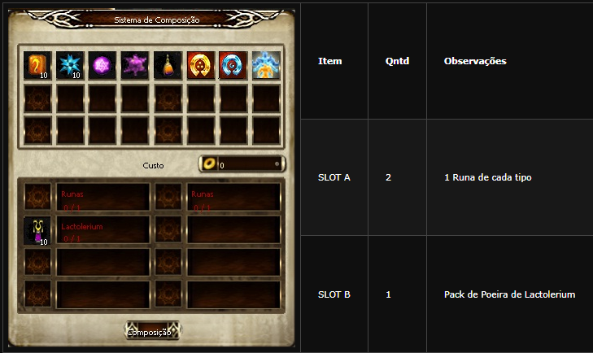
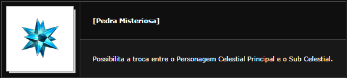

[WYD Raid Hut](/)

* PT-BR
  + [English (EN)](/en/knowledge-bases/21/articles/20383-sub-celestial)
  + [Português (Brasil) (PT-BR)](/pt-br/knowledge-bases/21/articles/20383-sub-celestial)
* Entrar / Registrar

* PT-BR
  + [English (EN)](/en/knowledge-bases/21/articles/20383-sub-celestial)
  + [Português (Brasil) (PT-BR)](/pt-br/knowledge-bases/21/articles/20383-sub-celestial)
* Entrar / Registrar

1. [FAQ WYD Global](/pt-br/knowledge-bases/21-faq-wyd-global)
2. [Guias do Jogo (PT-BR)](/pt-br/knowledge-bases/21-faq-wyd-global/categories/19-guias-do-jogo-pt-br/articles)
3. Artigos

# [Sub Celestial](/pt-br/knowledge-bases/21/articles/20383-sub-celestial)

A partir do level 120 do Celestial, através de uma QUEST específica, o jogador poderá fazer um novo Personagem Celestial e este Sub Celestial começará no level 1. O jogador poderá trocar o seu personagem Celestial dentro do jogo livremente entre o Personagem Celestial e o Sub.

Celestial com a utilização da Pedra Misteriosa.

**Como criar um personagem sub celestial**

O Personagem Celestial deve ser level 120 ou mais.

Pagar uma taxa de 100 de Fame.

Um Sephirot da classe desejada.

Uma Pedra Ideal.

Após equipar o Sephirot, clique na Pedra Ideal, você poderá criar um Sub Celestial e utilizando a Pedra Misteriosa na cidade, você poderá trocar o seu personagem Celestial Principal para o Sub Celestial.

**Como criar a pedra misteriosa**

O Personagem Principal ganha bônus em ataque, atributo e adicionais na Cythera de acordo com o nível do Sub Celestial.

**Adicionais na Cythera**

|  |  |
| --- | --- |
| Bônus de Atributo a Cythera | Atributo |
| Level 121 | +30 Defesa | +40 Força |
| Level 151 | +35 Defesa | +50 Força |
| Level 181 | +45 Defesa | +60 Força |
| Level 200 | +50 Defesa | +70 Força |

Observação: O jogador deve estar equipado com a Cytherea para que o Bônus seja entregue.

This article was helpful for 46 people. Is this article helpful for you?

 Yes, helpful
 No, not for me

Why this article is not helpful?

Cancelar
Gravar

* Comentários 0
* Antigos primeiro
  + Mais recentes primeiro
  + Antigos primeiro

Ver mais

[Desenvolvido](https://userecho.com?pcode=pwbue_label_asgard&utm_source=pblv5&utm_medium=cportal&utm_campaign=pbue) por UserEcho

### Partilhar

### Article stats

* 6 anos atrás
   Criado
* 8 meses atrás
   Atualizado
* 46
   Helpful
* 22.405
   Visualizações

