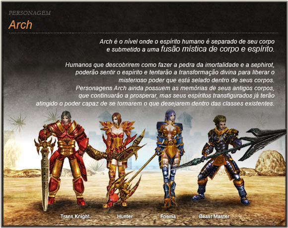

[WYD Raid Hut](/)

* PT-BR
  + [English (EN)](/en/knowledge-bases/21/articles/20384-arch)
  + [Português (Brasil) (PT-BR)](/pt-br/knowledge-bases/21/articles/20384-arch)
* Entrar / Registrar

* PT-BR
  + [English (EN)](/en/knowledge-bases/21/articles/20384-arch)
  + [Português (Brasil) (PT-BR)](/pt-br/knowledge-bases/21/articles/20384-arch)
* Entrar / Registrar

1. [FAQ WYD Global](/pt-br/knowledge-bases/21-faq-wyd-global)
2. [Guias do Jogo (PT-BR)](/pt-br/knowledge-bases/21-faq-wyd-global/categories/19-guias-do-jogo-pt-br/articles)
3. Artigos

# [Arch](/pt-br/knowledge-bases/21/articles/20384-arch)

**Caracterísitcas Especiais da Classe Arch**

Para se tornar um Personagem de classe Arch você deve terminar antes duas quests: A procura da vida eterna e Um novo começo. A aparência de um personagem Arch se assemelha com o da sua classe inicial e você poderá ainda escolher uma das quatro classes Arch existentes.

Quando você se transforma em um Personagem de classe Arch, em sua conta surgirá um novo personagem com o mesmo nome que representará esta transformação.

As Skills do personagem Arch será baseado nas skills que você escolheu durante a quest. A evolução de seu Arch será baseado no seu personagem principal

Os Personagens de classe Arch não podem usar Elmos e Capacetes. Você poderá usar equipamentos de defesa de acordo com sua classe inicial. Os Personagens de classe Arch não podem equipar Armas de classe E e Armas do tipo Lydians, mas podem equipar Armas do tipo Arch.

Quando você alcancar o nivel 370 com o seu Personagem de classe Arch, você receberá 112 Pontos de Aprendizagem, 288 Pontos de Atributos e 168 Pontos de Skill.

Após a transformação para a classe Arch, quando o seu Personagem de classe Normal evoluir, o seu Personagem de classe Arch respectivo receberá 8 pontos de Atributos em bônus por level evoluído. **Evolução do Personagem**

| Lista | Aumento na capacidade por level | | | |
| --- | --- | --- | --- | --- |
| HP | Trans Knight  4 | Foema  1 | Beast Master  1 | Huntress  2 |
| MP | Trans Knight  1 | Foema  3 | Beast Master  4 | Huntress  2 |
| Defensa(AC) | 2 | | | |
| Pontos de Aprendizagem | 2 (Lv.1~ Lv.200) 3 (Lv.201 ~ Lv.355) 1 (Lv356 ~) | | | |
| Pontos de status | 6 (Lv.1~ Lv.354) 12 (Lv355 ~) | | | |
| Pontos de Skill | 4 (Lv.1~ Lv.354) 2 (Lv355 ~) | | | |

This article was helpful for 42 people. Is this article helpful for you?

 Yes, helpful
 No, not for me

Why this article is not helpful?

Cancelar
Gravar

* Comentários 0
* Antigos primeiro
  + Mais recentes primeiro
  + Antigos primeiro

Ver mais

[Desenvolvido](https://userecho.com?pcode=pwbue_label_asgard&utm_source=pblv5&utm_medium=cportal&utm_campaign=pbue) por UserEcho

### Partilhar

### Article stats

* 6 anos atrás
   Criado
* 4 anos atrás
   Atualizado
* 42
   Helpful
* 16.203
   Visualizações

