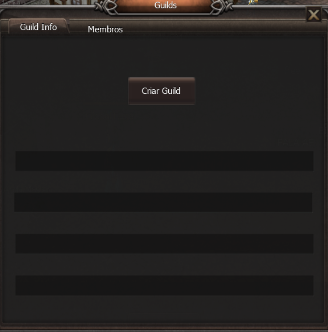
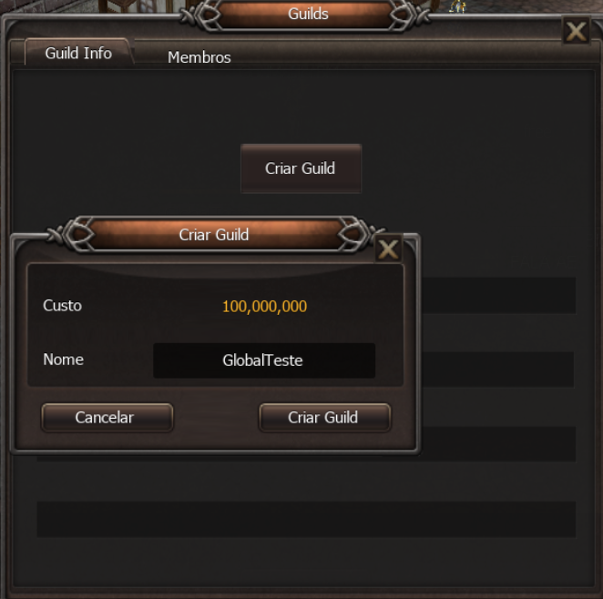
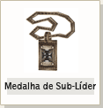

[WYD Raid Hut](/)

* PT-BR
  + [English (EN)](/en/knowledge-bases/21/articles/20395-guia-guilda)
  + [Português (Brasil) (PT-BR)](/pt-br/knowledge-bases/21/articles/20395-guia-guilda)
* Entrar / Registrar

* PT-BR
  + [English (EN)](/en/knowledge-bases/21/articles/20395-guia-guilda)
  + [Português (Brasil) (PT-BR)](/pt-br/knowledge-bases/21/articles/20395-guia-guilda)
* Entrar / Registrar

1. [FAQ WYD Global](/pt-br/knowledge-bases/21-faq-wyd-global)
2. [Guias do Jogo (PT-BR)](/pt-br/knowledge-bases/21-faq-wyd-global/categories/19-guias-do-jogo-pt-br/articles)
3. Artigos

# [(GUIA) Guilda](/pt-br/knowledge-bases/21/articles/20395-guia-guilda)

**Sistema de Guilda**

Quando você sai de um Grupo, você está permanentemente fora daquele grupo a não ser que lhe convoquem novamente, mas a Guilda é diferente. A Guilda impõe um envolvimento mais duradouro. O "Grupo" é o meio de jogar, a Guilda é um meio de fazer parte da comunidade. O sistema de guilda possui sistemas direcionados exclusivamente para ele, como por exemplo as guerras de guilda, de cidade e torre.

Criando uma Guilda

**[Acessando o menu de Guild dentro do jogo]**

O painel de guild pode ser acessado através do atalho “O” em seu teclado. Ele painel poderá ser utilizado por todos os membros da guild para visualizar informações sobre a mesma e visualizar os membros da guild. Além disso, o líder da guild poderá fixar mensagens para os membros e gerencia-los mesmo que eles estejam offline.

Importante: Agora as guilds contarão com um limite de 52 membros.

**[Criando uma Guild]**
Para criar uma guilda, é necessário acessar o Painel de Guild através do atalho “O" no seu teclado. O menu a seguir será exibido:

Ao abrir o painel de guild sem que o jogador esteja em uma guild,o botão Criar Guild será mostrado. Antes de clicar nele, certifique-se de que você também possui 100 milhões em GOLD no seu inventário.

Em seguida basta o jogador clicar no botão Criar Guild.

**[Escolhendo Sub-Líderes]**

O líder da guilda, pode escolher 3 sub-líderes. Os sub-líderes possuem o poder de convocar jogadores para a guilda e de líderar a guilda em uma batalha quando o líder da guilda não está disponivel.

****

**Sistema de Nominação**

1. Após clicar com o Ctrl + Botão direito do mouse a um membro da guilda que deseja escolher como Sub da Guilda por 50,000,000 Gold.
2. Uma janela com a mensagem "coloque o nome da Sub Guilda" irá aparecer, coloque o nome da Sub Guilda e aperte Enter.
3. Quando o registro da Sub ocorrer corretamente, o Sub líder irá receber uma Medalha de Sub líder automaticamente e a mensagem "xxx foi denominado Sub líder" irá ser exibida. Você poderá utilizar o GOLD do Sub líder como se fosse seu.

**[Nominação de membros da Guilda]**

O tamanho da Guilda se torna maior de acordo com a quantidade de membros convocados para as Sub-Guildas, por esse motivo é de grande importância nominar um sub-líder para que o mesmo possa recrutar membros pagando uma taxa por membro.

A Guilda é o membro nominado como Sub-Líder necessitam de GOLD e boa configuração

**Transferindo Guilda**
Se você não desejar ser o líider da Guilda, você pode transferir a medalha de líder a outro jogador.

**[ Método de transferência ]**

O Personagem que irá receber a medalha de líder deverá ser membro da guilda e você deve colocar o comando "/transferir [nome do membro]" o personagem irá receber automaticamente a Medalha de Líder ou de Sub Líder.

Quando você transferir a guilda, você deverá gastar 40 Milhões de GOLD.

GuildMark

A Guilda mostrada nas imagens é um exemplo. Caso você digite o comando '/[nome do personagem]', o nome da guilda será exibida na tela. Mas, o jogador deve estar conectado e você deve verificar se o mesmo não é um Sub-Líder. Você pode verificar se um membro é Líder, ou Sub-Líder, ou Membro Comum da Guilda pelo frame ao redor da GuildMark.

****

**[Expulsar/sair da Guilda]**
Para o GuildMaster expulsar um membro: /expulsar nome\_do\_personagem.

Para o membro da Guilda sair, digite o comando /expulsar

Preste muita atenção, pois caso o GuildMaster utilize o comando sem colocar o nome do personagem ao lado do comando a Guilda irá se desfazer.

Aliança entre Guildas

Guildas distintas podem efetuar alianças, assim, proibindo o PvP entre seus membros aliados nessas zonas e durante Guerras. Através da Aliança pode-se também inibir o modo Caos, evitando o ataque entre membros aliados. A declaração de aliado é permitida apenas uma vez para cada guilda, logo cada guilda pode ter apenas um aliado por vez.

|  |
| --- |
| **[ Declaração de Aliança ]** |
| |  |  |  |  | | --- | --- | --- | --- | |  | |  |  | | --- | --- | |  | A aliança entre as guildas é uma opção possível apenas para o mestre e o chefe de guilda, escolha a opção "Guilda" no menu que aparece ao clicar botão direito no personagem. | | |  |  | |  | |  |  | | --- | --- | |  | Ao selecionar a opção "Aliança", confirma a aliança com uma outra guilda. | | |
| **[ Fim da Aliança ]** |
| Na janela de do chat, utilize o comando "/ Fim da Alianca " para acabar com a aliança. |

Para formar uma aliança não é necessário que ambas as guildas concordem com isso, apenas significa que a sua guilda admite a guilda adversária como uma aliança e não atacará ela. No caso de somente a sua guilda ter anunciado de aliança, você não poderá atacar a guilda adversária, mas eles continuam podendo atacar a sua guilda. Para ter uma aliança completa, ambas guildas terão de anunciar a aliança.

**Comandos relacionados à Guilda**

|  |  |
| --- | --- |
| guild | Ver a lista dos membros conectados. Ver o estado de guerra com uma outra guilda. |
| - [messagem] | Mandar mensagem para os membros da guilda. |
| -- [messagem] | Mandar mensagem para os membros da guilda aliada caso sejam aliados em alguma guerra |
| guildtax [valor da taxa] | O valor da taxa pode ser fixado entre 0~20, em % (apenas os mestres das guildas campeãs que possuirem a zona de guilda da cidade.) |
| /summonguild | Convoca todos os membros da guilda conectados. No caso do Mestre de Guilda convocar todos os membros da guilda, no caso do Chefe de guilda apenas possível de convocar os membros da subguilda. (comando possível apenas para o mestre e o chefe de guilda) |
| /expulsar [nome do membro] | Expulsa o membro da guilda desejado. (Possível apenas para o mestre e o chefe da guilda.) |
| /Teleportar [nome do membro] | Teleporta para a localização do membro da guilda relacionado. (possível apenas para os membros que estiverem usando as medalhas de guilda.) |
| |  | | --- | | Teleporte permitido = level +100 | |
| /fim da guerra | Cancela/Recusa o anúncio de guerra na guilda adversária. (Possível apenas para mestre e o chefe de guilda) |
| /fimirma | Pedido de fim de aliança para guilda adversária. (Possível apenas para mestre, chefe da guilda.) |
| /criar [nome] | Cria uma nova guilda com o pagamente de 100 Milhões de GOLD |
| /expulsar | Sai/Expulsa membro da Guilda(impossível aos domingos) |
| /tranferir [nome do membro da Guilda] | Transfere a Medalha de Líder ou Sub-Líder para um membro comum |
| /[personagem] | Verifica a Guilda, cidadania, e fama do personagem(impossível se o jogador estiver desconectado) |

This article was helpful for 7 people. Is this article helpful for you?

 Yes, helpful
 No, not for me

Why this article is not helpful?

Cancelar
Gravar

* Comentários 0
* Antigos primeiro
  + Mais recentes primeiro
  + Antigos primeiro

Ver mais

[Desenvolvido](https://userecho.com?pcode=pwbue_label_asgard&utm_source=pblv5&utm_medium=cportal&utm_campaign=pbue) por UserEcho

### Partilhar

### Article stats

* 6 anos atrás
   Criado
* 2 anos atrás
   Atualizado
* 7
   Helpful
* 7.307
   Visualizações

