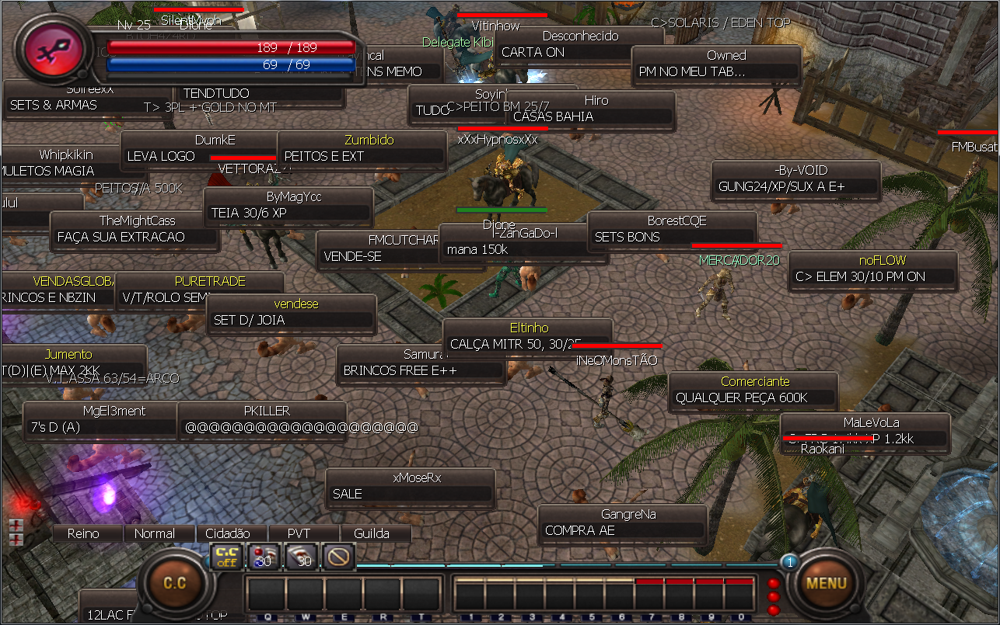
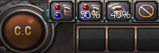
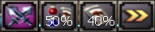
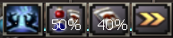
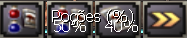

[WYD Raid Hut](/)

* PT-BR
  + [English (EN)](/en/knowledge-bases/21/articles/20396-modo-cc-controle-de-combatemacro)
  + [Português (Brasil) (PT-BR)](/pt-br/knowledge-bases/21/articles/20396-modo-cc-controle-de-combatemacro)
* Entrar / Registrar

* PT-BR
  + [English (EN)](/en/knowledge-bases/21/articles/20396-modo-cc-controle-de-combatemacro)
  + [Português (Brasil) (PT-BR)](/pt-br/knowledge-bases/21/articles/20396-modo-cc-controle-de-combatemacro)
* Entrar / Registrar

1. [FAQ WYD Global](/pt-br/knowledge-bases/21-faq-wyd-global)
2. [Guias do Jogo (PT-BR)](/pt-br/knowledge-bases/21-faq-wyd-global/categories/19-guias-do-jogo-pt-br/articles)
3. Artigos

# [Modo C.C. (Controle de Combate/MACRO)](/pt-br/knowledge-bases/21/articles/20396-modo-cc-controle-de-combatemacro)

O modo C.C. é um sistema de ataque automático que faz com que o seu personagem ataque ou utilize magias automaticamente quando um monstro entra no seu raio de ataque.
O Modo C.C. também permite que os jogadores conversem pelo Chat enquanto caçam.

**Ao conectar-se no jogo, o Modo C.C. estará desligado. Você pode escolher qual modo você quer utilizar clicando no botão C.C.**

**Como usar o C.C. Mode**

Você pode colocar as skills de buff no 1º slot da barra rápida enquanto usa o C.C. Mode para fazer seu personagem usar o buff.

|  |  |
| --- | --- |
|  | **[Controle de Combate]** Você pode escolher o controle de combate físico clicando no botao C.C. e a personagem irá automaticamente as usar todas as skills de Buff da primeira barra rápida e o personagem irá atacar fisicamente todos os monstros que estiverem dentro do seu raio de ataque. |
|  | **[ Combate Mágico ]** Você pode escolher o controle de combate mágico clicando no botao C.C. e personagem irá automaticamente utilizar todas as skills de Buff da primeira barra rápida e então a personagem irá atacar os monstros com as skills que estiverem abaixo da barra de ataque automático(barra vermelha) |
|  | **[ Modo Passivo ]** Você pode escolher o controle de combate passivo clicando no botao C.C. e a personagem irá automaticamente utilizar todas as skills de Buff e então utilizará as poçóes e rações de montaria quando necessário |

**Observações:**
Personagem irá atacar automaticamente ou usar skills dependendo do raio de ataque.
Personagem irá usar poções automaticamente quando o seu HP baixar a um certo por cento.
Personagem irá usar rações automaticamente quando o HP da montaria baixar a um certo por cento.
Modo C.C. não ataca outros jogadores caso você esteja caçando em uma área PK mesmo com o Modo PK ativo.

This article was helpful for 6 people. Is this article helpful for you?

 Yes, helpful
 No, not for me

Why this article is not helpful?

Cancelar
Gravar

* Comentários 0
* Antigos primeiro
  + Mais recentes primeiro
  + Antigos primeiro

[Desenvolvido](https://userecho.com?pcode=pwbue_label_asgard&utm_source=pblv5&utm_medium=cportal&utm_campaign=pbue) por UserEcho

### Partilhar

### Article stats

* 6 anos atrás
   Criado
* 6 anos atrás
   Atualizado
* 6
   Helpful
* 6.429
   Visualizações

