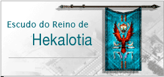
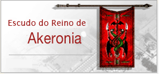

[WYD Raid Hut](/)

* PT-BR
  + [English (EN)](/en/knowledge-bases/21/articles/20462-sistema-de-reinos)
  + [Português (Brasil) (PT-BR)](/pt-br/knowledge-bases/21/articles/20462-sistema-de-reinos)
* Entrar / Registrar

* PT-BR
  + [English (EN)](/en/knowledge-bases/21/articles/20462-sistema-de-reinos)
  + [Português (Brasil) (PT-BR)](/pt-br/knowledge-bases/21/articles/20462-sistema-de-reinos)
* Entrar / Registrar

1. [FAQ WYD Global](/pt-br/knowledge-bases/21-faq-wyd-global)
2. [Guias do Jogo (PT-BR)](/pt-br/knowledge-bases/21-faq-wyd-global/categories/19-guias-do-jogo-pt-br/articles)
3. Artigos

# [Sistema de Reinos](/pt-br/knowledge-bases/21/articles/20462-sistema-de-reinos)

**Dois Reinos**

Há muito tempo, os humanos moravam na mesma vila e seguiam as mesmas regras. Contudo, quando eles aprenderam mais sobre a própria história e as relíquias dos seus ancestrais, descobriram que eles eram referidos como ''Nação da Classe superior''. Eles resolveram também desenvolver as crenças na morte, no Paraíso e nos seres desconhecidos que habitam o submundo, enquanto outros alimentavam sua Fé em Deus. Infelizmente, eles se separaram em dois grupos, os crentes em Deus e os que aspiram em dominar o Céu e a Terra.

Por causa da diferença de suas crenças, eles separaram suas regras e formaram dois novos sistemas, estabelecendo seus reinos: "Hekalotia" e "Akelonia".

****

****

**Como entrar em um Reino**

- Os interessados devem ter no minimo 220 de Level. Uma vez que o jogador chegar ao level determinado e quiser entrar em um reino, o Rei pedirá pagamento.
- A quantidade de Safira a ser paga depende do número de cavaleiros do Reino.

- Para aqueles que ingressaram e já tem uma capa de level 256, ela poderá ser intitulada a um poder maior caso for pago uma quantia de Safira ( Capa de Aprendiz, Capa de Campeoes). A quantidade de Safira é determinada, novamente, pelo número de cavaleiros do Reino. **Como se desligar de um Reino**
-
Quando os jogadores querem sair de seus reinos originais e ingressar em outro, a separação tem que ser paga por 16 pedaços de safiras. O pagamento deve ser feito para o Gerente Real do Reino.

-
Depois que sair de um reino, o jogador será reconhecido com uma capa branca.

- Os procedimentos para ingressar em um outro reino será exatamente como antes.

****

**Benefícios de ser de um Reino**

- Você pode ter uma capa de cada Reino.
- Se você derrotar um cavaleiro de outro reino em zonas PK possíveis, você ganha experiência. Se você morrer, você perde experiência

|  |  |  |  |  |  |  |
| --- | --- | --- | --- | --- | --- | --- |
| Imagem |  |  |  |  |  |  |
| Nome | Manto de Akelonia | Manto do Andarilho | Manto de Hekalotia | Manto de Shiner | Manto do Aventureiro | Manto do Guerreiro |
| Level | 220 | | | 256 | | |
| add. DEF | 75 | | | 150 | | |
| Aumento de HP | 100 | | | 200 | | |

|  |  |  |  |  |  |  |
| --- | --- | --- | --- | --- | --- | --- |
| Imagem |  |  |  |  |  |  |
| Nome | Elite de Akelonia | Elite dos Aventureiros | Elite de Hekalotia | Mestre de Akelonia | Mestre dos Aventureiros | Mestre de Hekalotia |
| Level | 355 | | | - | | |
| add. DEF | 150 | | | 200 | | |
| Aumento de HP | 200 | | | 220 | | |

,

This article was helpful for 7 people. Is this article helpful for you?

 Yes, helpful
 No, not for me

Why this article is not helpful?

Cancelar
Gravar

* Comentários 0
* Antigos primeiro
  + Mais recentes primeiro
  + Antigos primeiro

[Desenvolvido](https://userecho.com?pcode=pwbue_label_asgard&utm_source=pblv5&utm_medium=cportal&utm_campaign=pbue) por UserEcho

### Partilhar

### Article stats

* 6 anos atrás
   Criado
* 4 anos atrás
   Atualizado
* 7
   Helpful
* 7.301
   Visualizações

