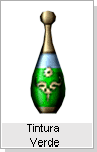
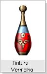
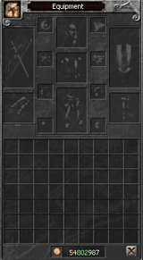
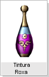
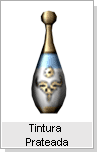
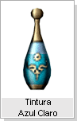

[WYD Raid Hut](/)

* PT-BR
  + [English (EN)](/en/knowledge-bases/21/articles/20464-sistema-de-pintura)
  + [Português (Brasil) (PT-BR)](/pt-br/knowledge-bases/21/articles/20464-sistema-de-pintura)
* Entrar / Registrar

* PT-BR
  + [English (EN)](/en/knowledge-bases/21/articles/20464-sistema-de-pintura)
  + [Português (Brasil) (PT-BR)](/pt-br/knowledge-bases/21/articles/20464-sistema-de-pintura)
* Entrar / Registrar

1. [FAQ WYD Global](/pt-br/knowledge-bases/21-faq-wyd-global)
2. [Guias do Jogo (PT-BR)](/pt-br/knowledge-bases/21-faq-wyd-global/categories/19-guias-do-jogo-pt-br/articles)
3. Artigos

# [Sistema de Pintura](/pt-br/knowledge-bases/21/articles/20464-sistema-de-pintura)

O sistema de pintura é um meio inovador e criativo de dar aos jogadores a liberdade de expressar de seu lado artistico, deixando-os pintar suas armaduras com diferentes cores.

**Itens que podem ser pintados**

Todos os tipos de equipamentos(Exceto Armas e Acessórios) podem ser pintados.

**Itens relacionados a pintura**

**Tintura**

Um vidro contendo essências de elementos de diversas cores. Pode ser

transformado em Feijão Mágico através da Poeira de Oriharucon, podendo ser comprado no Premium Neil.

|  |  |  |  |  |
| --- | --- | --- | --- | --- |
|  |  |  |  |  |
|  |  |  |  |  |

**Poeira de Oriharucon**

Utilizado para transformar a Tintura em Feijão Mágico, também utilizado no upgrade dos itens através dos refinamentos.

**Feijão Mágico**

Item que permite modificar a cor dos itens, ao refinar a Tintura com a Poeira de Oriharucon sera formado o Feijão Mágico

**Removedor de Tintura**

Item que devolve a cor original (padrão), pode ser comprado no Item Mall.

**Como Pintar**

**[2 Fórmulas padrões de pintura ]**

- Formula 1: Tintura + Poeira de Oriharucon = Feijão Mágico
- Formula 2: Utilize o Feijão Mágico aplicando-o diretamente no item desejado.

**[Ordem de pintura]**

Escolha cautelosamente a cor desejada

Compre o Feijão Mágico ou a Tintura da cor desejada no NPC (Premium Neil). O item comprado será entregue no **Guarda Carga**.

Deve equipar a Tintura onde o familiar e equipado normalmente e utilizar a Poeira de Oriharucon para refinar em Feijão Mágico (Probabilidade de sucesso = 100%).

Modificar a cor do item de defesa desejado através do Feijão Mágico concluído.

**Atenção**

Os itens de defesa que não estejam refinados (+0) não podem ser pintados. Só podem ser pintados itens +1 ou maiores.

Você não pode pintar um item que está pintado. Você deve antes remover a tintura.

This article was helpful for 5 people. Is this article helpful for you?

 Yes, helpful
 No, not for me

Why this article is not helpful?

Cancelar
Gravar

* Comentários 0
* Antigos primeiro
  + Mais recentes primeiro
  + Antigos primeiro

[Desenvolvido](https://userecho.com?pcode=pwbue_label_asgard&utm_source=pblv5&utm_medium=cportal&utm_campaign=pbue) por UserEcho

### Partilhar

### Article stats

* 6 anos atrás
   Criado
* 5
   Helpful
* 4.081
   Visualizações

