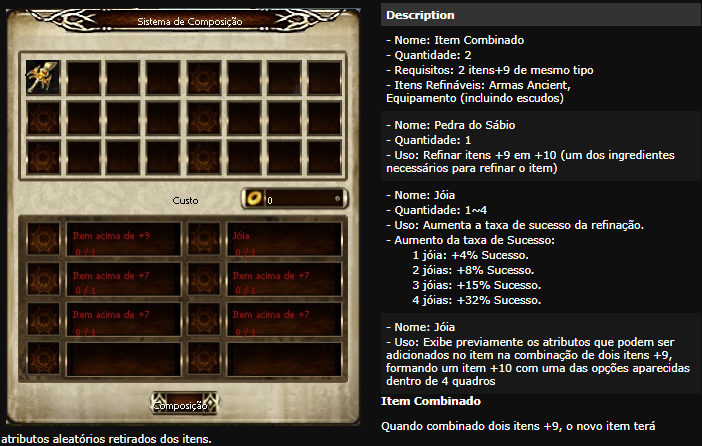
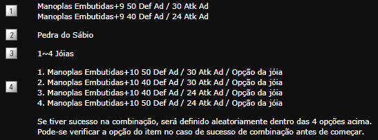
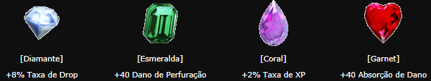

[WYD Raid Hut](/)

* PT-BR
  + [English (EN)](/en/knowledge-bases/21/articles/21072-sistema-de-refinacao-0-a-11)
  + [Português (Brasil) (PT-BR)](/pt-br/knowledge-bases/21/articles/21072-sistema-de-refinacao-0-a-11)
* Entrar / Registrar

* PT-BR
  + [English (EN)](/en/knowledge-bases/21/articles/21072-sistema-de-refinacao-0-a-11)
  + [Português (Brasil) (PT-BR)](/pt-br/knowledge-bases/21/articles/21072-sistema-de-refinacao-0-a-11)
* Entrar / Registrar

1. [FAQ WYD Global](/pt-br/knowledge-bases/21-faq-wyd-global)
2. [Guias do Jogo (PT-BR)](/pt-br/knowledge-bases/21-faq-wyd-global/categories/19-guias-do-jogo-pt-br/articles)
3. Artigos

# [Sistema de Refinação +0 a +11](/pt-br/knowledge-bases/21/articles/21072-sistema-de-refinacao-0-a-11)

Com exceção dos itens marcados como ''impossível de refinar'', todas as armas e armaduras podem ser refinadas através de Poeira Oriharucon e Poeira Lactorerium. Se você refinar seus itens usando o Poeira Oriharucon e Poeira Lactorerium, +(número) e marcado seguindo o nome do item. Quando sua refinação aumenta, o poder de ataque do item, o poder defensivo e a opção adicional são também aumentados em 10% e outra opção de bônus será adicionado se você for hábil para refinar seus equipamentos para o level 9. E também, quanto mais alta a classe das suas armas e armaduras, maior a dificuldade para refiná-las. Os itens de classes baixas têm maior taxa de sucesso. Quando a refinação do item aumenta, a taxa de sucesso de refinação abaixa, resultando no aumento do consumo da poeira.

**Itens de defesa e armas podem ser refinadas, com a diferença que armas exigem um processo mais longo no qual se deve passar para Ancient antes de poder refinar para +10, diferente de armaduras.**

**Refinação de armas:**

Armas tem um processo maior, em que se faz necessário refinar ela até +9 normalmente e logo depois torná-la Ancient, através do NPC Compositor. Ao fazer isto, op item voltará a um valor de refinação +7, fazendo-se necessário refiná-la até +9 novamente.
Logo após refinar duas armas ao nível Ancient +9, você poderá tentar uni-las para obter uma com refinação de nível +10!

**> Refinação +10**

O sistema é parecido com a formação de item Ancient, para refinar será necessário juntar dois itens +9 e fundir para formar um item +10.

Com a base das opções dos dois itens +9, a opção do item combinado de +10 é definida.

Pela mesma forma de um item Ancient, a opção adicional de um item combinado pode variar de acordo com a jóia (pedra/gema) usada, pode-se fabricar um item que ultrapasse as opções do item +9. No caso de um item Ancient, apenas as armas podem ser combinadas, mas no caso de refinamento de um item para o nível +10, podem ser combinados tanto as armas quanto as defesas. Para formar um item combinado para o nível +10 é necessário o uso de um item chamado de ''Pedra do Sábio''. **> Combinação de itens**

Pode formar um item +10 através da ''Aileen'' da cidade de Azran, é necessário dois itens com mesmo nome no nivel +9 e 50 milhões de gold para a combinação.

**Exemplo**

Item necessário para refinar um item para +10.

**Jóias**

Aumenta a probabilidade de sucesso na combinação. Possível a utilização do mesmo tipo de jóia.

**Item permitido para combinação: Armas Ancient, Defesa (incluindo Escudos)**

**Observações:**

* A opção base do item aumenta, mas as opções bônus não são afetadas.
* Apenas os itens do tipo como Normal, Místico, Arcano, Legendário e Ancient são permitidos para a combinação. No caso de item Ancient, permitido apenas os que foram fabricados pelas mesmas jóias.
* Para combinar é necessário ter 50 milhoes de gold.
* Em caso de sucesso um item +10 irá aparecer no seu inventário e se houver falha, os 2 itens +9 permanecerão, mas o resto dos ingredientes irão desaparecer.
* Em caso de sucesso um item +10 irá aparecer no seu inventário e se houver falha, os 2 itens +9 permanecerão, mas o resto dos ingredientes irão desaparecer.
* Caso haja sucesso na combinação dos itens, você terá um atributo adicional a sua arma baseada na jóia utilizada.
* Caso haja falha, os 2 itens +9 permanecerão, mas o resto dos ingredientes irão desaparecer.
* A combinação pode ser feita apenas nas armas Ancient e defesa (Inclusive escudo), mas os acessórios não podem ser combinados. Armas normais padrões não podem ser combinadas.

**> Refinação +11**

Ao conseguir sucesso nesta composição para +10, utilizando-se a Poeira de Lactolerium, você poderá refiná-la até o nível +11.
Ao concluir estes passos, estará apto a tentar refinar para +12.

Para itens de defesa, inclusos escudos, o processo é mais simples, bastando refinar 2 itens até +9 e seguir o mesmo processo para +10 e +11.

This article was helpful for 30 people. Is this article helpful for you?

 Yes, helpful
 No, not for me

Why this article is not helpful?

Cancelar
Gravar

* Comentários 0
* Antigos primeiro
  + Mais recentes primeiro
  + Antigos primeiro

[Desenvolvido](https://userecho.com?pcode=pwbue_label_asgard&utm_source=pblv5&utm_medium=cportal&utm_campaign=pbue) por UserEcho

### Partilhar

### Article stats

* 6 anos atrás
   Criado
* 6 anos atrás
   Atualizado
* 30
   Helpful
* 13.087
   Visualizações

