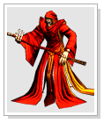

[WYD Raid Hut](/)

* PT-BR
  + [English (EN)](/en/knowledge-bases/21/articles/21703-dungeon-kefra)
  + [Português (Brasil) (PT-BR)](/pt-br/knowledge-bases/21/articles/21703-dungeon-kefra)
* Entrar / Registrar

* PT-BR
  + [English (EN)](/en/knowledge-bases/21/articles/21703-dungeon-kefra)
  + [Português (Brasil) (PT-BR)](/pt-br/knowledge-bases/21/articles/21703-dungeon-kefra)
* Entrar / Registrar

1. [FAQ WYD Global](/pt-br/knowledge-bases/21-faq-wyd-global)
2. [Guias do Jogo (PT-BR)](/pt-br/knowledge-bases/21-faq-wyd-global/categories/19-guias-do-jogo-pt-br/articles)
3. Artigos

# [Dungeon Kefra](/pt-br/knowledge-bases/21/articles/21703-dungeon-kefra)

### **Dungeon Kefra**

O mapa da dungeon Kefra, esconde um colosso de mesmo nome em uma de suas salas: o mortal Kefra. O poderoso Boss guarda um portal para o **Continente Desconhecido**.(local onde se realiza a *quest* "**Pista das Runas**")

A fim de chegar ao **Continente Desconhecido**, onde estão localizados os NPCs **Alquimista Odin** e **Uxmal**, você deverá ir ao mapa para derrotar o Kefra no seu servidor, ir até a Dungeon Kefra, passando pelo território do Lich Crunt (2202 3866) até chegar a entrada do **Hall do Kefra -** localizado no número "4" do mapa abaixo. (2365 3892).

Para acessar o Hall do Kefra, é preciso entregar um Pergaminho Selado ao NPC Sobrevivente (2371 3887). Para cada pergaminho selado, o NPC lhe concederá 100 entradas para o **Hall do Kefra (4).**

**OBS1:** Todos os canais podem tentar matar o Kefra, mas o portal só será aberto no **canal novato (Servidor verde).**

**OBS2:**Para sair do Continente Perdido tente utilizar o Pergaminho de Retorno ou relogue seu personagem. Não existe restrição de level ou classe para acessar o Continente Desconhecido.

Na cidade desconhecida de Kefra você encontrará NPC que vendem itens e npcs para composições de itens ,dentre estes estão os NPCs necessários para compor itens +12 a +15.

**COMO DERROTAR O KEFRA?**

O Boss Kefra aparece uma vez por semana em todos os canais. Ao entrar no Hall do Kefra (atravessando o portal), você encontrará o boss Kefra, alguns Lichs e um numero alto de mini-bosses que auxiliam o grande Kefra em batalha.

O nível de dificuldade da *quest* é bem elevado, já que o boss tem grande quantidade de HP, dano e algumas skills próprias bastante poderosas. Logo, é necessário formar um grande **grupo**para derrotar esse monstro. É recomendo a união entre guildas e jogadores para formar uma caçada épica. Ao derrotar o Boss os jogadores receberão premiações valiosas.

**DROP:**

O jogador que abate a criatura (ultimo ataque). Recebe automaticamente em seu inventário os itens:

Pedra da imortalidade (100% de chance).

Sephirot de TK (100% de chance).

Sephirot de FM (100% de chance).

Sephirot de BM (100% de chance).

Sephirot de HT (100% de chance).

Poeira de Lac 100% (100% de chance).

Skill Sephira: Força Espectral (100% de chance).

Alma do Beriel (50% de chance).

Pedra Lunar (50% de chance).

Joia da escuridão (25% de chance)

Ovo de Hipogrifo (2% de chance).

**LEMBRE-SE: É necessário permancer com espaço no inventário para que os itens possam ser entregues.**

This article was helpful for 3 people. Is this article helpful for you?

 Yes, helpful
 No, not for me

Why this article is not helpful?

Cancelar
Gravar

* Comentários 0
* Antigos primeiro
  + Mais recentes primeiro
  + Antigos primeiro

Ver mais

[Desenvolvido](https://userecho.com?pcode=pwbue_label_asgard&utm_source=pblv5&utm_medium=cportal&utm_campaign=pbue) por UserEcho

### Partilhar

### Article stats

* 6 anos atrás
   Criado
* 5 anos atrás
   Atualizado
* 3
   Helpful
* 9.343
   Visualizações

