[WYD Raid Hut](/)

* PT-BR
  + [English (EN)](/en/knowledge-bases/21/articles/22192-premium-neil-prisang-neil)
  + [Português (Brasil) (PT-BR)](/pt-br/knowledge-bases/21/articles/22192-premium-neil-prisang-neil)
* Entrar / Registrar

* PT-BR
  + [English (EN)](/en/knowledge-bases/21/articles/22192-premium-neil-prisang-neil)
  + [Português (Brasil) (PT-BR)](/pt-br/knowledge-bases/21/articles/22192-premium-neil-prisang-neil)
* Entrar / Registrar

1. [FAQ WYD Global](/pt-br/knowledge-bases/21-faq-wyd-global)
2. [Guias do Jogo (PT-BR)](/pt-br/knowledge-bases/21-faq-wyd-global/categories/19-guias-do-jogo-pt-br/articles)
3. Artigos

# [Premium Neil (Prisang Neil)](/pt-br/knowledge-bases/21/articles/22192-premium-neil-prisang-neil)

**Premium Neil (Prisang Neil)**

O NPC Premium Neil é o NPC responsável pela venda de todos os itens de NP (Cash) do jogo. O jogador poderá encontrá-lo em todas as cidades, próximo ao Guarda Cargas. Para acessá-lo, basta clicar com o botão esquerdo do Mouse e colocar sua senha primária.

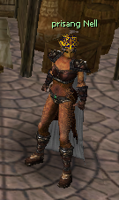

Os Itens são separados por Abas, com o nome das cidades do jogo:

###

### **Armi****a**

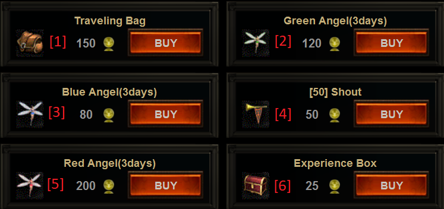

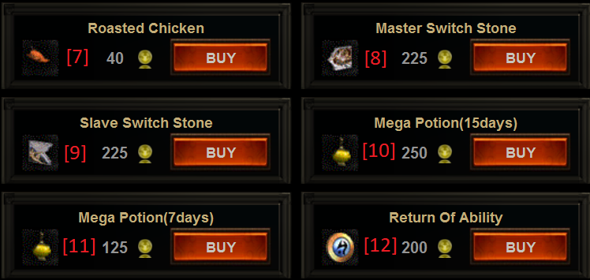

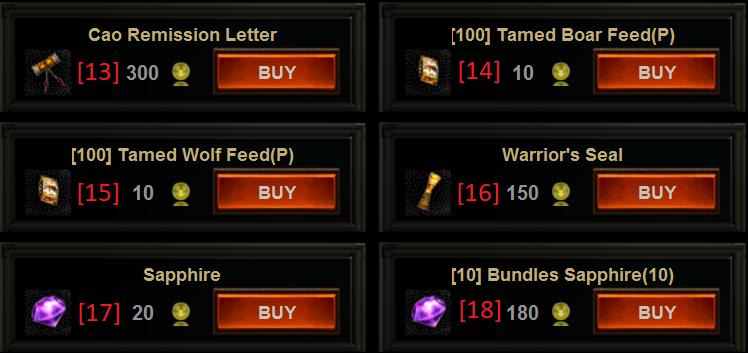

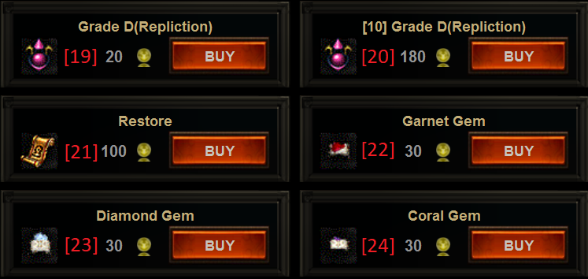

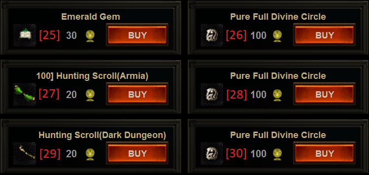

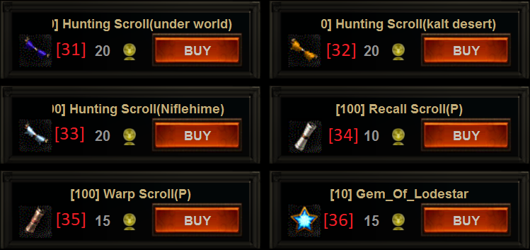

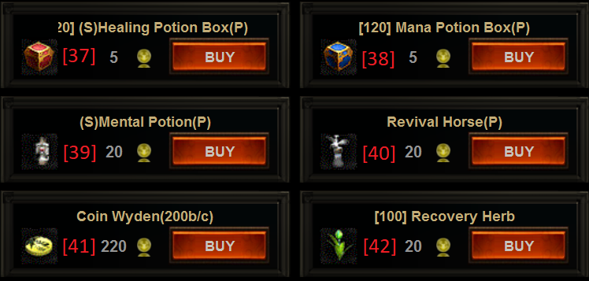

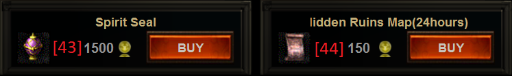

[1] **-** **Bolsa do Andarilho** - Item Utilizado para desbloquear uma bolsa adicional em seu personagem por 30 dias.

[2] **-****Fada Verde -**Equipe no slot familiar para obter aumento na porcentagem de experiência (16%)

[3]**- Fada Azul -**Equipe no slot familiar para obter aumento na porcentagem de drop (32%)

[4] **- Trombeta Mágica -**Permite enviar mensagens em todos os canais do jogo ao mesmo tempo. Use o Comando /gritar no chat do jogo

[5] ****-**** ****Fada Vermelha -**** Equipe no slot familiar para obter aumento na porcentagem de experiência (16%) e drop (32%). Duração: 3 dias

[6] **- Baú de Experiência -**Aumenta consideravelmente a Experiência recebida ao derrotar monstros durante 2 horas. Caso vários baús de experiência sejam consumidos, o tempo será acumulado.

[7] **- Frango -**Aumenta consideravelmente o dano contra monstros durante 4 horas. O bônus não é acumulável.

[8] **- Pedra da Troca (Maior) -**Permite trocar o nick do personagem. Precisa ser usado junto com a pedra da troca menor.

[9] **- Pedra da Troca (Menor) -**Permite trocar o nick do personagem. Precisa ser usado junto com a pedra da troca maior.

[10]**- Porção Divina (7 Dias) -**Aumenta atributos e HP no período de 7 dias.

[11] **-******Porção Divina (15 Dias) -**** Aumenta atributos e HP no período de 15 dias.

[12] **- Retorno de Habilidade -**Reseta todos os pontos atribuídos em Força, Inteligência, Destreza e Constituição. Equipar e falar com a mestre de habilidades em Armia.

[13] **- Pergaminho do Perdão -**Recebe 50 pontos de caos (CP) ao usar esse item.

[14] **- Ração de Javali -**Utilize para recuperar o HP do Javali. 100 Unidades.

[15] **- Ração de Lobo -**Utilize para recuperar o HP do Lobo. 100 Unidades.

[16] **- Selo do Guerreiro -**Desbloqueia a capa level 3 do personagem Mortal (utilizar após o level 356) e ganho de 100 de fama para personagens Celestiais.

[17] **- Safira -**Utilizada para criação da pedra da imortalidade, obtenção da capa de reino e resete de pontos de habilidade (NPC: AbilityMaster).

[18] **- **Safira (10unid) -**** Utilizada para criação da pedra da imortalidade, obtenção da capa de reino e resete de pontos de habilidade (NPC: AbilityMaster). 10 Unidades.

[19] **- Replation [D] -**Altera aleatoriamente os adicionais de um equipamento de defesa [D]. Aviso: Chance de perder a refinação!

[20] **- **Replation [D] (10unid) -**** Altera aleatoriamente os adicionais de um equipamento de defesa [D]. Aviso: Chance de perder a refinação! (10 unidades).

[21] **- Restore -** Utilizado para remover trajes de sua montaria.

[22] **- Gema de Garnet -**Colocar o adicional de "Absorção de dano" em itens Anct, +10 ou superior

[23] **- Gema de Diamante -**Colocar o adicional de "porcentagem de drop" em itens anct, +10 ou superior

[24] **- Gema de Coral -**Colocar o adicional de "experiência" em itens Anct, +10 ou superior

[25] **- Gema de Esmeralda -**Colocar o adicional de "perfuração de dano" em itens Anct, +10 ou superior

[26] **- Círculo Divino Composto Puro -**Reinicializa as Skills da linhagem e 100 pontos de aprendizagem do tipo Confiança, M.Sagrada, Sobrevivência e Elemental.

[27] **- Pedido de Caça (Armia) -**Teleporta para locais de caça (Armia, Erion e Azran).

[28] **- **Círculo Divino Composto Puro -**** Reinicializa as Skills da linhagem e 100 pontos de aprendizagem do tipo Trans, Magia Negra, Troca e Evocação.

[29] **- **Pedido de Caça (Dungeon) -**** Teleporta para locais de caça (Dungeon)

[30] **- **Círculo Divino Composto Puro -**** Reinicializa as Skills da linhagem e 100 pontos de aprendizagem do tipo Espada Mágica, Magia Especial, Natureza e Captura.

[31] **- **Pedido de Caça (SubMundo) -**** Teleporta para locais de caça (SubMundo)

[32] **- **Pedido de Caça (Deserto) -**** Teleporta para locais de caça (Deserto)

[33] -****Pedido de Caça (Gelo) -**** Teleporta para locais de caça (Gelo)

[34] **- Pergaminho do Retorno -**Retorne para a ultima cidade visitada.

[35] **- Pergaminho do Portal -**Teleporte para o local escolhido (Marque um local utilizando: Gema Estelar).

[36] **- Gema Estelar -**Item utilizado para gravar um local de caça (Utilize o Pergaminho do portal para ir até o local gravado).

[37] **- Pote de HP (120unid) -**Recupere 500 de HP. Atalho: Tecla ''Q''.

[38] **- **Pote de MP (120unid) -**** Recupere 500 de MP. Atalho: Tecla ''W''.

[39] **- Porção Mental -**Aumente seu Poder de Ataque por 24 horas.

[40] **- Retornar Cavalo -**Reviva a montaria instantaneamente, sem precisar ir até o mestre de montaria.

[41] **- Wyden Coin -**Item que pode ser trocado por 200 de NP (Cash).

[42] **- Erva da Cura -**A erva da cura tem poderes medicinais e pode curar o Congelamento, Envenenamento e outros Buffs negativos.

[43] **- Selo da Alma -**Utilize para Selar um personagem. Ao selar, o Selo da Alma será transferido diretamente para o baú. Retire todos os itens do seu personagem antes de iniciar o processo!

[44] **- Mapa do Vale -**Item utilizado para obtenção da Fada do Vale (clique com o botão direito no mapa). Utilize a fada do vale para acessar o mapa do ''Vale Escondido'' por 24 horas.

### **Erion**

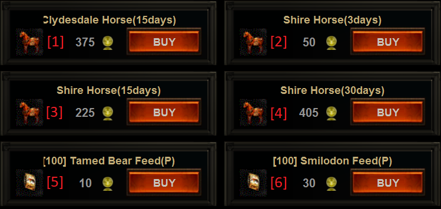

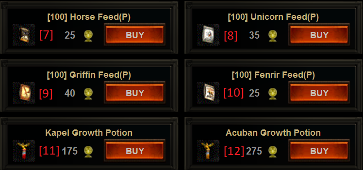

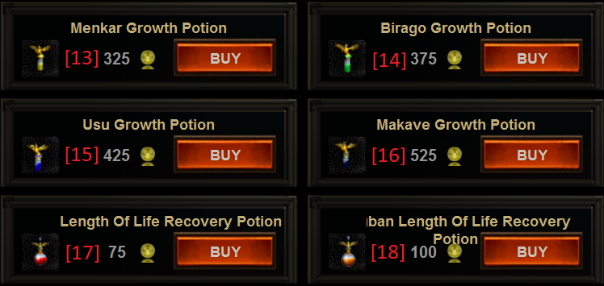

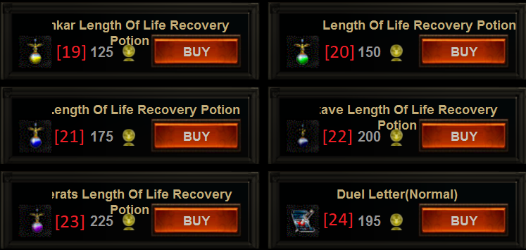

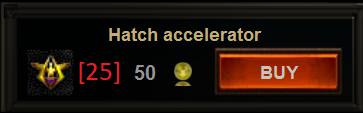

[1] - **Clydesdale (15 dias) -**Montaria mágica com duração de 15 dias. Atributos: +140 dano / 24% magia. (A montaria não possui HP).

[2] - **Shire (3 dias) -** Montaria mágica com duração de 3 dias. Atributos: +35 dano / +7% magia. (A montaria não possui HP).

[3] - **Shire (15 dias) -** Montaria mágica com duração de 15 dias. Atributos: +35 dano / +7% magia. (A montaria não possui HP).

[4] - **Shire (30 dias) -** Montaria mágica com duração de 30 dias. Atributos: +35 dano / +7% magia. (A montaria não possui HP).

[5] - **Ração de Urso -**Item utilizado para recuperar o HP do Urso. (100 unidades)

[6] - **Ração de Dente de Sabre -**Item utilizado para recuperar o HP do Tigre Dente de Sabre. (100 unidades)

[7] - **Ração de Cavalo -**Item utilizado para recuperar o HP do Cavalo. (100 unidades)

[8] - **Ração de Unicórnio -**Item utilizado para recuperar o HP do Unicórnio, Unisus e Pégasos. (100 unidades)

[9] - **Ração de Grifo -**Item utilizado para recuperar o HP do Urso. (100 unidades)

[10] - **Ração de Fenrir -**Item utilizado para recuperar o HP do Fenrir. (100 unidades)

[11] - **Catalizador Kapel -**Evolua sua montaria de filhote para adulto: Dente de Sabre, Dragão Menor e Urso.

[12] - **Catalizador Acuban -** Evolua sua montaria de filhote para adulto: Cavalo S / Sela, Cavalo Fantasma e Cavalo Leve.

[13] - **Catalizador Menkar -** Evolua sua montaria de filhote para adulto: Cavalo Equipado e Andaluz.

[14] - **Catalizador Birago -** Evolua sua montaria de filhote para adulto: Dragão, Fenrir das Sombras e Fenrir.

[15] - **Catalizador Usu -** Evolua sua montaria de filhote para adulto: Unicórnio, Unisus  e Pégasos.

[16] - **Catalizador Makave -** Evolua sua montaria de filhote para adulto: Grifo, Hipogrifo e Grifo Sangrento.

[17] - **Restaurador Kapel -** Aumenta a vida útil de sua montaria em 3 pontos: Dente de Sabre, Dragão Menor e Urso.

[18] - **Restaurador Acuban -**Aumenta a vida útil de sua montaria em 3 pontos:Cavalo S / Sela, Cavalo Fantasma e Cavalo Leve.

[19] - **Restaurador Menkar -**Aumenta a vida útil de sua montaria em 3 pontos: Cavalo Equipado e Andaluz.

[20] - **Restaurador Birago -**Aumenta a vida útil de sua montaria em 3 pontos: Dragão, Fenrir das Sombras e Fenrir.

[21] - **Restaurador Usu -**Aumenta a vida útil de sua montaria em 3 pontos: Unicórnio, Unisus e Pégasos.

[22] - **Restaurador Makave -**Aumenta a vida útil de sua montaria em 3 pontos: Grifo, Hipogrifo e Grifo Sangrento.

[23] - **Restaurador Alperats -**Aumenta a vida útil de sua montaria em 3 pontos: Dragão Vermelho e Tigre de Fogo.

[24] - **Carta Duelo (N)** **-**Item necessário para acessar a Quest da Carta Duelo (N). Utilizar o item no Altar em Noatun (Deserto).

[25] - **Acelerador de Crescimento -**Acelere o nascimento da sua montaria! Obs: Acelera um nivel de incubação por uso.

### **Azran**

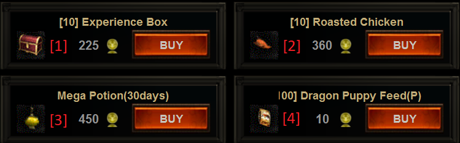

[1] - **Baú de Experiência (10 unidades) -** Aumenta consideravelmente a Experiência recebida ao derrotar monstros durante 2 horas. Caso vários baús de experiência sejam consumidos, o tempo será acumulado. Pacote com 10 unidades.

[2] - **Frango (10 unidades) -** Aumenta consideravelmente o dano contra monstros durante 4 horas. O bônus não é acumulável. Pacote com 10 unidades.

[3] - ****Porção Divina (30 Dias) -**** Aumenta atributos e HP no período de 30 dias.

[4] - **Ração de Dragão Menor -** Item utilizado para recuperar o HP do Dragão Menor (100 unidades)

### **Nifleheim**

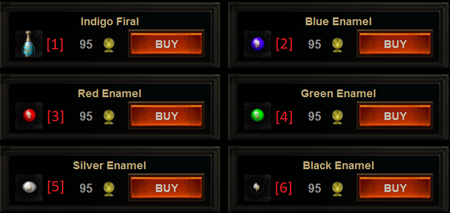

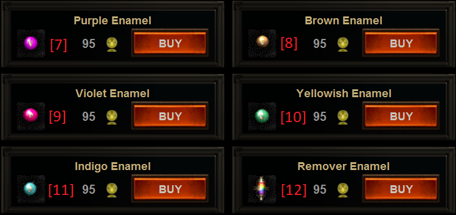

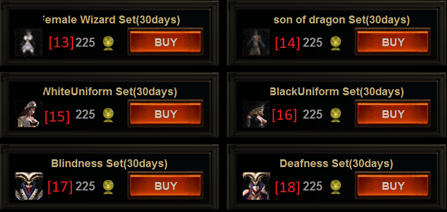

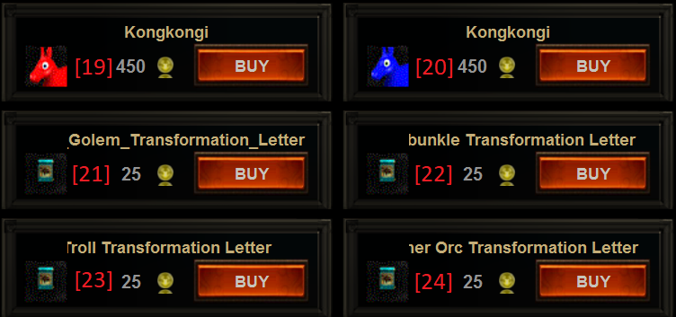

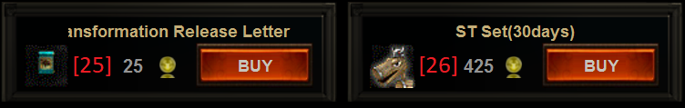

[1] - **Tintura Azul Claro -**Item necessário para composição do Feijão Azul Claro.

[2] - **Feijão Azul** - Feijão Mágico que possibilita pintar uma parte do seu set de cor: Azul

[3] - **Feijão Vermelho** - Feijão Mágico que possibilita pintar uma parte do seu set de cor: Vermelho

[4] - **Feijão Verde** - Feijão Mágico que possibilita pintar uma parte do seu set de cor: Verde

[5] - **Feijão Prateado** - Feijão Mágico que possibilita pintar uma parte do seu set de cor: Prateado

[6] - **Feijão Preto** - Feijão Mágico que possibilita pintar uma parte do seu set de cor: Preto

[7] - **Feijão Roxo** - Feijão Mágico que possibilita pintar uma parte do seu set de cor: Roxo

[8] - **Feijão Marrom** - Feijão Mágico que possibilita pintar uma parte do seu set de cor: Marrom

[9] - **Feijão Violeta** - Feijão Mágico que possibilita pintar uma parte do seu set de cor: Violeta

[10] - **Feijão Amarelo** - Feijão Mágico que possibilita pintar uma parte do seu set de cor: Amarelo

[11] - **Feijão Azul Claro** - Feijão Mágico que possibilita pintar uma parte do seu set de cor: Azul Claro

[12] - **Removedor de Tintura -** Remove a cor do set que foi píntado anteriormente.

[13] - **Traje Bruxa -**Mude a aparência do seu personagem! (30 dias de duração).

[14] - **Traje Draconiano -**Mude a aparência do seu personagem! (30 dias de duração).

[15] - **Traje White -**Mude a aparência do seu personagem! (30 dias de duração).

[16] - **Traje Black -**Mude a aparência do seu personagem! (30 dias de duração).

[17] - **Traje Blindness -**Mude a aparência do seu personagem! (30 dias de duração).

[18] - **Traje Deafness -**Mude a aparência do seu personagem! (30 dias de duração).

[19] - **Traje de montaria: Pula Pula Vermelho -**Mude a aparência de sua montaria! Obs: Após a aplicação do traje, a montaria ficará imóvel até que a remoção do traje seja feita. Adquira o item **Restore**na loja de Armia (Neil). Após a remoção, o traje será perdido.

[20] - **Traje de montaria: Pula Pula Azul -**Mude a aparência de sua montaria! Obs: Após a aplicação do traje, a montaria ficará imóvel até que a remoção do traje seja feita. Adquira o item Restore na loja de Armia (Neil). Após a remoção, o traje será perdido.

[21] - **Pergaminho da Transformação: Golem de Fogo -**Utilizada para transformar o personagem em Golem de Fogo por alguns minutos.

[22] - **Pergaminho da Transformação: Carbunkle -** Utilizada para transformar o personagem em Carbunkle por alguns minutos.

[23] - **Pergaminho da Transformação: Troll -**Utilizada para transformar o personagem em Troll por alguns minutos.

[24] - **Pergaminho da Transformação: Troll Arqueiro -**Utilizada para transformar o personagem em Troll Arqueiro por alguns minutos.

[25] - **Pergaminho de Remoção da Transformação -** Utilizada para retirar qualquer transformação.

[26] - **Traje de Boneco de Madeira -** Mude a aparência do seu personagem! (30 dias de duração).

### **Gifts**

Utilize essa aba para resgatar presentes gratuitamente em eventos especiais!

### **Big Sale**

Essa aba será ativa quando algum item especial estiver em promoção limitada. Fique atento!

This article was helpful for 7 people. Is this article helpful for you?

 Yes, helpful
 No, not for me

Why this article is not helpful?

Cancelar
Gravar

* Comentários 0
* Antigos primeiro
  + Mais recentes primeiro
  + Antigos primeiro

Ver mais

[Desenvolvido](https://userecho.com?pcode=pwbue_label_asgard&utm_source=pblv5&utm_medium=cportal&utm_campaign=pbue) por UserEcho

### Partilhar

### Article stats

* 6 anos atrás
   Criado
* 1 ano atrás
   Atualizado
* 7
   Helpful
* 13.080
   Visualizações

