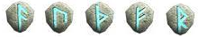
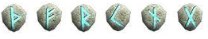
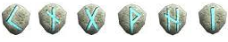
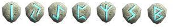
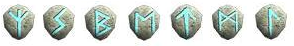
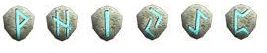
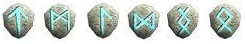

[WYD Raid Hut](/)

* PT-BR
  + [English (EN)](/en/knowledge-bases/21/articles/22278-pista-de-runas)
  + [Português (Brasil) (PT-BR)](/pt-br/knowledge-bases/21/articles/22278-pista-de-runas)
* Entrar / Registrar

* PT-BR
  + [English (EN)](/en/knowledge-bases/21/articles/22278-pista-de-runas)
  + [Português (Brasil) (PT-BR)](/pt-br/knowledge-bases/21/articles/22278-pista-de-runas)
* Entrar / Registrar

1. [FAQ WYD Global](/pt-br/knowledge-bases/21-faq-wyd-global)
2. [Guias do Jogo (PT-BR)](/pt-br/knowledge-bases/21-faq-wyd-global/categories/19-guias-do-jogo-pt-br/articles)
3. Artigos

# [Pista de runas](/pt-br/knowledge-bases/21/articles/22278-pista-de-runas)

A quest Pista de Runas tem várias utilidades, como: obter runas, drop de itens, upar e também concluir as quest para receber a refinação abençoada.

Para que a quest possa ser realizada, os jogadores precisam estar em grupo.

Para começar a quest é necessário compor a Pista de Runas. Então primeiramente teremos que possuir sete poeiras de lactolerium. Após conseguir as poeiras iremos ao Continente Desconhecido na cidade do Kefra, falar com o NPC Alquimista Odin para compor a Pista de Runas (existe chance de falha).

Após realizar a composição da Pista de Runas +0, vá para o hall de kefra e procure pelo NPC Uxmal (X:3301 Y:1692) para registrar a quest.

O registro só é feito entre os horários:

XY:15 ~~ XY:20

XY:35 ~~ XY:40

XY:55 ~~ XY:00

A quest divide-se em 7 etapas:

Pista de Runas +0 (Lich):

Só é permitido a entrada de dois grupos por vez. O objetivo dessa quest é simplesmente matar o lich verdadeiro em um grupo de 8 lichs. Caso mate o lich errado o grupo de lich será sumonado novamente. A quest só termina após matar o lich certo e com isso a Pista de runas será refinada para o líder (+1) e uma runa específica daquela quest aparecerá para cada integrante do grupo.

RUNAS: Ansuz, Uraz, Thurisaz, Fehu e Raidho.

Pista de Runas +1 (Torre):

É permitida a entrada de três grupos por vez. O objetivo dessa quest é bem simples: Defender a Torre Thor durante 15 minutos! Se o grupo obter sucesso, a quest será concluída. Cada integrante receberá uma runa, e o líder irá receber também a Pista de Runas +2.

RUNAS: Thurisaz, Fehu, Raidho, Kenaz, Naudhiz e Gebo.

Pista de Runas +2 (Amon):

É permitida a entrada de até três grupo por vez. Para concluir a quest é necessário apenas matar o Boss, que é sumonado faltando 10 minutos para acabar a quest. Apenas o Líder dos grupos podem entrar para matar o Boss. O líder do grupo que matar o boss, conclui a quest e ganha a runa, e o Líder recebe a Pista de Runas +3.

DICA: Excelente local para adquirir experiência.

RUNAS: Kenaz, Naudhiz, Gebo, Wunjo, Hagalaz e Isa.

Pista de Runas +3 (Lobo):

Só é permitida a entrada de apenas dois grupos por vez. Essa quest possui 8 salas onde irá aparecer o boss. Para fazer com que o boss apareça é necessário eliminar o mob "Sulrang", um lobo que fica pelo centro do mapa. Cada vez que mata 1 "Sulrang" o boss aparece em uma das salas, resta ao grupo procurá-lo e eliminá-lo. O grupo que matar o maior número de boss, ganhará uma runa e o Líder refinará a Pista de Runas para +4.

RUNAS: Isa, Jara, Eihwaz, Perthro, Elhaz, Sowilo e Berkano.

Pista de Runas +4 (Labirinto):

Só é permitida a entrada de dois grupos. Essa quest é uma espécie de labirinto de 36 salas, com 4 mobs por sala. O objetivo da quest é acertar a sala certa e matar os mobs presentes nelas, para assim ser sumonado ao boss. É importante saber que a presença do líder é necessária em cada sala, pois sua ausência fará com que o piso das salas comecem a pegar fogo. Caso o grupo de mobs eliminado não seja o correto, a quest continuará. Após ser sumonado, só é preciso matar o boss para cada integrante ganhar runa, e o Líder refinar a Pista de Runas para +5.

RUNAS: Elhaz, Sowilo, Berkano, Ehwaz, Tiwaz, Mannaz e Laguz.

Pista de Runas +5 (Barlog):

Só é permitida a entrada de dois grupo nessa quest. O objetivo dessa quest é juntar o maior número de semente de cristal, pois essas sementes são usadas pelo líder poder entrar em portais. Na primeira sala possui um portal, na segunda possui dois e assim por diante. O objetivo do grupo é tentar chegar ao boss pelos portais. O grupo que conseguir matar o boss primeiro fará com que cada integrante receba uma runa e o Líder refinará a Pista de Runas para +6.

RUNAS: Wunjo, Hagalaz, Isa, Jara, Eihwaz e Perthro.

Pista de Runas +6 (Coelho):

É permitida a entrada de três grupos por vez. O objetivo dessa quest é caçar a quantia designada de Gold Carbunkles para que o boss apareça. Caso algum mob "ZAKUM" chegue ao centro, 1” Gold Carbuncle” será reduzido. Após matar 100 Gold Carbuncles e não passe nenhum mob "ZAKUM" o boss nascerá no centro. O grupo que matar o boss, receberá runas e a pessoa que matar irá receber o item Refinação Abençoada.

RUNAS: Tiwaz, Mannaz, Laguz, Dagaz Ing e Othel.

ATENÇÃO: Caso o líder do grupo registre uma pista, não será possível registrar outra através do mesmo grupo.

É importante também manter os mesmos membros do grupo após o registro. Adicionar membros, remover membros ou alterar líderes poderão causar problemas, ocasionando a perda da pista registrada.

This article was helpful for 68 people. Is this article helpful for you?

 Yes, helpful
 No, not for me

Why this article is not helpful?

Cancelar
Gravar

* Comentários 0
* Antigos primeiro
  + Mais recentes primeiro
  + Antigos primeiro

Ver mais

[Desenvolvido](https://userecho.com?pcode=pwbue_label_asgard&utm_source=pblv5&utm_medium=cportal&utm_campaign=pbue) por UserEcho

### Partilhar

### Article stats

* 6 anos atrás
   Criado
* 12 meses atrás
   Atualizado
* 68
   Helpful
* 56.156
   Visualizações

