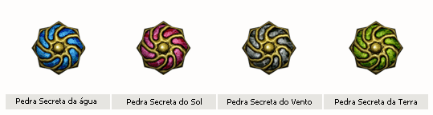
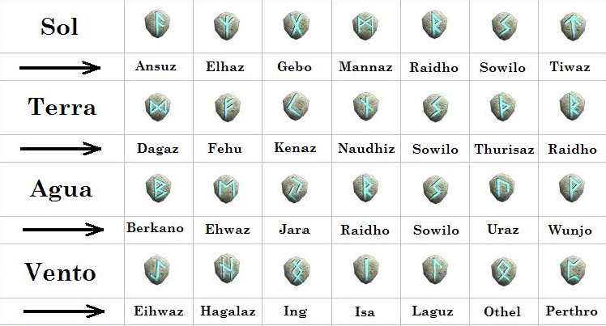

[WYD Raid Hut](/)

* PT-BR
  + [English (EN)](/en/knowledge-bases/21/articles/22279-criacao-do-celestial)
  + [Português (Brasil) (PT-BR)](/pt-br/knowledge-bases/21/articles/22279-criacao-do-celestial)
* Entrar / Registrar

* PT-BR
  + [English (EN)](/en/knowledge-bases/21/articles/22279-criacao-do-celestial)
  + [Português (Brasil) (PT-BR)](/pt-br/knowledge-bases/21/articles/22279-criacao-do-celestial)
* Entrar / Registrar

1. [FAQ WYD Global](/pt-br/knowledge-bases/21-faq-wyd-global)
2. [Guias do Jogo (PT-BR)](/pt-br/knowledge-bases/21-faq-wyd-global/categories/19-guias-do-jogo-pt-br/articles)
3. Artigos

# [Criação do Celestial](/pt-br/knowledge-bases/21/articles/22279-criacao-do-celestial)

O Celestial é o 3º personagem liberado após o começo de uma saga. Para poder criá-lo, é necessário ter um personagem mortal level 400 e um arch level 356 (mínimo permitido). É importante afirmar que quanto maior o level do arch, mais forte o celestial se torna.

ATRIBUTOS

* Mudança da capa do personagem.
* Atribuição de pontos relacionados a o level do personagem Arch
* Aprendizagem da skill sephira: Limite da alma, também conhecida como Soul
* Cythera (tiara): Pode variar em prateada, dourada e mística dependendo do level do personagem e da conclusão da quest arch: OS 4 CRISTAIS. Se o personagem atender todas as exigências (estar com o level máximo e concluir a quest) a Cythera recebida será a mística.

CRIAÇÃO DO PERSONAGEM

Para criar o personagem, são necessários os itens:

* 4 pedras secretas: Sol, Terra, Vento e Água
* Saphirot da sua classe atual
* Pedra da Imortalidade

Ao obter todos todos os itens é necessário equipar o Saphirot, a pedra da imortalidade e ter as 4 pedras secretas no inventário. É importante lembrar que a composição de pedra ideal precisa ser feita por um arch, pois caso o personagem seja um mortal o resultado será a criação de um novo arch. Após isso fale com o rei do seu reino e será criada a pedra Ideal.

PEDRAS SECRETAS

As pedras secretas são criada através da combinação de runas específicas. Após obter as pedras corretas de cada combinação é preciso procurar o NPC “Odin” na cidade de Kefra.

CONFIGURAÇÃO DA SKILL: LIMITE DA ALMA

A skill “limite da alma” atribui pontos de habilidades de acordo com sua configuração. O NPC responsável pela configuração da soul é o Ehre, em Erion. Para configurar da forma que melhore as características do personagem, é necessário fazer uma certa combinação de jóias:

FOR/CON: Diamante + Diamante + Diamante.

INT/CON: Esmeralda + Esmeralda + Esmeralda.

DES/CON: Coral + Coral + Coral.

FOR/DES: Garnet + Garnet + Garnet.

INT/DES: Diamante + Esmeralda + Coral.

CON/DES: Diamante + Coral + Garnet.

FOR: Esmeralda + Coral + Garnet.

INT: Esmeralda + Diamante + Coral.

CON: Coral + Esmeralda + Garnet.

DES: Garnet + Diamante + Coral.

This article was helpful for 32 people. Is this article helpful for you?

 Yes, helpful
 No, not for me

Why this article is not helpful?

Cancelar
Gravar

* Comentários 0
* Antigos primeiro
  + Mais recentes primeiro
  + Antigos primeiro

[Desenvolvido](https://userecho.com?pcode=pwbue_label_asgard&utm_source=pblv5&utm_medium=cportal&utm_campaign=pbue) por UserEcho

### Partilhar

### Article stats

* 6 anos atrás
   Criado
* 6 anos atrás
   Atualizado
* 32
   Helpful
* 42.515
   Visualizações

