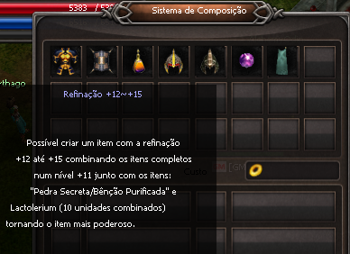
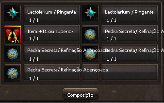

[WYD Raid Hut](/)

* PT-BR
  + [English (EN)](/en/knowledge-bases/21/articles/22542-sistema-de-refinacao-12-a-15)
  + [Português (Brasil) (PT-BR)](/pt-br/knowledge-bases/21/articles/22542-sistema-de-refinacao-12-a-15)
* Entrar / Registrar

* PT-BR
  + [English (EN)](/en/knowledge-bases/21/articles/22542-sistema-de-refinacao-12-a-15)
  + [Português (Brasil) (PT-BR)](/pt-br/knowledge-bases/21/articles/22542-sistema-de-refinacao-12-a-15)
* Entrar / Registrar

1. [FAQ WYD Global](/pt-br/knowledge-bases/21-faq-wyd-global)
2. [Guias do Jogo (PT-BR)](/pt-br/knowledge-bases/21-faq-wyd-global/categories/19-guias-do-jogo-pt-br/articles)
3. Artigos

# [Sistema de Refinação +12 a +15](/pt-br/knowledge-bases/21/articles/22542-sistema-de-refinacao-12-a-15)

A composição é feita através do NPC Alquimista Odin, que se encontra no Continente Desconhecido (Cidade do Kefra)

Itens necessários para composição:

\* 1 Item +11 ou superior (Ancient no caso de armas)

\* 4 pedras secretas aleatórias ou 4 refinações abençoadas;

\* 2 Pacs de Lac com 10 unidades ou 2 Emblemas da proteção;

Obs1: Caso a composição seja feita com Pac de Lac, existe uma pequena chance do item ser destruído caso não tenha sucesso. Neste caso, o jogador perderá o item por completo.

Obs2: Usando-se 2 Emblemas da proteção, em caso de falha, a opção adicional do item torna-se um cristal de extração, dando-se a possibilidade de salvar as opções adicionais de qualquer item, seja ele arma ou item de defesa.

Se obter sucesso, todos os itens usados serão destruídos e restará somente o item +12 (ou superior). Em caso de falha, todos os itens serão destruídos, e o item +11 ou superior terá sua refinação reduzida em 1 nível, ou seja, de +11 ele pode voltar para +10, de +14 ele pode voltar para +13, etc.

**Chance de sucesso:**

Cada refinação possui uma chance fixa de sucesso:

+12 = 4%
+13 = 3%
+14 = 2%
+15 = 1%

Além da chance fixa, cada Pedra Secreta ou Refinação Abençoada dará uma bonificação de sucesso para a composição:

Pedra secreta: 1% de chance por unidade.

Ex: Composição de um item de +11 para +12 com 4 Pedras Secretas = 4% da chance fixa + 4%  (1% de cada Pedra Secreta) = **8% de chance de sucesso.**

**Refinação Abençoada (unidade):**

+0 > 2%
+1 > 3%
+2 > 4%
+3 > 5%
+4> 6%
+5 > 7%
+6> 8%
+7 > 10%
+8 > 12%
+9 > 15%

Ex1: Composição de um item de +11 para +12 com 4 refinações abençoadas +0 = 4% de chance fixa + 8% (2% de cada refinação abençoada) = **12% de chance de sucesso.**

Ex2: Composição de um item de +12 para +13 com 4 refinações abençoadas +3 = 3% de chance fixa + 20% (5% de cada refinação abençoada +3) = **23% de chance de sucesso.**

**IMPORTANTE: Ao utilizar 1 refinação+1 na composição, o item não corre o risco de virar extração e cada emblema utilzado nessa composição concede 1% de sucesso na refinação do item.**

This article was helpful for 79 people. Is this article helpful for you?

 Yes, helpful
 No, not for me

Why this article is not helpful?

Cancelar
Gravar

* Comentários 0
* Antigos primeiro
  + Mais recentes primeiro
  + Antigos primeiro

[Desenvolvido](https://userecho.com?pcode=pwbue_label_asgard&utm_source=pblv5&utm_medium=cportal&utm_campaign=pbue) por UserEcho

### Partilhar

### Article stats

* 6 anos atrás
   Criado
* 3 anos atrás
   Atualizado
* 79
   Helpful
* 31.596
   Visualizações

