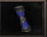
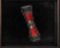

[WYD Raid Hut](/)

* PT-BR
  + [English (EN)](/en/knowledge-bases/21/articles/22545-pergaminhos-da-agua)
  + [Português (Brasil) (PT-BR)](/pt-br/knowledge-bases/21/articles/22545-pergaminhos-da-agua)
* Entrar / Registrar

* PT-BR
  + [English (EN)](/en/knowledge-bases/21/articles/22545-pergaminhos-da-agua)
  + [Português (Brasil) (PT-BR)](/pt-br/knowledge-bases/21/articles/22545-pergaminhos-da-agua)
* Entrar / Registrar

1. [FAQ WYD Global](/pt-br/knowledge-bases/21-faq-wyd-global)
2. [Guias do Jogo (PT-BR)](/pt-br/knowledge-bases/21-faq-wyd-global/categories/19-guias-do-jogo-pt-br/articles)
3. Artigos

# [Pergaminhos da Água](/pt-br/knowledge-bases/21/articles/22545-pergaminhos-da-agua)

Os pergaminhos da água tem com objetivo, criar uma nova forma de jogadores adquirirem experiência. Existem três tipos de pergaminhos: Normal, Místico e Arcano.

ONDE FICA?

Os pergaminhos são usados na caverna da água, nos arredores de Azran (X: 1965, Y:1771). Vá para a cidade e entre no portal que se encontra abaixo da fonte.

COMO FUNCIONA?

O uso ideal para os pergaminhos é com um grupo fechado. Cada vez que o pergaminho é usado, a equipe é direcionada para uma sala. O objetivo da quest é abater todos os MOBs no tempo estipulado. Se for concluído o pergaminho ganha um level e a equipe pode usá-lo novamente e seguir para um próximo andar (total de 8 andares por pergaminho). Caso os MOBs não sejam abatidos no tempo, o pergaminho é perdido.

O BATEDOR:

O ideal é que o jogador responsável por matar os MOBs, seja nível baixo (de preferência mortal) e esteja com todos os itens necessários para ganhar o máximo de XP possível (Baú e Fada). Assim todos os outros integrantes vão conseguir adquirir uma boa experiência.

PERGAMINHOS (N) e (M):

Esses pergaminhos tem a mesma funcionalidade, os 2 são utilizados apenas para mortal e arch. A diferença é que o pergaminho (M) é um pouco mais difícil e consequentemente, disponibiliza mais XP do que o pergaminho (N).

PERGAMINHO (A):

Tem a mesma funcionalidade dos (N) e (M), porém é de uso restrito apenas para celestiais.

Sendo assim, o batedor não pode ser um mortal, mas a ideia continua a mesma, ou seja, quanto menor o level do batedor maior a XP. Vale lembrar também que o jogador precisa de itens de melhoramento da XP.

**ATENÇÃO: Para acessar as quests, é necessário um grupo de no mínimo 8 jogadores!**

This article was helpful for 23 people. Is this article helpful for you?

 Yes, helpful
 No, not for me

Why this article is not helpful?

Cancelar
Gravar

* Comentários 0
* Antigos primeiro
  + Mais recentes primeiro
  + Antigos primeiro

[Desenvolvido](https://userecho.com?pcode=pwbue_label_asgard&utm_source=pblv5&utm_medium=cportal&utm_campaign=pbue) por UserEcho

### Partilhar

### Article stats

* 6 anos atrás
   Criado
* 4 anos atrás
   Atualizado
* 23
   Helpful
* 11.139
   Visualizações

