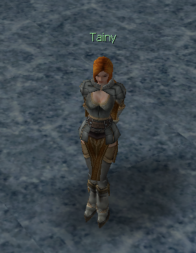
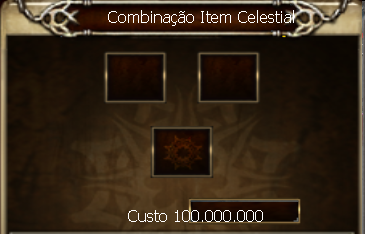

[WYD Raid Hut](/)

* PT-BR
  + [English (EN)](/en/knowledge-bases/21/articles/22809-passando-adicional-para-arma-arch)
  + [Português (Brasil) (PT-BR)](/pt-br/knowledge-bases/21/articles/22809-passando-adicional-para-arma-arch)
* Entrar / Registrar

* PT-BR
  + [English (EN)](/en/knowledge-bases/21/articles/22809-passando-adicional-para-arma-arch)
  + [Português (Brasil) (PT-BR)](/pt-br/knowledge-bases/21/articles/22809-passando-adicional-para-arma-arch)
* Entrar / Registrar

1. [FAQ WYD Global](/pt-br/knowledge-bases/21-faq-wyd-global)
2. [Guias do Jogo (PT-BR)](/pt-br/knowledge-bases/21-faq-wyd-global/categories/19-guias-do-jogo-pt-br/articles)
3. Artigos

# [Passando adicional para arma Arch](/pt-br/knowledge-bases/21/articles/22809-passando-adicional-para-arma-arch)

Nenhuma arma é boa o suficiente se não tiver um add considerável em sua base, para isso existe uma forma de deixá-la forte o suficiente.

Para realizar tal feito é necessário ter os seguintes itens:

* Arma desejada +9 (anct)
* Arma com o add +9 (anct)
* item [D] ou [E] +9
* 100.000.000 de gold

 

Vá ao NPC Tainy em Karden (gelo) e entregue os itens, mas lembre-se: a chance de falha não pode ser descartada.

Boa sorte!

This article was helpful for 20 people. Is this article helpful for you?

 Yes, helpful
 No, not for me

Why this article is not helpful?

Cancelar
Gravar

* Comentários 0
* Antigos primeiro
  + Mais recentes primeiro
  + Antigos primeiro

Ver mais

[Desenvolvido](https://userecho.com?pcode=pwbue_label_asgard&utm_source=pblv5&utm_medium=cportal&utm_campaign=pbue) por UserEcho

### Partilhar

### Article stats

* 6 anos atrás
   Criado
* 1 ano atrás
   Atualizado
* 20
   Helpful
* 25.382
   Visualizações

