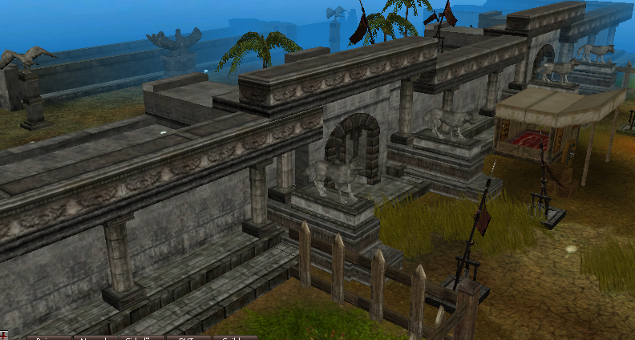
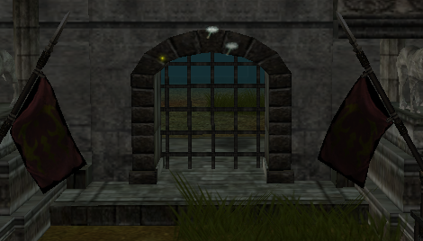
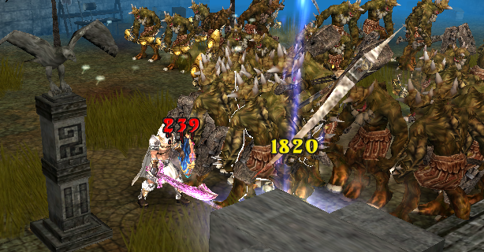

[WYD Raid Hut](/)

* PT-BR
  + [English (EN)](/en/knowledge-bases/21/articles/22855-coliseu)
  + [Português (Brasil) (PT-BR)](/pt-br/knowledge-bases/21/articles/22855-coliseu)
* Entrar / Registrar

* PT-BR
  + [English (EN)](/en/knowledge-bases/21/articles/22855-coliseu)
  + [Português (Brasil) (PT-BR)](/pt-br/knowledge-bases/21/articles/22855-coliseu)
* Entrar / Registrar

1. [FAQ WYD Global](/pt-br/knowledge-bases/21-faq-wyd-global)
2. [Guias do Jogo (PT-BR)](/pt-br/knowledge-bases/21-faq-wyd-global/categories/19-guias-do-jogo-pt-br/articles)
3. Artigos

# [Coliseu](/pt-br/knowledge-bases/21/articles/22855-coliseu)

O coliseu é uma quest de drop que ocorre diariamente, nos servidores novatos. A grande arena está localizada no Leste de Azran, na coordenada: (X:2596 Y:1726).

**COMO PARTICIPAR:**

Entre na arena no horário em que o seu personagem se enquadra e aguarde os portões serem fechados.

**O QUE FAZER:**

Após o início da quest, monstros com grande capacidade de drop surgirão.

Obs: Vá preparado, pois a quest é PVP!

****

**HORÁRIOS:**

Nível 1.

19:00 - Apenas personagens Mortais e Archs podem participar.

19:05 - Entradas e saídas serão seladas.

19:07 - A divisória será aberta e os monstros aparecerão.

19:17 - Fim da Quest.

Nível 2.

20:00 - Apenas personagens Mortais e Arch podem participar.

20:05 - Entradas e saídas serão seladas.

20:07 - A divisória será aberta e os monstros aparecerão.

20:17 - Fim da Quest.

Nível 3.

21:00 - Todos os personagens podem participar.

21:05 - Entradas e saídas serão seladas.

21:07 - A divisória será aberta e os monstros aparecerão.

21:17 - Fim da Quest.

**OBS: Será necessário o item Notificação Pública para participar da Quest. As quests ocorrem no servidor novato.**

**DROPS:**

O Drop das as salas se resumem a cristais, restos e poeiras de Ori e Lac. A capacidade de drop da quest está relacionada aos níveis. Quanto maior o Nível, mais itens o jogador irá adquirir.

This article was helpful for 9 people. Is this article helpful for you?

 Yes, helpful
 No, not for me

Why this article is not helpful?

Cancelar
Gravar

* Comentários 0
* Antigos primeiro
  + Mais recentes primeiro
  + Antigos primeiro

Ver mais

[Desenvolvido](https://userecho.com?pcode=pwbue_label_asgard&utm_source=pblv5&utm_medium=cportal&utm_campaign=pbue) por UserEcho

### Partilhar

### Article stats

* 6 anos atrás
   Criado
* 5 anos atrás
   Atualizado
* 9
   Helpful
* 6.396
   Visualizações

