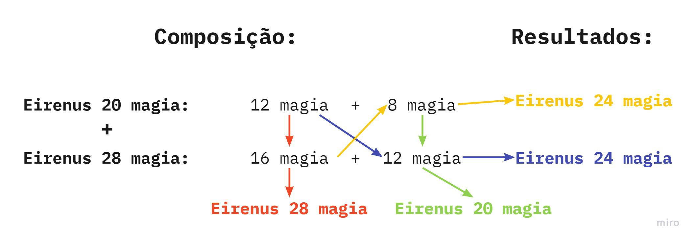
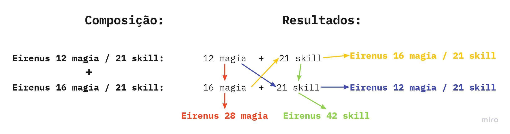
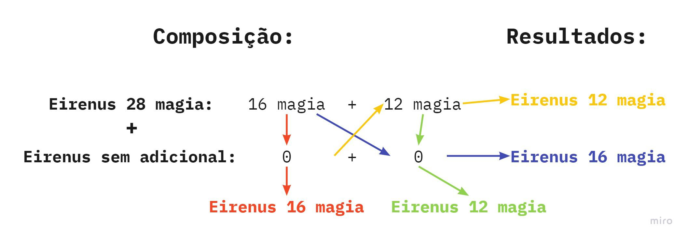

[WYD Raid Hut](/)

* PT-BR
  + [English (EN)](/en/knowledge-bases/21/articles/23123-refinacao-10-e-mudanca-de-adicionais)
  + [Português (Brasil) (PT-BR)](/pt-br/knowledge-bases/21/articles/23123-refinacao-10-e-mudanca-de-adicionais)
* Entrar / Registrar

* PT-BR
  + [English (EN)](/en/knowledge-bases/21/articles/23123-refinacao-10-e-mudanca-de-adicionais)
  + [Português (Brasil) (PT-BR)](/pt-br/knowledge-bases/21/articles/23123-refinacao-10-e-mudanca-de-adicionais)
* Entrar / Registrar

1. [FAQ WYD Global](/pt-br/knowledge-bases/21-faq-wyd-global)
2. [Guias do Jogo (PT-BR)](/pt-br/knowledge-bases/21-faq-wyd-global/categories/19-guias-do-jogo-pt-br/articles)
3. Artigos

# [REFINAÇÃO +10 E MUDANÇA DE ADICIONAIS](/pt-br/knowledge-bases/21/articles/23123-refinacao-10-e-mudanca-de-adicionais)

Para refinar um item para "+10", vá até a cidade de Azran e encontre o NPC Alieen (X:2529 Y:1725).

Itens necessários:

• [02] Itens +9 iguais e do mesmo tipo (N, M, A, Le ou Anct).

• [04] jóias iguais

• [30] Poeiras de Lac

• 5.000.000 gold

**Sucesso:**

Todos os itens utilizados para composição serão destruídos e você receberá um item +10.

**Falha:**

Jóias, pedra do sábio e o Gold serão perdidos.

---

**GEMA DE EFEITO**

É possível definir um efeito extra para itens +10 (ou superior), em função da jóia utilizada na composição.

Diamante: 8% na Taxa de Drop

Esmeralda: 40 Pontos de perfuração

Coral: 2% na Taxa de Experiência.

Garnet: 40 pontos de absorção de Dano.

Obs: Caso o item escolhido para composição seja uma arma Anct, os efeitos das armas terão que ser iguais e as jóias utilizadas terão que ser compatíveis com o efeito.

Ex: As duas armas com efeito de 8% de drop e 4 diamantes.

---

### COMPOSIÇÃO DE ADICIONAIS

Toda arma no jogo possui **dois adicionais internos**, mesmo que apenas um seja visível no sistema do jogo.

#### Exemplo 1: Eirenus com adicional de Magia

* **Eirenus 28 Magia**: internamente possui 12 Magia + 16 Magia
* **Eirenus 20 Magia**: internamente possui 12 Magia + 8 Magia

> Mesmo que o jogo exiba apenas um valor, ele é composto por dois adicionais fixos. Esses adicionais sempre respeitam combinações válidas existentes no sistema. Portanto, não existem combinações como "10 Magia", já que esse valor não é composto por dois adicionais válidos.

#### Exemplo 2: Eirenus com Magia e Skill

* **Eirenus 12 Magia / 21 Skill**
* **Eirenus 16 Magia / 21 Skill**

> Neste caso, a arma apresenta **dois adicionais de categorias diferentes**, por isso ambos são exibidos.

#### Exemplo 3: Eirenus com dois adicionais baixos

* **Eirenus 12 Magia / 8 Magia**

> Armas com adicionais baixos também seguem a regra de dois adicionais internos. Nesse caso, é possível que um dos valores esteja zerado (invisível para o jogador).

##### Possíveis composições internas:

* 12 + 8 = **20% Magia**
* 12 + 0 = **12% Magia**
* 8 + 0 = **8% Magia**
* 0 + 0 = **0% Magia**

---

**ENTENDENDO MELHOR:****EXEMPLO 1:**

Vamos supor que que iremos compor uma Eirenus +10 através de 2 Eirenus +9, cujo adicionais são: 20 magia e 28 magia. Quais os adicionais a minha arma pode receber?

Os adicionais de uma Eirenus cruzará com os adicionais da outra Eirenus, possibilitando os adicionais:

* 12 + 16 = 28
* 12 + 12 = 24
* 8 + 16 = 24
* 8 + 12 = 20

---

**EXEMPLO 2:**

Os adicionais utilizados desta vez, são: 12 magia / 21 Skill e 16 magia / 21 Skill. Nesse caso os adicionais podem ser iguais aos das armas apresentados ou os adicionais iguais das duas armas podem ser somados (Magia + Magia ou Skill + Skill.).

Possibilidades:

* 12 + 21 = 12/21
* 16 + 21 = 16/21
* 12 + 16 = 28 magia
* 21 + 21 = 42 skill

---

**EXEMPLO 3:**

Caso uma das armas utilizadas não possua adicional: Eirenus 28 base + Eirenus sem adicional:

Possibilidades:

* 12 + 0 = 12
* 16 + 0 = 16
* 0 + 16 = 16
* 0 + 12 = 12

**IMPORTANTE: ALÉM DOS EXEMPLOS CITADOS, AS ARMAS PODEM ADQUIRIR O ADICIONAL DE UMA DAS DUAS ARMAS SEM SOMAR O DAS DUAS.**

**EXEMPLOS:**

**1. Eirenus 8 base de ataque magico e Eirenus 42 skill -  A arma pode ficar com 8 ou 42.****2. Eirenus sem adicional (base 0) e Erinus  28 base - A Arma pode ficar com 0 ou 28 (além dos outros adicionais informados acima.**

This article was helpful for 28 people. Is this article helpful for you?

 Yes, helpful
 No, not for me

Why this article is not helpful?

Cancelar
Gravar

* Comentários 0
* Antigos primeiro
  + Mais recentes primeiro
  + Antigos primeiro

Ver mais

[Desenvolvido](https://userecho.com?pcode=pwbue_label_asgard&utm_source=pblv5&utm_medium=cportal&utm_campaign=pbue) por UserEcho

### Partilhar

### Article stats

* 6 anos atrás
   Criado
* 4 meses atrás
   Atualizado
* 28
   Helpful
* 20.817
   Visualizações

