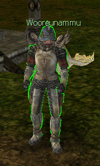

[WYD Raid Hut](/)

* PT-BR
  + [English (EN)](/en/knowledge-bases/21/articles/23390-guia-mudanca-de-classe-e-mudanca-de-corpo)
  + [Português (Brasil) (PT-BR)](/pt-br/knowledge-bases/21/articles/23390-guia-mudanca-de-classe-e-mudanca-de-corpo)
* Entrar / Registrar

* PT-BR
  + [English (EN)](/en/knowledge-bases/21/articles/23390-guia-mudanca-de-classe-e-mudanca-de-corpo)
  + [Português (Brasil) (PT-BR)](/pt-br/knowledge-bases/21/articles/23390-guia-mudanca-de-classe-e-mudanca-de-corpo)
* Entrar / Registrar

1. [FAQ WYD Global](/pt-br/knowledge-bases/21-faq-wyd-global)
2. [Guias do Jogo (PT-BR)](/pt-br/knowledge-bases/21-faq-wyd-global/categories/19-guias-do-jogo-pt-br/articles)
3. Artigos

# [GUIA: Mudança de classe e mudança de corpo](/pt-br/knowledge-bases/21/articles/23390-guia-mudanca-de-classe-e-mudanca-de-corpo)

**Mudança de classe:**
Existe 2 formas de realizar esse procedimento em seu personagem:

**1- NPC Wooreunammu**

Para mudar a classe dos personagens, vá em Kefra e procure o NPC Wooreunammu (X:3230 Y:1683).

Para realizar a troca de cada classe, são necessários:

* Sephirot da Classe desejada
* 100kk

Equipe o Sephirot e clique no NPC, após isso a classe será Alterada.

O Fafão criou um vídeo para ajudar no entendimento desse procedimento. Para assisti-lo, [clique aqui](https://www.youtube.com/watch?v=AZIi8x2SMp8)!

**2 - Sephiroth Blessing:**

Para mudar a classe do personagem, equipe a Sephiroth da classe desejada e ative o item Sephiroth Blessing.

-> O item Sephiroth Blessing pode ser adquirido nos eventos mensais do servidor Global.

-> **IMPORTANTE: Ao alterar a classe todas as skills sephira serão desaprendidas!**

---

**Mudança de corpo:**

Para realizar esse procedimento, equipe a Sephiroth da classe desejada e ative o item Sephiroth Protection.

-> O item Sephiroth Protection pode ser adquirido nos eventos mensais do servidor Global.

-> Para realizar o procedimento da mudança de corpo, é necessário remover os equipamentos do personagem.

This article was helpful for 37 people. Is this article helpful for you?

 Yes, helpful
 No, not for me

Why this article is not helpful?

Cancelar
Gravar

* Comentários 0
* Antigos primeiro
  + Mais recentes primeiro
  + Antigos primeiro

Ver mais

[Desenvolvido](https://userecho.com?pcode=pwbue_label_asgard&utm_source=pblv5&utm_medium=cportal&utm_campaign=pbue) por UserEcho

### Partilhar

### Article stats

* 6 anos atrás
   Criado
* 3 anos atrás
   Atualizado
* 37
   Helpful
* 15.105
   Visualizações

