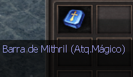

[WYD Raid Hut](/)

* PT-BR
  + [English (EN)](/en/knowledge-bases/21/articles/24025-guia-barra-de-mithril)
  + [Português (Brasil) (PT-BR)](/pt-br/knowledge-bases/21/articles/24025-guia-barra-de-mithril)
* Entrar / Registrar

* PT-BR
  + [English (EN)](/en/knowledge-bases/21/articles/24025-guia-barra-de-mithril)
  + [Português (Brasil) (PT-BR)](/pt-br/knowledge-bases/21/articles/24025-guia-barra-de-mithril)
* Entrar / Registrar

1. [FAQ WYD Global](/pt-br/knowledge-bases/21-faq-wyd-global)
2. [Guias do Jogo (PT-BR)](/pt-br/knowledge-bases/21-faq-wyd-global/categories/19-guias-do-jogo-pt-br/articles)
3. Artigos

# [GUIA: Barra de Mithril](/pt-br/knowledge-bases/21/articles/24025-guia-barra-de-mithril)

As barras de mithril são itens utilizados para aprimorar o adicional de armaduras e armas de classes Archs ou Celestiais.

Embora o ícone dos itens pareçam iguais, existem várias classes de barras, então preste atenção na descrição.

As classes são: **Ataque mágico, Dano, Crítico, Defesa e Imunidade.**

**As armaduras e armas precisam estar com a refinação mínima em +11 para o processo ser iniciado.**

**ADICIONAL MÁXIMO DE CADA CLASSE:**

**ATAQUE MÁGICO**:

* Armaduras - 20% máximo
* Armas - 44% máximo

**DANO:**

* Peito e calça - 54 máximo
* Bota - 84 máximo
* Luva - 66 máximo
* Armas - 99 máximo

**CRÍTICO:**

* Peito e calça - 13% máximo

**DEFESA:**

* Peito e calça - 60 máximo
* Luva - 90 máximo

**IMUNIDADES:**

* Luva - 42 máximo

**Agora a chance de reduzir o adicional de um item ao utilizar o item “Barra de mithril” será desligada quando o adicional do item atingir um valor mínimo. Dessa forma, a barra ainda poderá ser utilizada, mas não haverá chance do adicional ser reduzido. Confira em qual ponto a "Proteção de adicional” é ativada na lista abaixo:**

**Aumento de dano: 24
Ataque mágico: 8%
Chance de Crítico: 6%
Defesa: 25** **O caminho para obter os aprimoramentos máximos não é fácil. As barras podem falhar, não sofrer alterações ou refinar, então:**

BOA SORTE E NÃO DESISTA!

This article was helpful for 65 people. Is this article helpful for you?

 Yes, helpful
 No, not for me

Why this article is not helpful?

Cancelar
Gravar

* Comentários 0
* Antigos primeiro
  + Mais recentes primeiro
  + Antigos primeiro

Ver mais

[Desenvolvido](https://userecho.com?pcode=pwbue_label_asgard&utm_source=pblv5&utm_medium=cportal&utm_campaign=pbue) por UserEcho

### Partilhar

### Article stats

* 6 anos atrás
   Criado
* 3 anos atrás
   Atualizado
* 65
   Helpful
* 22.450
   Visualizações

