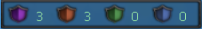

[WYD Raid Hut](/)

* PT-BR
  + [English (EN)](/en/knowledge-bases/21/articles/24218-guia-arena-real)
  + [Português (Brasil) (PT-BR)](/pt-br/knowledge-bases/21/articles/24218-guia-arena-real)
* Entrar / Registrar

* PT-BR
  + [English (EN)](/en/knowledge-bases/21/articles/24218-guia-arena-real)
  + [Português (Brasil) (PT-BR)](/pt-br/knowledge-bases/21/articles/24218-guia-arena-real)
* Entrar / Registrar

1. [FAQ WYD Global](/pt-br/knowledge-bases/21-faq-wyd-global)
2. [Guias do Jogo (PT-BR)](/pt-br/knowledge-bases/21-faq-wyd-global/categories/19-guias-do-jogo-pt-br/articles)
3. Artigos

# [GUIA: Arena Real](/pt-br/knowledge-bases/21/articles/24218-guia-arena-real)

A Arena Real é um torneio que ocorre entre os cavaleiros de Kersef! A quest pode ser acessada todos os dias no canal novato. Para participar, fique atento aos registros que são abertos às 13:00, 19:00, 20:30 e 23:00.

Como funciona:

Uma vez que o registro é iniciado, até 52 jogadores podem se registrar nos NPCs “Repus” localizados em Armia (2121 2150), Azran (2491 1727) e Gelo (3666 3138). Após o registro, 4 grupos serão formados aleatoriamente e os jogadores deverão se enfrentar na Arena.

Quando a quest é encerrada, todos os membros do grupo vencedor recebem premiações. As recompensas variam em cupons e experiência.

-> Apenas personagens Celestiais podem se registrar.

-> Caso dois grupos sobrevivam até o final, a equipe com mais vidas será o vencedor.

-> Caso os dois grupos possuam a mesma quantidade de vidas, não haverá vencedores.

-> O jogador precisará permanecer vivo por pelo menos 2 minutos para que sua pontuação seja computada.

-> Os jogadores dentro da Arena Real terão a aparência da montaria e armadura alterados para um visual padrão.

-> Os jogadores dentro da Arena Real receberão uma bonificação no HP total ao serem teleportados para o mapa. O valor de HP obtido será igual para todos os jogadores, mas poderá variar a depender do horário da quest.

-> O level máximo para participar da Arena Real das 20:30 é 340.

-> O level mínimo para participar da Arena Real das 23:00 é 341.

---

**Arena Real: Modo Torre Infinita**

O modo “Torre Infinita” da Arena Real contará com uma dinâmica diferente que obrigará os jogadores a testarem sua jogabilidade e estratégias de uma forma diferente. No início da quest a “Royal Tower” será sumonada aleatoriamente dentro do mapa da Arena Real e as equipes devem tentar destruí-la para ganhar 1 ponto. Sempre que a torre for destruída, uma nova torre será sumonada em outro local aleatoriamente. Ao término da quest, a equipe que possuir mais pontos, será a vencedora. Mas cuidado, cada jogador possui apenas uma vida, porém sempre que o jogador morrer, ele terá apenas 10% de chance de perdê-la e retornar para cidade. Dessa forma, as equipes terão que criar novas estratégias para se proteger, derrubar torres e remover jogadores de equipes inimigas simultaneamente.

---

**Arena Real: Tower Mode**

No novo modo as equipes devem criar estratégias para destruir as torres que irão aparecer aleatoriamente no mapa da quest enquanto tentam combater com as outras equipes.

-> A equipe que destruir 30 torres primeiro, será a vencedora.

-> Se apenas uma equipe sobreviver dentro da quest, ela será a vencedora.

-> Cada jogador possui apenas uma vida, porém, ao ser morto, existe uma chance aleatória do jogador permanecer na quest.

-> O modo ocorre todos os dias às 12:00, 17:00 e 19:30.

-> Não há ganho de experiência por participar/vencer a quest.

->Existe um cooldown de 10 segundos para o spawn da primeira torre após o início da quest.

-> Reduzido o cooldown de spawn da nova torre após a destruição.

---

**Passe de Batalha**

Nesse update, o Sistema de Tier na Arena Real vai permitir novas classificações dentre Bronze, Prata, Ouro, Platina e Diamante que funcionarão de acordo com o Ranking do site. Além disso, será liberado o novo sistema de upgrade dos itens Hardcore para Celestial.

**Experiência do passe de batalha:**

* Participar da Arena - 10 Exp.
* Vencer qualquer arena - 100 Exp.

-> Para receber as pontuações o jogador precisa permanecer ativo na arena por pelo menos 2 minutos.

**Ranking**

A pontuação do ranking será contabilizada das arenas realizadas do dia 01/07/2022 até o dia 01/08/2022. A atualização dos itens do passe de batalha juntamente com a atualização do royal ranking serão atualizadas a partir de segunda-feira 04/07/2022, para que todos os jogadores tenham o final de semana para resgatar as recompensas pendentes da última season.

No final de cada season, será feito um levantamento dos jogadores com as maiores pontuações para a classificação dentro de cada Tier. Com base nessa classificação, o jogador receberá o Brasão Real, que poderá ser trocado no NPC Real Master.

**Definição Tiers:**

Tier Posição no Ranking Recompensa

Diamante: 1º ao 5º [30] Brasão Real

Platina: 6º ao 15º [20] Brasão Real

Ouro: 16º ao 25º [15] Brasão Real

Prata: 26º ao 40º [10] Brasão Real

Bronze: 41º ao 52º [05] Brasão Real

**Como garantir minha recompensa no fim da Season?**

Após a finalização da season, os itens serão entregue com até 3 dias úteis do último dia da season. Os jogadores poderão trocar o item Brasão Real no NPC Real Master que estará localizado atrás do Coliseu de Arzan.

**NPC Real Master (Arzan)**

Entregue

[01] Brasão Real

**Quantidade Recompensa Aleatória**

[01] Cristal de Bahamut

[02] Cristal de Amunra

[01] Barra de Prata (1Bi)

[01] Cursed Hat (Black)

[01] Ovo de Dragão Lendário

-> Todas as recompensas são imóveis.

This article was helpful for 16 people. Is this article helpful for you?

 Yes, helpful
 No, not for me

Why this article is not helpful?

Cancelar
Gravar

* Comentários 0
* Antigos primeiro
  + Mais recentes primeiro
  + Antigos primeiro

Ver mais

[Desenvolvido](https://userecho.com?pcode=pwbue_label_asgard&utm_source=pblv5&utm_medium=cportal&utm_campaign=pbue) por UserEcho

### Partilhar

### Article stats

* 6 anos atrás
   Criado
* 3 anos atrás
   Atualizado
* 16
   Helpful
* 8.024
   Visualizações

