[WYD Raid Hut](/)

* PT-BR
  + [English (EN)](/en/knowledge-bases/21/articles/24236-guia-montaria)
  + [Português (Brasil) (PT-BR)](/pt-br/knowledge-bases/21/articles/24236-guia-montaria)
* Entrar / Registrar

* PT-BR
  + [English (EN)](/en/knowledge-bases/21/articles/24236-guia-montaria)
  + [Português (Brasil) (PT-BR)](/pt-br/knowledge-bases/21/articles/24236-guia-montaria)
* Entrar / Registrar

1. [FAQ WYD Global](/pt-br/knowledge-bases/21-faq-wyd-global)
2. [Guias do Jogo (PT-BR)](/pt-br/knowledge-bases/21-faq-wyd-global/categories/19-guias-do-jogo-pt-br/articles)
3. Artigos

# [GUIA: Montaria](/pt-br/knowledge-bases/21/articles/24236-guia-montaria)

As montarias fazem parte do equipamento de cada personagem. Elas atribuem adicionais que variam de acordo com a classe do animal: velocidade de movimento, dano, ataque mágico, evasão, absorção e imunidades.

**Quais são?**

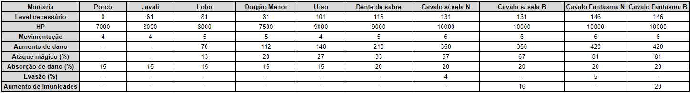

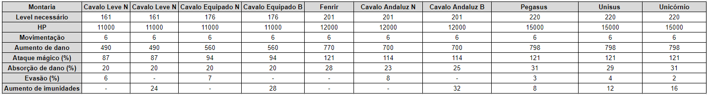

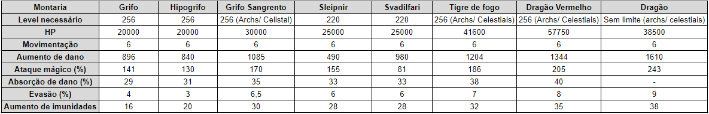

-> Essas informações estão relacionadas com as montarias no level 120.
-> Os ovos de Grifo Sangrendo, podem apenas ser equipados em personagens Celestiais.

Existem algumas etapas antes de poder montar no seu animal. São elas:**Ovo:** Toda montaria nasce de um ovo e cada um tem um valor de incubação específico. Para fazer com que a incubação diminua, você precisa equipar o ovo e utilizar uma poeira de ori. Se houver sucesso no procedimento, o ovo ganha uma refinação e o tempo de espera para a próxima incubação (pode haver falha na composição). O Objetivo é fazer que o ovo tenha o número de refinações igual ao de incubações, assim a cria nasce do ovo. Para acelerar o processo, é possível adquirir o acelerador de nascimento (hatch accelerator) na NP Store (cada unidade, reduz uma incubação do ovo sem tempo de espera).

**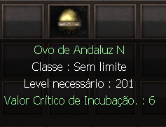

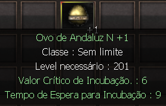**

**Cria:** As crias se tornam companheiras na jornada e precisam abater as criaturas para adquirir experiência. Quando obtém o level máximo, se tornam montarias. Para acelerar o processo, é possível adquirir o catalisador específico de cada cria na NP Store e a cria se torna montaria rapidamente.

**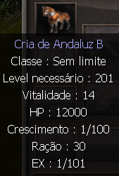**

**Montaria:** Nessa etapa é possível montá-la e receber os atributos específicos.

**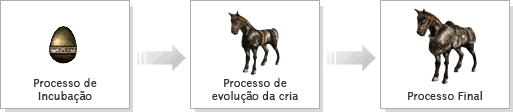**

**Amagos**

Os amagos são itens usado para aumentar o level da montaria. Cada sucesso na refinação atribui um crescimento dos adicionais, porém, a taxa de sucesso vai diminuindo de acordo com o level atingido. Ao atingir o level 120, a montaria permanece bloqueada e para realizar o desbloqueio.

As montarias podem atingir o level máximo de 180 e para evoluir sua montaria após o level 120, basta realizar os desbloqueios nos níveis 120 e 140 e 160. Confira abaixo os itens requeridos.

[01] Montaria level 120 OU 140 0u 160
[100] Âmagos da respectiva montaria
[01] Alma do Unicórnio
[01] Alma da Fênix

-> Em caso de sucesso, todos os itens serão destruídos e a montaria terá o nível desbloqueado.
-> Em caso de falha, todos os itens serão destruídos(menos a montaria).
-> Após o level 120, além do bônus nos atributos padrões, a montaria também receberá novos adicionais de dano/defesa PvP que aumentarão de acordo com o level da montaria.

Alguns amagos são parecidos, então preste atenção no nome do item antes de obtê-lo. Essas são algumas classes de amagos encontrados no jogo.

**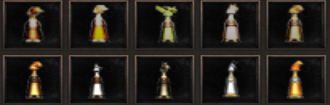**

**Vitalidade**

Toda montaria tem um número de vidas e uma barra de HP. No icone na montaria, estão apresentados como Vitalidade e Ração.

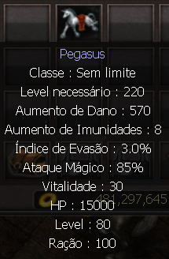

Caso sua montaria morra, leve-a ao “MountMaster” e ela será ressuscitada por 1 milhão de gold. A montaria pode perder de 1 a 3 vidas aleatoriamente (caso queira restaurar as vidas perdidas, compre o restaurador da montaria específica na NP Store para recuperar de 1 a 3 vidas).
Para que isso não aconteça compre a ração específica no “MountCaptor”.

**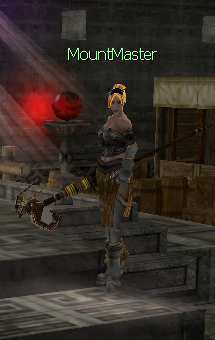

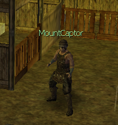**

**LEMBRE-SE: As montarias podem morrer de fome até mesmo fora de combate. Alimente-a frequentemente!**

This article was helpful for 34 people. Is this article helpful for you?

 Yes, helpful
 No, not for me

Why this article is not helpful?

Cancelar
Gravar

* Comentários 0
* Antigos primeiro
  + Mais recentes primeiro
  + Antigos primeiro

Ver mais

[Desenvolvido](https://userecho.com?pcode=pwbue_label_asgard&utm_source=pblv5&utm_medium=cportal&utm_campaign=pbue) por UserEcho

### Partilhar

### Article stats

* 6 anos atrás
   Criado
* 2 anos atrás
   Atualizado
* 34
   Helpful
* 46.327
   Visualizações

