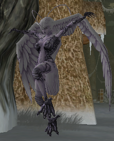
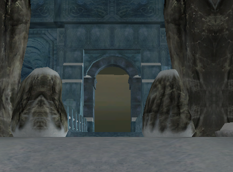
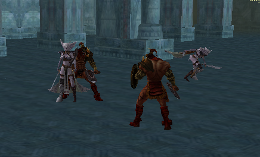
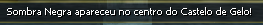
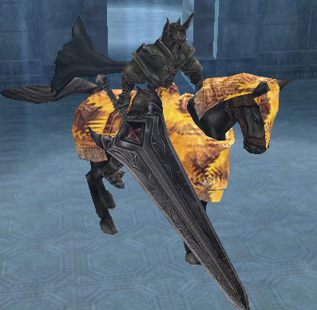
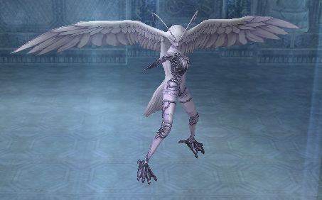

[WYD Raid Hut](/)

* PT-BR
  + [English (EN)](/en/knowledge-bases/21/articles/25266-quest-rainha-valquiria)
  + [Português (Brasil) (PT-BR)](/pt-br/knowledge-bases/21/articles/25266-quest-rainha-valquiria)
* Entrar / Registrar

* PT-BR
  + [English (EN)](/en/knowledge-bases/21/articles/25266-quest-rainha-valquiria)
  + [Português (Brasil) (PT-BR)](/pt-br/knowledge-bases/21/articles/25266-quest-rainha-valquiria)
* Entrar / Registrar

1. [FAQ WYD Global](/pt-br/knowledge-bases/21-faq-wyd-global)
2. [Guias do Jogo (PT-BR)](/pt-br/knowledge-bases/21-faq-wyd-global/categories/19-guias-do-jogo-pt-br/articles)
3. Artigos

# [Quest Rainha Valquíria](/pt-br/knowledge-bases/21/articles/25266-quest-rainha-valquiria)

**Quest Rainha Valquíria**

A quest Rainha Valquíria é dividida em quatro etapas com duração total de 15 minutos. Exclusivo para Celestial e só pode ser feita em grupo.

A 1ª parte da quest tem um simples objetivo, encontrar a IceQueen Mirror e matá-la. A Ice Queen se encontra por todo o território de Nipleheim.

Após matar a Ice Queen irá liberar a 2ª parte da quest e dará início a quest, ou seja, a partir desse momento o grupo terá 15 minutos para concluir toda a quest.

A 2ª parte da quest ocorre dentro do Castelo do Gelo e tem como objetivo matar todos os monstros que foram sumonados com a morte da Ice Queen, para assim liberar a 3ª parte da quest.

Um total de 29 monstros ( 9 Berserker Titan, 5 Berserker Ref, 6 Valkyria tina, 5 Valkyria Rosen, 4 Verid).

Ao matar todos os monstros uma mensagem irá aparecer para todos do grupo.

A 3ª parte da quest tem como objetivo matar o temido Sombra Negra que estará localizado no centro do mapa, para então ser sumonado para a última parte.

A 4ª e última parte é eliminar a Ice Queen Verid que estará localizada na segunda sala do mapa.

O drop da IceQueenVerid é 100% “Coração do Beriel” e um dos itens a seguir: [01] Alma do Beriel, [01] Refinação Abençoada +1, [01] Emblema da Proteção, [01] Barra de prata(50kk).

O tempo de duração da quest é de 15 minutos após a morte da IceQueen Mirror.

This article was helpful for 14 people. Is this article helpful for you?

 Yes, helpful
 No, not for me

Why this article is not helpful?

Cancelar
Gravar

* Comentários 0
* Antigos primeiro
  + Mais recentes primeiro
  + Antigos primeiro

Ver mais

[Desenvolvido](https://userecho.com?pcode=pwbue_label_asgard&utm_source=pblv5&utm_medium=cportal&utm_campaign=pbue) por UserEcho

### Partilhar

### Article stats

* 6 anos atrás
   Criado
* 3 anos atrás
   Atualizado
* 14
   Helpful
* 9.037
   Visualizações

