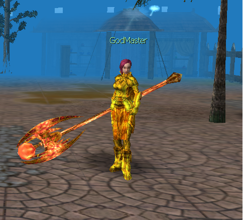
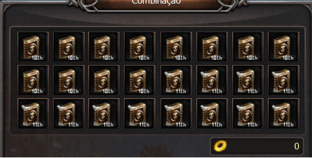

[WYD Raid Hut](/)

* PT-BR
  + [English (EN)](/en/knowledge-bases/21/articles/48529-npc-godmaster)
  + [Português (Brasil) (PT-BR)](/pt-br/knowledge-bases/21/articles/48529-npc-godmaster)
* Entrar / Registrar

* PT-BR
  + [English (EN)](/en/knowledge-bases/21/articles/48529-npc-godmaster)
  + [Português (Brasil) (PT-BR)](/pt-br/knowledge-bases/21/articles/48529-npc-godmaster)
* Entrar / Registrar

1. [FAQ WYD Global](/pt-br/knowledge-bases/21-faq-wyd-global)
2. [Guias do Jogo (PT-BR)](/pt-br/knowledge-bases/21-faq-wyd-global/categories/19-guias-do-jogo-pt-br/articles)
3. Artigos

# [NPC GodMaster](/pt-br/knowledge-bases/21/articles/48529-npc-godmaster)

O NPC GodMaster fica localizado na cidade de Armia (X: 2126 Y: 2123) e tem como principal objetivo principal negociar livros de skill com os jogadores interessados em aprimorar seus personagens.

Ao clicar no livro desejado, será informado os itens necessários para obtenção dos mesmos. Por exemplo:

* Para obter a 10ª Skill:

* Para obter a 11ª Skill:

****

**ATENÇÂO:**

1. **Cada livro pertence a uma classe específica, então preste atenção na skill que está sendo adquirida para não ter problemas com a compra.**
2. **Todos os livros são imóveis, ou seja, uma vez adquiridos não podem ser transferidos para outra conta.**
3. **A equipe não se responsabiliza por compras erradas. Depois de adquiridos a ação não poderá ser desfeita.**

This article was helpful for 4 people. Is this article helpful for you?

 Yes, helpful
 No, not for me

Why this article is not helpful?

Cancelar
Gravar

* Comentários 0
* Antigos primeiro
  + Mais recentes primeiro
  + Antigos primeiro

[Desenvolvido](https://userecho.com?pcode=pwbue_label_asgard&utm_source=pblv5&utm_medium=cportal&utm_campaign=pbue) por UserEcho

### Partilhar

### Article stats

* 4 anos atrás
   Criado
* 4 anos atrás
   Atualizado
* 4
   Helpful
* 2.354
   Visualizações

