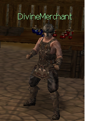
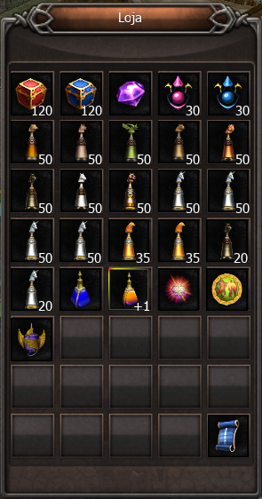

[WYD Raid Hut](/)

* PT-BR
  + [English (EN)](/en/knowledge-bases/21/articles/48532-npc-divinemerchant-victory-coupom)
  + [Português (Brasil) (PT-BR)](/pt-br/knowledge-bases/21/articles/48532-npc-divinemerchant-victory-coupom)
* Entrar / Registrar

* PT-BR
  + [English (EN)](/en/knowledge-bases/21/articles/48532-npc-divinemerchant-victory-coupom)
  + [Português (Brasil) (PT-BR)](/pt-br/knowledge-bases/21/articles/48532-npc-divinemerchant-victory-coupom)
* Entrar / Registrar

1. [FAQ WYD Global](/pt-br/knowledge-bases/21-faq-wyd-global)
2. [Guias do Jogo (PT-BR)](/pt-br/knowledge-bases/21-faq-wyd-global/categories/19-guias-do-jogo-pt-br/articles)
3. Artigos

# [NPC DivineMerchant (Victory Coupom)](/pt-br/knowledge-bases/21/articles/48532-npc-divinemerchant-victory-coupom)

O DivineMerchant é um NPC importante localizado na cidade de Armia (X:2143 Y: 2087) que ajuda na evolução dos jogadores.

Nele você encontra vários itens que podem ser adquiridos através dos Cupons encontrados nas LANs N, M e A. Esses itens são:

**IMPORTANTE!**

* **Todos os itens são Imóveis e por isso não pode ser transferido para outra conta.**
* **O item PEDRA DA IMORTALIDADE encontrado nesse NPC pode apenas ser utilizado na criação do Arch. Por ser imóvel não será útil em outras progressões ou composições no jogo com criação da PEDRA****IDEAL.**
* **Agora também será possível adquirir os âmagos das montarias Grifo, Hipogrifo, Svadilfari e Sleipnir.**
* **Agora será possível adquirir o item **“Pedra Ideal(Limitada)”** imóvel pelo preço de 50 Victory Coupons. A Pedra Ideal(Limitada) apenas pode ser utilizada para criar personagens Celestiais.**

This article was helpful for 4 people. Is this article helpful for you?

 Yes, helpful
 No, not for me

Why this article is not helpful?

Cancelar
Gravar

* Comentários 0
* Antigos primeiro
  + Mais recentes primeiro
  + Antigos primeiro

Ver mais

[Desenvolvido](https://userecho.com?pcode=pwbue_label_asgard&utm_source=pblv5&utm_medium=cportal&utm_campaign=pbue) por UserEcho

### Partilhar

### Article stats

* 4 anos atrás
   Criado
* 3 anos atrás
   Atualizado
* 4
   Helpful
* 3.389
   Visualizações

