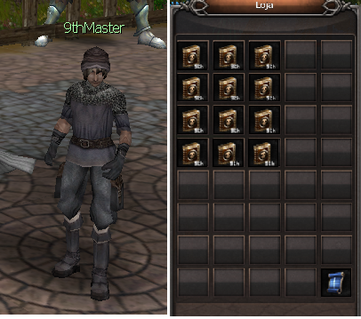

[WYD Raid Hut](/)

* PT-BR
  + [English (EN)](/en/knowledge-bases/21/articles/48534-npc-9th-master)
  + [Português (Brasil) (PT-BR)](/pt-br/knowledge-bases/21/articles/48534-npc-9th-master)
* Entrar / Registrar

* PT-BR
  + [English (EN)](/en/knowledge-bases/21/articles/48534-npc-9th-master)
  + [Português (Brasil) (PT-BR)](/pt-br/knowledge-bases/21/articles/48534-npc-9th-master)
* Entrar / Registrar

1. [FAQ WYD Global](/pt-br/knowledge-bases/21-faq-wyd-global)
2. [Guias do Jogo (PT-BR)](/pt-br/knowledge-bases/21-faq-wyd-global/categories/19-guias-do-jogo-pt-br/articles)
3. Artigos

# [NPC 9th Master](/pt-br/knowledge-bases/21/articles/48534-npc-9th-master)

Esse NPC é responsável pela entrega na nona skill da classe desejada. Ele fica localizado em Armia (X:2136 Y:2115) próximo a saída para o campo de Armia,

**ATENÇÂO:**

1. **Cada livro pertence a uma classe específica, então preste atenção na skill que está sendo adquirida para não ter problemas com a compra.**
2. **Todos os livros são imóveis, ou seja, uma vez adquiridos não podem ser transferidos para outra conta.**
3. **A equipe não se responsabiliza por compras erradas. Depois de adquiridos a ação não poderá ser desfeita.**

This article was helpful for 2 people. Is this article helpful for you?

 Yes, helpful
 No, not for me

Why this article is not helpful?

Cancelar
Gravar

* Comentários 0
* Antigos primeiro
  + Mais recentes primeiro
  + Antigos primeiro

[Desenvolvido](https://userecho.com?pcode=pwbue_label_asgard&utm_source=pblv5&utm_medium=cportal&utm_campaign=pbue) por UserEcho

### Partilhar

### Article stats

* 4 anos atrás
   Criado
* 2
   Helpful
* 1.580
   Visualizações

