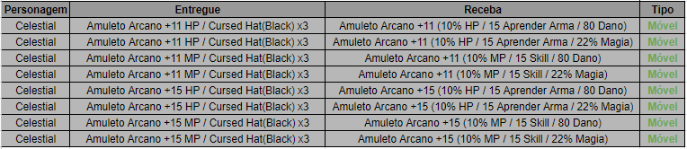

[WYD Raid Hut](/)

* PT-BR
  + [English (EN)](/en/knowledge-bases/21/articles/48732-npc-jazeg)
  + [Português (Brasil) (PT-BR)](/pt-br/knowledge-bases/21/articles/48732-npc-jazeg)
* Entrar / Registrar

* PT-BR
  + [English (EN)](/en/knowledge-bases/21/articles/48732-npc-jazeg)
  + [Português (Brasil) (PT-BR)](/pt-br/knowledge-bases/21/articles/48732-npc-jazeg)
* Entrar / Registrar

1. [FAQ WYD Global](/pt-br/knowledge-bases/21-faq-wyd-global)
2. [Guias do Jogo (PT-BR)](/pt-br/knowledge-bases/21-faq-wyd-global/categories/19-guias-do-jogo-pt-br/articles)
3. Artigos

# [NPC Jazeg](/pt-br/knowledge-bases/21/articles/48732-npc-jazeg)

Adicionado o NPC Jazeg(2117 2081) onde será possível alterar o adicional nos itens “Amuleto Arcano (HP)” e “Amuleto Arcano(MP)” que possuírem a refinação +11 ou +15.

-> Não existe chance de falha na composição.

-> Qualquer problema envolvendo o NPC informado, basta nos informar!

This article was helpful for 2 people. Is this article helpful for you?

 Yes, helpful
 No, not for me

Why this article is not helpful?

Cancelar
Gravar

* Comentários 0
* Antigos primeiro
  + Mais recentes primeiro
  + Antigos primeiro

[Desenvolvido](https://userecho.com?pcode=pwbue_label_asgard&utm_source=pblv5&utm_medium=cportal&utm_campaign=pbue) por UserEcho

### Partilhar

### Article stats

* 4 anos atrás
   Criado
* 4 anos atrás
   Atualizado
* 2
   Helpful
* 2.131
   Visualizações

