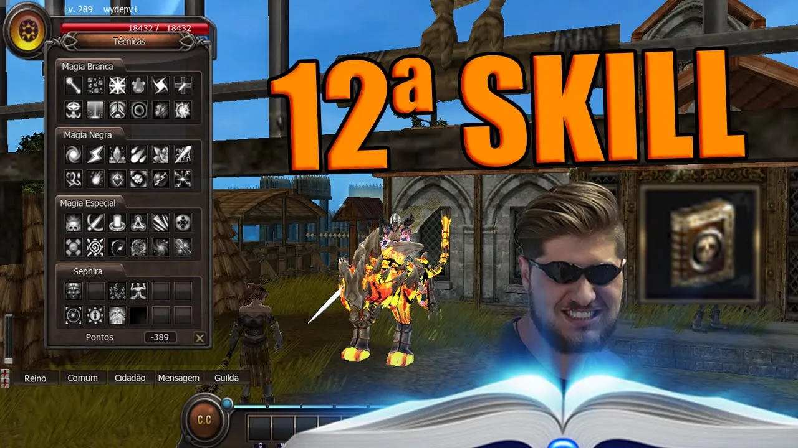

[WYD Raid Hut](/)

* PT-BR
  + [English (EN)](/en/knowledge-bases/21/articles/50022-12th-skills)
  + [Português (Brasil) (PT-BR)](/pt-br/knowledge-bases/21/articles/50022-12th-skills)
* Entrar / Registrar

* PT-BR
  + [English (EN)](/en/knowledge-bases/21/articles/50022-12th-skills)
  + [Português (Brasil) (PT-BR)](/pt-br/knowledge-bases/21/articles/50022-12th-skills)
* Entrar / Registrar

1. [FAQ WYD Global](/pt-br/knowledge-bases/21-faq-wyd-global)
2. [Guias do Jogo (PT-BR)](/pt-br/knowledge-bases/21-faq-wyd-global/categories/19-guias-do-jogo-pt-br/articles)
3. Artigos

# [12th skills](/pt-br/knowledge-bases/21/articles/50022-12th-skills)

**As 12º skills foram adicionadas ao jogo e poderão ser aprendidas por personagens celestiais acima do level 320.
-> O personagem precisa aprender a 11º skill da mesma linhagem antes de aprender a 12º skill.
-> Existe o custo de 12.000 pontos de fame para aprender a 12º skill. Inicialmente esse custo será reduzido para 1.200 para facilitar os testes das novas skills.
-> As skills poderão ser adquiridas no NPC “Jazeg” localizado na cidade de Armia.**

**---**

**TransKnight**

**Confiança**

**Clod Attack** **(Passiva)** - Ao acertar a skill Destino, há uma probabilidade de reduzir a evasão do oponente em 10% por 64 segundos.

**Trans**

**WindStorm (Passiva)** - Elimina a penalidade de redução de HP e maximiza o ataque ao buffar a skill Assalto.

**Espada Mágica**

**Seal Master (Passiva)** - Aprimora a lentidão após congelar o inimigo com a skill Tempestade de Gelo.

---

**Foema**

**Magia Branca**

**Holy Power (Passiva)** - Dobra a duração do debuff causado pela skill Flash (-10% de Evasão por 64 segundos).

**Magia Negra**

**Thunder Lising (Passiva)** - O poder de ataque mágico é aumentado em 5%.

**Magia Especial**

**Another Change (Ativa)** - Substitui seu HP em MP e recupera 2000 de HP por segundo.

---

**Beast Master**

**Elemental:
Manaburn Master (Passiva)** - Aumenta a queima de mana da skill Chamas Etéreas.

**Evocação:**

**Ice Armor (Passiva)** - Aumenta a defesa do personagem. Ao ser infligido com um ataque, o atacante pode receber uma redução de movimento de 128 segundos (Lentidão).

**Natureza:**

**Last Resistance (Ativa)** - Aumenta por 32 segundos o HP e defesa do personagem

---

**Huntress**

**Sobrevivência**

**Freezing (Passiva)** - Aumenta a precisão em 15% se a skill Encantar Gelo estiver ativa.

**Troca**

**Reinforce Soul (Passiva)** - Aumenta em 20% o bônus da skill Limite da Alma. Caso a soul esteja configurada em dois atributos, aumenta 20% em cada um.

**Captura**

**Ambush (Passiva)** - A skill Lâmina das Sombras causa 128 segundos de lentidão no inimigo, mesmo tirando miss, reduzindo seu movimento para 1.

---

Entenda um pouco sobre o funcionamento das skills assistindo o vídeo abaixo!

#FAFÃOGameplays

This article was helpful for 8 people. Is this article helpful for you?

 Yes, helpful
 No, not for me

Why this article is not helpful?

Cancelar
Gravar

* Comentários 0
* Antigos primeiro
  + Mais recentes primeiro
  + Antigos primeiro

[Desenvolvido](https://userecho.com?pcode=pwbue_label_asgard&utm_source=pblv5&utm_medium=cportal&utm_campaign=pbue) por UserEcho

### Partilhar

### Article stats

* 4 anos atrás
   Criado
* 4 anos atrás
   Atualizado
* 8
   Helpful
* 12.421
   Visualizações

