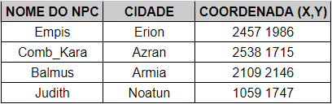

[WYD Raid Hut](/)

* PT-BR
  + [English (EN)](/en/knowledge-bases/21/articles/57606-guia-guild)
  + [Português (Brasil) (PT-BR)](/pt-br/knowledge-bases/21/articles/57606-guia-guild)
* Entrar / Registrar

* PT-BR
  + [English (EN)](/en/knowledge-bases/21/articles/57606-guia-guild)
  + [Português (Brasil) (PT-BR)](/pt-br/knowledge-bases/21/articles/57606-guia-guild)
* Entrar / Registrar

1. [FAQ WYD Global](/pt-br/knowledge-bases/21-faq-wyd-global)
2. [Guias do Jogo (PT-BR)](/pt-br/knowledge-bases/21-faq-wyd-global/categories/19-guias-do-jogo-pt-br/articles)
3. Artigos

# [Guia: Guild](/pt-br/knowledge-bases/21/articles/57606-guia-guild)

Se você chegou até aqui, já deve fazer parte de alguma Guild do servidor. As guilds são equipes criadas entre jogadores cujo os objetivos são: fortalecer o seu reino e os personagens, através de guerras e missões realizadas no servidor. Para entender como funciona o sistema de guilds, é preciso conhecer os principais pontos:

**Fame Guild**

Os pontos de fama são atributos recebidos pela Guild através das guerras realizadas no servidor. Essa pontuação tem como principal objetivo realizar apostas nas cidades que gostaria de conquistar através das guerras de cidades.

-> Os pontos de fama também são obtidas através do boss Kefra, que tem respawn fixo no Sábado e do boss SandLich, que nasce 1 vez no servidor novato às 23:30;

-> Os pontos de fama são resetados nas segundas-feiras;

---

**Guerra de Torres**

A Guerra de Torres é uma batalha que ocorre diariamente nos arredores de Erion, com o intuito de adquirir Fame Guild para sua Guild e remover Fame Guild do seu adversário. É uma das principais fontes de fama do jogo, então é muito importante que as guilds participem. Essa Guerra acontece simultaneamente em todos os canais. Os participantes optam por defender a torre da sua Guild ou atacar a torre das guilds adversárias. Ao término da guerra, a (Fame guild atual) + (Fame guild obtida) nunca poderá ser maior do que 200.

Exemplo 1: A “guild A” possuía 199 de fame guild e derrubou uma torre durante a guerra, ela receberá +1 de fame guild.

Exemplo 2: A “guild B” possuía 190 de fame guild e defendeu a torre durante a guerra, ela receberá 10 de fame guild.

Exemplo 3: A “guild C” possuía 100 de fame guild e derrubou uma torre durante a guerra, ela receberá +100 de fame guild.

-> As guerras ocorrem de segunda a sexta, das 21:00 às 21:30 horas;

-> As guerras estão ativadas em todos os canais;

-> Todos os personagens podem participar, sem exceção;

---

**Guerra de Cidades**

Para que ocorra uma guerra entre cidades, uma guild desafiante deve "apostar" na cidade que deseja ganhar. Para realizar a aposta, a guild precisa obter no mínimo 100 pontos de fama. Caso duas guilds apostem, quem tiver mais fame guild será a desafiante. A guild vencedora ganha a cidade e deve defender a cidade na próxima semana.

-> As apostas são feitas aos sábados no NPC encontrado na cidade que a guild gostaria de conquistar.

-> As guerras ocorrem todo domingo, das 20:00 às 20:30 horas;

---

**Guerra de Noatun**

A maior e mais importante guerra para uma guild. A guild que domina a coroa é a única que pode coletar o gold arrecadado no castelo de Noatun. Ela ocorre de 15 em 15 dias, para se ganhar a guerra, o líder da guild deve ocupar (ficar em cima) do altar de Thor por mais tempo que o líder da guild adversária, obtendo mais pontos. Um aviso com a pontuação de cada guild será mostrado de 5 em 5 minutos.

-> As guerras de Noatun ocorrem todo domingo, das 21:00 às 22:00 horas;

-> A guerra de noatun ocorre caso em um mesmo servidor 2 guilds diferentes possuam cidades.

-> Agora a guild que possuir o castelo de Noatun receberá +200 de fame guild na segunda-feira;

---

**Guild Influence**

A “guild Influence” é uma pontuação que pode ser obtida por todos os membros da guild ao realizarem atividades diariamente dentro do jogo, fazendo assim com que os membros sejam uma peça chave para garantir a manutenção dos territórios, realizar apostas e aumentar a arrecadação da guild.

> Todas as guilds que desejarem realizar uma aposta no sábado ou manter seus territórios no domingo, deverão possuir um saldo de guild Influence superior a 400;

-> A taxa de conversão de guild Influence para guild Coins será alterada para 5% por cada território que a guild possuir;

-> Quando um líder de guild realizar o resgate de guild coins em algum NPC de aposta no domingo, ele receberá automaticamente as guild coins referentes a todos os seus territórios com um clique;

-> Os pontos de guild influence são resetados nas segundas-feiras;

A “guild influence” poderá ser obtida por qualquer membro da guild ao realizar atividades dentro do jogo. Inicialmente as atividades qualificadas para receber guild influence são:

**Arena Real:** A cada rodada da Arena Real, todas as guilds que possuírem pelo menos 1 membro no grupo vencedor, receberão “guild influence”.

-> Possuir mais membros no grupo vencedor não irá influenciar na quantidade de “Guild Influence” obtida.

**IceQueenVerid:** Quando o boss “IceQueenVerid” for derrotado, a guild receberá uma quantidade fixa de “Guild Influence” por cada membro da guild que estiver no grupo que realizou a derrota do boss.

-> Quanto mais membros da guild no grupo, mais “guild influence” será obtida pela guild.

**SandLich:** Quando o boss “SandLich” for derrotado, a guild de todos os jogadores que estiverem próximos do boss receberão uma quantidade fixa de “guild influence”.

-> Os jogadores não precisam estar no grupo do jogador que realizou o KS para receber a “guild influence”.

**Zona LAN A:** Ao derrotar monstros na Zona LAN M e A, haverá uma probabilidade de obter “guild influence”.

Caçador de Espólios: Ao realizar a quest “Caçador de Espólios”, haverá uma probabilidade de obter uma quantidade fixa de “guild influence” ao converter espólios em Rubis.

Sistema Apostas

Para realizar uma aposta (guerra de cidades) no sábado, a guild desafiante também precisará possuir no mínimo 400 pontos de “guild influence", mas essa pontuação não será removida.

---

**Manutenção de Cidade**

Logo após o término das apostas realizadas no sábado, caso a guild dona de algum território não possua a quantidade mínima de 400 pontos de “guild influence” necessária para "manutenção" daquele território, ele será perdido imediatamente e a guild desafiante daquela cidade será a nova dona do território.

-> Caso não existam guilds desafiantes, a cidade ficará sem dono.

-> Cada território terá um custo diferente de “guild influence” para manutenção.

-> Não haverá dedução de “guild influence” para manutenção.

---

**Sistema de Recompensas**

A guild poderá arrecadar “guild coins” a depender da quantidade de “guild influence” acumulado pela guild no decorrer da semana. Para isso ocorrer, caso a guild possua a quantidade mínima para manutenção dos seus territórios, após o término das apostas no sábado, uma porcentagem da “guild influence” da guild será convertida em “guild coins”.

-> Cada território contará com um fator próprio de conversão de “guild influence” em “guild coins”. Exemplo: Uma guild dona de Armia teria 15% da GI convertida em GC, já uma guild com Erion teria 5% da GI convertida em GC.

-> Esse valor será convertido e estará disponível para resgate pelo líder da guild ao término da guerra de cidades, assim como ocorria com a arrecadação de ouro no sistema antigo. Dessa forma, caso o território seja perdido em uma guerra, a guild vencedora poderá resgatar as guild coins daquele território.

-> Caso a guild possua mais de um território, as “guild coins” poderão ser resgatadas em cada um deles seguindo o fator de conversão de cada território.

-> Após a conversão de “guild influence” em “guild coin”, toda “guild influence” é zerada.

-> O imposto ainda é cobrado por NPCs e auto vendas mas o valor arrecadado é removido do jogo.

---

**Sobre a Guild Shop**

A moeda “guild coin” é entregue em formato de um item que pode ser utilizado para comprar itens no NPC “guild shop”. O “guild shop” conta com itens consumíveis importantes para manutenção da guild e até equipamentos exclusivos.

Confira abaixo a lista de itens que podem ser adquiridos na guild shop utilizando as Guild Coins:

* Refinação Abençoada +9
* Essência dos Deuses +0
* Essência dos Deuses +6
* Poeira de Lac 100
* Pedra Lunar
* Jóia da Escuridão
* Barra de Prata (1bi)
* Alma do Beriel
* Coração do Beriel
* Books Sephira
* Poção Divina (7 dias)
* Poção Territorial (24 horas)
* Kingdom Amulet +0 por cada território que possuírem.

-> Todas as Guild Coins do jogo são apagadas durante a manutenção semanal. Dessa forma, todas as Guild Coins devem ser utilizadas na Guild Shop antes da manutenção de quinta-feira ou serão deletadas.

-> Apenas os líderes de guild podem transferir as “guild coins”;

-> Todos os itens são imóveis;

-> Caso o jogador saia da guild as guild coins serão apagadas automaticamente;

**Poção Territorial:** Uma poderosa poção capaz de aprimorar diversos atributos do guerreiro que for capaz de conquistá-la.

**Efeitos da Poção:**

+5% HP

+2% ganho de EXP

+20% chance de drop

+4.000 de dano PvE

-> O efeito da poção dura 24 horas. O tempo corre mesmo com o jogador deslogado;

-> Atualmente, o efeito da poção é cancelado caso o item “Pedra Misteriosa” seja utilizado;

-> As bonificações da poção são aplicadas apenas no canal em que a guild possuir pelo menos um território

**Kingdom Amulet:** Um artefato forjado pelo ferreiro real mais habilidoso de Kersef. Conta com atributos únicos e uma capacidade ímpar de aprimoramento.

**Atributos do item:**

+10% HP

+10% MP

+15 Aprender Arma

+15 Aprendizagem de Skill

-> O amuleto pode ser refinado no NPC Kings Forge (2108 2112) ao custo de [01] Guild Coin. Há chance de falha, mas não existe chance de quebra ou perda de refinação.

-> O amuleto pode receber um adicional aleatório no NPC King Jeweler (2092 2119) ao custo de [02] Guild Coin.

Obs 1: Os itens disponíveis na Guild Shop e seus respectivos preços podem sofrer mudanças/balanceamentos a qualquer momento.

Obs 2: A Guild Shop pode ser acessada nos NPCs localizados dentro das zonas de guild ou em Noatun (1054 1714).

Obs 3: Todos os itens adquiridos na Guild Shop são imóveis e não podem ser transferidos para o Guarda Carga.

-> O item “Kingdom Amulet” possui como adicional base +10% HP/MP, +15 “aprender arma'' e +15 “aprendizado de skill”. O item também pode ser refinado e ter seu adicional aleatorizado em uma quest utilizando guild coins.

-> Todos os itens são imóveis e não podem ser transferidos para o Guarda Carga.

This article was helpful for 5 people. Is this article helpful for you?

 Yes, helpful
 No, not for me

Why this article is not helpful?

Cancelar
Gravar

* Comentários 0
* Antigos primeiro
  + Mais recentes primeiro
  + Antigos primeiro

[Desenvolvido](https://userecho.com?pcode=pwbue_label_asgard&utm_source=pblv5&utm_medium=cportal&utm_campaign=pbue) por UserEcho

### Partilhar

### Article stats

* 3 anos atrás
   Criado
* 2 anos atrás
   Atualizado
* 5
   Helpful
* 4.691
   Visualizações

