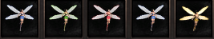

[WYD Raid Hut](/)

* PT-BR
  + [English (EN)](/en/knowledge-bases/21/articles/58182-guia-fadas)
  + [Português (Brasil) (PT-BR)](/pt-br/knowledge-bases/21/articles/58182-guia-fadas)
* Entrar / Registrar

* PT-BR
  + [English (EN)](/en/knowledge-bases/21/articles/58182-guia-fadas)
  + [Português (Brasil) (PT-BR)](/pt-br/knowledge-bases/21/articles/58182-guia-fadas)
* Entrar / Registrar

1. [FAQ WYD Global](/pt-br/knowledge-bases/21-faq-wyd-global)
2. [Guias do Jogo (PT-BR)](/pt-br/knowledge-bases/21-faq-wyd-global/categories/19-guias-do-jogo-pt-br/articles)
3. Artigos

# [GUIA: Fadas](/pt-br/knowledge-bases/21/articles/58182-guia-fadas)

As fadas são itens de apoio aos personagens e tem como objetivo melhorar e facilitar os itens dropados a partir dos MOBs. Atualmente existem 5 fadas no servidor, são elas:

Fada azul, verde, vermelha, prateada e dourada.

**Fada azul**

Pode ser encontrada através da loja do jogo (Prisang Nell) ou negociada por jogadores no servidor. Possui 3 dias de duração após ser equipada e custa 80 NPs. Essa fada aumenta a porcentagem de drop em 32%.

**Fada verde**

Encontrada na Prisang Nell por 120 NPs ou através de negociações entre jogadores. Essa fada aumenta a experiência do personagem em 16%. Possui 3 dias de duração após ser equipada.

**Fada vermelha**

Ela custa 200 Nps na Prisang Nell, mas também pode ser negociada entre jogadores no servidor. Ela aumenta em 16% a experiência do personagem e 32% de chance de drop. Possui 3 dias de duração após ser equipada.

**Fada prateada**

Para obtê-la, é preciso possuir a fada vermelha e o item “Flash prateado”, encontrado no NPC Farche em Erion pelo valor de 2kk em gold.

Basta equipar a fada vermelha e utilizar o flash para transformá-la em prateada. Essa fada possui os mesmos atributos da fada vermelha (32% drop/ 16% XP), porém, vende automaticamente os itens não agrupáveis, dropados por MOBs ao serem abatidos. Essa fada também agrupa automaticamente os itens agrupáveis em seu inventário.

**Fada Dourada**

Para criar essa fada, é preciso ir até Niflheim (cidade do gelo) e comprar o item “Flash dourado” no NPC Mai por 12kk em gold. Equipe a fada, utilize o flash e você irá obter a fada dourada. Essa fada aumenta em 18% a taxa de experiência e 50% de drop e possui a mesma funcionalidade da fada vermelha.

**Obs: As fadas douradas e prateadas excluem todos os itens não agrupáveis com exceção das Pedras da Luz.**

This article was helpful for 13 people. Is this article helpful for you?

 Yes, helpful
 No, not for me

Why this article is not helpful?

Cancelar
Gravar

* Comentários 0
* Antigos primeiro
  + Mais recentes primeiro
  + Antigos primeiro

Ver mais

[Desenvolvido](https://userecho.com?pcode=pwbue_label_asgard&utm_source=pblv5&utm_medium=cportal&utm_campaign=pbue) por UserEcho

### Partilhar

### Article stats

* 3 anos atrás
   Criado
* 3 anos atrás
   Atualizado
* 13
   Helpful
* 7.955
   Visualizações

