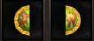

[WYD Raid Hut](/)

* PT-BR
  + [English (EN)](/en/knowledge-bases/21/articles/58184-guia-fragmentos-da-alma)
  + [Português (Brasil) (PT-BR)](/pt-br/knowledge-bases/21/articles/58184-guia-fragmentos-da-alma)
* Entrar / Registrar

* PT-BR
  + [English (EN)](/en/knowledge-bases/21/articles/58184-guia-fragmentos-da-alma)
  + [Português (Brasil) (PT-BR)](/pt-br/knowledge-bases/21/articles/58184-guia-fragmentos-da-alma)
* Entrar / Registrar

1. [FAQ WYD Global](/pt-br/knowledge-bases/21-faq-wyd-global)
2. [Guias do Jogo (PT-BR)](/pt-br/knowledge-bases/21-faq-wyd-global/categories/19-guias-do-jogo-pt-br/articles)
3. Artigos

# [GUIA: Fragmentos da Alma](/pt-br/knowledge-bases/21/articles/58184-guia-fragmentos-da-alma)

Os Fragmentos da alma são itens utilizados para compor as Almas da Fênix e do Unicórnio, responsáveis pela criação da pedra da imortalidade (itens importantes para a evolução dos personagens Arch, Celestial e Sub Celestial).

Leve 12 unidades do fragmento da alma até o NPC Alchemy Annie localizado em Azram (X: 2511 Y:1729).

Após realizar esse procedimento, o NPC lhe entregará aleatoriamente uma das 2 almas: Unicórnio ou Fenix.

Os fragmentos da Alma podem ser encontrados no:

* Deserto: MOB RujeperBroken
* Kefra: MOBS LichVatama e LichCrunt
* Quest Deserto desconhecido

-> A taxa de drop desses itens são bem baixas, então boa sorte em sua caçada!

This article was helpful for 8 people. Is this article helpful for you?

 Yes, helpful
 No, not for me

Why this article is not helpful?

Cancelar
Gravar

* Comentários 0
* Antigos primeiro
  + Mais recentes primeiro
  + Antigos primeiro

[Desenvolvido](https://userecho.com?pcode=pwbue_label_asgard&utm_source=pblv5&utm_medium=cportal&utm_campaign=pbue) por UserEcho

### Partilhar

### Article stats

* 3 anos atrás
   Criado
* 3 anos atrás
   Atualizado
* 8
   Helpful
* 4.932
   Visualizações

