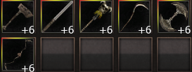
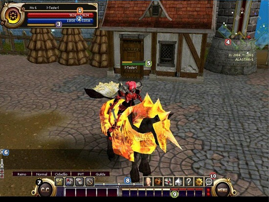
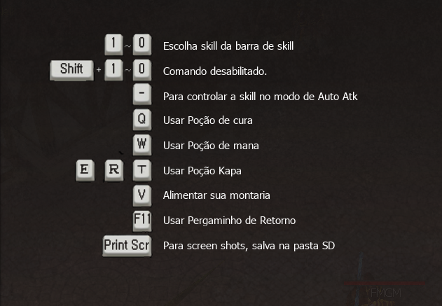
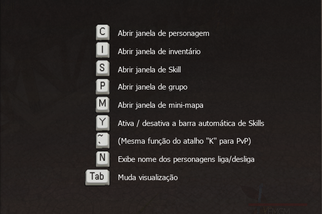
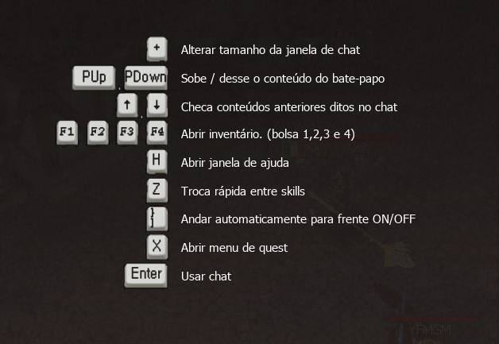

[WYD Raid Hut](/)

* PT-BR
  + [English (EN)](/en/knowledge-bases/21/articles/58185-guia-para-novatos)
  + [Português (Brasil) (PT-BR)](/pt-br/knowledge-bases/21/articles/58185-guia-para-novatos)
* Entrar / Registrar

* PT-BR
  + [English (EN)](/en/knowledge-bases/21/articles/58185-guia-para-novatos)
  + [Português (Brasil) (PT-BR)](/pt-br/knowledge-bases/21/articles/58185-guia-para-novatos)
* Entrar / Registrar

1. [FAQ WYD Global](/pt-br/knowledge-bases/21-faq-wyd-global)
2. [Guias do Jogo (PT-BR)](/pt-br/knowledge-bases/21-faq-wyd-global/categories/19-guias-do-jogo-pt-br/articles)
3. Artigos

# [Guia para novatos](/pt-br/knowledge-bases/21/articles/58185-guia-para-novatos)

Se você é novo no servidor, seja bem vindo ao WYD GLOBAL.

Neste guia, vamos apresentar os princípios básicos do jogo para que você não se perca.

**ESCOLHA O SERVIDOR**

Primeiramente entre no jogo e escolha o canal que desejar, o canal verde é chamado de “canal novato”. Nesse canal é possível abrir lojas para comerciar seus itens e também não existem áreas PVP, ou seja você pode explorar a vontade sem ser assassinado por outro jogador.

---

**PRIMEIRO ACESSO**

Após escolher o servidor você será levado a tela de personagem onde precisará cadastrar uma senha numérica antes de escolher seu personagem. Lembre bem da senha adicionada, pois você precisará dela sempre que for entrar no jogo.

---

**ESCOLHA SUA CLASSE**

Você poderá escolher 1 das 4 classes disponíveis para iniciar sua jornada e são elas:

* **HUNTRES:** Arqueira. Consegue distribuir bastante dano a longa distância, porém o posicionamento é importante ao escolher o personagem.
* **BEAST MASTER:** Evocador. Capaz de sumonar e se transformar em criaturas poderosas.
* **FOEMA:** Feiticeira. Esse personagem pode lançar poderosas magias capazes de atingir várias criaturas de uma só vez.
* **TRANS KNIGHT:** Guerreiro. Um corajoso cavaleiro perito em ataques a curta distância que consegue bloquear bastante dano.

->Todos os personagens possuem build alternativas de skills e equipamentos. Vai de acordo com o gosto e ajogabilidade do jogador.

---

**QUEST INICIAL**

Escolheu seu personagem? Então vamos ao jogo!

1 - Você será teleportado para o CAMPO DE TREINO, primeira quest do jogo. Fale com o **Unicornio** e escolha gratuitamente uma de suas armas iniciais.

2 - Fale com o NPC CabuncleWyd, Ele lhe presenteará com algumas magias que lhe tornarão mais forte temporariamente.

3 - Siga o percurso até a conclusão do caminho e abata o chefe Orc até consegui o emblema Orc.

4 - Após realizar o procedimento, volte ao incio da quest e fale com o chefe de treino, ele lhe dará uma recompensa por levar o emblema Orc até ele.

---

**INTERFACE**

Como em todo jogo, a interface é a apresentação inicial que o jogador recebe para melhorar seu primeiro contato e facilitar no desenvolvimento de sua jornada. Abaixo iremos apresentar um pouco dessa interface e outras informações importantes:

1. Barra de HP: O valor do lado esquerdo da barra vermelho é o seu HP atual, o valor do lado direito é o seu HP máximo. A barra é localizada logo acima do personagem e pode ser ativada/desativada (junto ao nome dos personagens da tela) apertando a tecla "N".
2. Barra de MP: O valor do lado esquerdo da barra azul é o seu MP atual, o valor do lado direito é o seu MP máximo. Assim como a barra de HP é localizada logo acima do personagem e pode ser ativada/desativada (junto ao nome dos personagens da tela) apertando a tecla "N".
3. Barra de HP da Montaria: HP máximo é igual a barra amarela completa, a barra de HP da montaria se encontra logo abaixo da barra de MP.
4. Mini Mapa: Permite que você veja a sua localização ou a dos membros do seu grupo. Atalho tecla "M".
5. Indicadores de HP e HP da Montaria: Representação gráfica localizada da quantidade de HP e HP de montaria que o jogador possui no momento. Graças a esta barra o jogador não precisa buscar as informações na barra principal (encontrada no canto esquerdo superior da tela).
6. Janela de Chat: Aperte a tecla "+" para aumentá-la, tecle 'ENTER' para ativar o campo de inserção de texto.
7. Quantidade de poção de HP no inventário: O menu de macro (CC) permite ao jogador escolher a porcentagem de HP/MP com que as poções serão utilizadas automaticamente, além de possibilitar que o personagem entre em modo de combate automático.
8. Barra de Experiência: Mostra experiência necessária até o próximo level.
9. Barra de Skills: (Pode definir 10 skills no total, "1~10" ou "F1~F10" pode ser usado para escolher entre as skills definidas. A skill definida pode ser excluída da barra selecionando-a e apertando a tecla "Del". As skills que funcionam no modo automático de ataque podem ser distinguidos através da barra em laranja acima do ícone da skill, podendo ser controlado de 2~10 skills através da tecla " Y ".
10. Barra de Menu do sistema: Possui vários botões da tela do jogo e opções.

---

**TECLAS DE ATALHO**

Para mais informações sobre a Quest e outras informações básicas [clique aqui](https://www.youtube.com/watch?v=iTco_2mltbc&t=68s) e venha aprender um pouco mais com o Fafão, um dos jogadores de WYD mais conhecidos ao longo dos anos.

Boa sorte!

This article was helpful for 8 people. Is this article helpful for you?

 Yes, helpful
 No, not for me

Why this article is not helpful?

Cancelar
Gravar

* Comentários 0
* Antigos primeiro
  + Mais recentes primeiro
  + Antigos primeiro

[Desenvolvido](https://userecho.com?pcode=pwbue_label_asgard&utm_source=pblv5&utm_medium=cportal&utm_campaign=pbue) por UserEcho

### Partilhar

### Article stats

* 3 anos atrás
   Criado
* 3 anos atrás
   Atualizado
* 8
   Helpful
* 5.775
   Visualizações

