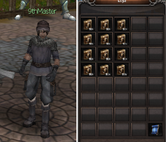
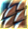
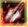
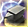
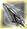
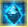
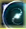

[WYD Raid Hut](/)

* PT-BR
  + [English (EN)](/en/knowledge-bases/21/articles/67187-nona-skill-9th)
  + [Português (Brasil) (PT-BR)](/pt-br/knowledge-bases/21/articles/67187-nona-skill-9th)
* Entrar / Registrar

* PT-BR
  + [English (EN)](/en/knowledge-bases/21/articles/67187-nona-skill-9th)
  + [Português (Brasil) (PT-BR)](/pt-br/knowledge-bases/21/articles/67187-nona-skill-9th)
* Entrar / Registrar

1. [FAQ WYD Global](/pt-br/knowledge-bases/21-faq-wyd-global)
2. [Guias do Jogo (PT-BR)](/pt-br/knowledge-bases/21-faq-wyd-global/categories/19-guias-do-jogo-pt-br/articles)
3. Artigos

# [Nona Skill - (9th)](/pt-br/knowledge-bases/21/articles/67187-nona-skill-9th)

# Nona Skill - 9th

As 9th podem ser aprendidas por todos os personagens e são encontradas no NPC 9thMaster (X:2136 Y:2115), localizado na Cidade de Armia. As skills podem ser adquiridas em troca de ouro (Confirme o valor antes de comprar).

-> Os livros de 9th também podem ser adquiridos através de eventos e promoções, além do mercado entre jogadores.
-> Apenas é possível aprender a 9th da mesma linhagem da 8th.

-> Ao aprender a 9th, o limite máximo de pontos de maestria é aumentado para 320.

-> A 9th pode ser desaprendida utilizado o Círculo Divino Composto.

-> A 9th pode ser aprendida a partir do level 201 em personagens Celestiais / Subcelestiais.

Para cada classe de cada personagem existe uma 9th diferente.

-> São necessários 255 pontos de skill para aprender a habilidade.

#### BeastMaster:

Elemental - Anti-Magia (Buff)

Ao usar essa habilidade, um escudo é criado a sua volta, podendo se esquivar de magias. Quanto mais ponto nesta linhagem, maior será a duração do efeito.

Evocação - Unidade Mental (Passiva)

Ao aprender essa habilidade, suas evocações se tornarão mais poderosas.

Natureza - Concha Resistente (Passiva)

Reduz a chance de receber ataques críticos.

#### TransKnight:

Confiança - Proteção Divina (Buff)

Ao usar essa habilidade, o personagem se tornará invulnerável por certo período e amplificará a cura da skill "Aura de Cura" (10% dos pontos em INT).

Trans - Mãos Sangrentas (Passiva)

Ao usar duas armas de uma mão e acertar um ataque crítico, existe uma chance de regenerar uma pequena quantidade de HP.

Espada mágica - Espelho Mágico (Passiva)

Aumento na chance de acertar um ataque mágico no oponente.

#### Huntress:

Sobrevivência - Contra Ataque (Passiva)

Após se esquivar de um ataque, o seu próximo ataque será aumentado.

Troca - Ponto do Mestre (Passiva)

Ao aprender essa habilidade, o poder de Alquimia de seu personagem será ampliado, aumentando a chance de sucesso na composição de jóias.

Captura - Tiro Direto (Passiva)

O primeiro ataque após sair da invisibilidade irá causar um bônus de dano proporcional ao HP do alvo. Adicionalmente, o ataque irá paralisar o alvo e reduzir a capacidade de absorção da skill “controle de mana” durante um curto período de tempo.

#### Foema:

Magia Branca - Cenote (Passiva)

Adiciona uma probabilidade de aumentar a cura recebida por membros do grupo (crítico de cura).

Magia Negra - Magia Misteriosa (Buff)

Ao usar essa habilidade, seus ataques causam maior dano e o custo de mana das skills será aumentado.

Magia Especial - Remover Memória

Ao usar a habilidade ‘CANCELAMENTO’, existirá a chance do alvo ser incapacitado de mover-se. Contudo, ainda poderá usar suas habilidades.

This article was helpful for 12 people. Is this article helpful for you?

 Yes, helpful
 No, not for me

Why this article is not helpful?

Cancelar
Gravar

* Comentários 0
* Antigos primeiro
  + Mais recentes primeiro
  + Antigos primeiro

[Desenvolvido](https://userecho.com?pcode=pwbue_label_asgard&utm_source=pblv5&utm_medium=cportal&utm_campaign=pbue) por UserEcho

### Partilhar

### Article stats

* 2 anos atrás
   Criado
* 2 anos atrás
   Atualizado
* 12
   Helpful
* 7.959
   Visualizações

