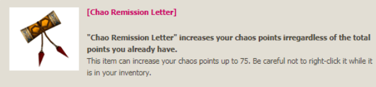
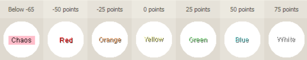
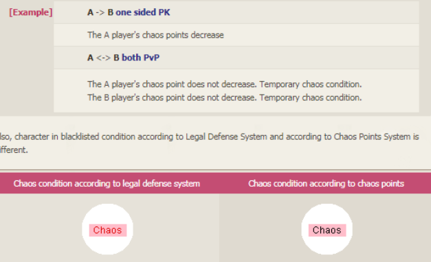

[WYD Raid Hut](/)

* PT-BR
  + [English (EN)](/en/knowledge-bases/21/articles/67189-chaos-points)
  + [Português (Brasil) (PT-BR)](/pt-br/knowledge-bases/21/articles/67189-chaos-points)
* Entrar / Registrar

* PT-BR
  + [English (EN)](/en/knowledge-bases/21/articles/67189-chaos-points)
  + [Português (Brasil) (PT-BR)](/pt-br/knowledge-bases/21/articles/67189-chaos-points)
* Entrar / Registrar

1. [FAQ WYD Global](/pt-br/knowledge-bases/21-faq-wyd-global)
2. [Guias do Jogo (PT-BR)](/pt-br/knowledge-bases/21-faq-wyd-global/categories/19-guias-do-jogo-pt-br/articles)
3. Artigos

# [Chaos Points](/pt-br/knowledge-bases/21/articles/67189-chaos-points)

**Pontos de Caos**
Todos os novos personagens começam com 0 pontos de Caos.

**[Como ganhar/perder CP]**
Toda vez que seu personagem matar outro personagem, você receberá uma dedução em seus pontos de caos. O personagem com menos de -75 pontos de caos terá seu nome em preto ou entrará na "lista negra".

Matar jogadores na lista negra não lhe dará penalidade de caos.

 **[Como verificar seu ponto de caos atual]**
- Insira o comando: "/cp" em sua janela de bate-papo para verificar seu atual ponto de caos.

**[Circunstâncias em que os pontos de caos serão deduzidos]**
- Dependendo dos pontos de caos do jogador que está sendo alvo de PK, os pontos de caos que serão deduzidos são de 2 a 3 pontos

****

 **[Obtendo aumento nos pontos de caos]**
 - Ao subir de nível
1) 1 ~ 350: +3
 2) 351 ~ 370: +1
 3) 371 ~ 400: +5

Se você quiser aumentar ainda mais seus Chaos Points, tente subir de nível ou usar o item "Pergaminho do Perdão".

****

**[Exceção à perda de pontos de caos]**
Você não perderá pontos de caos durante as guerras de guildas.
Chaos Points não são deduzidos quando você está dentro da área PK em cada cidade. **Penalidade de acordo com os pontos do Caos**

O sistema de pontos PK para um personagem recém-criado é 0, o intervalo de pontos é de -75 a +75 pontos.
A cor do nome do jogador mudará de acordo com a posição do personagem na categoria do Sistema de Pontos PK. A cor não mudará drasticamente, mas gradualmente.

O ponto de experiência a ser deduzido em um personagem com pontos de caos negativos será baseado no sistema de pontos PK.

**Sistema de Defesa Legal**

Para atacar jogadores que não estão na lista negra, aquele que iniciar o PK será temporariamente colocado na lista negra; o limite de tempo é de 1 minuto. Durante este período, o jogador que realiza PK pode ser atacado por outros jogadores, portanto, quando o realizador de PK for atacado por outros jogadores, as regras do Sistema de PK não serão aplicáveis ao realizador de PK.

This article was helpful for 5 people. Is this article helpful for you?

 Yes, helpful
 No, not for me

Why this article is not helpful?

Cancelar
Gravar

* Comentários 0
* Antigos primeiro
  + Mais recentes primeiro
  + Antigos primeiro

Ver mais

[Desenvolvido](https://userecho.com?pcode=pwbue_label_asgard&utm_source=pblv5&utm_medium=cportal&utm_campaign=pbue) por UserEcho

### Partilhar

### Article stats

* 2 anos atrás
   Criado
* 3 meses atrás
   Atualizado
* 5
   Helpful
* 2.613
   Visualizações

