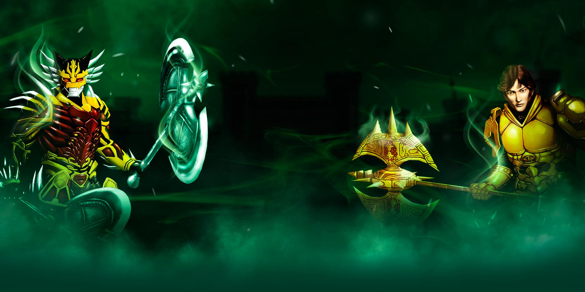
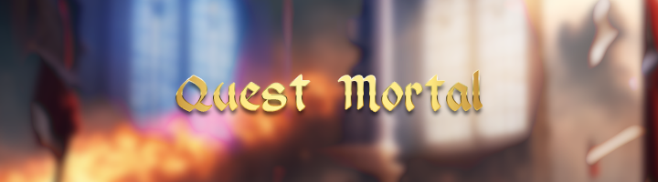

Oi,
[Mudar Senha](/./mudar-senha)

Entrar
[Criar Conta](/./criar-conta)

* [")](/pt-br/2402)
* [")](/en/)

Entrar

X

**Erro:**

Usuário

Senha

Lembre-me
[ ]

[Esqueceu o login ou senha?](/./recuperar-senha)

Entrar

## Sidebar

×

* [Home](/pt-br/)
* [Notícias](/pt-br/noticias)
  + [Noticias](/pt-br/noticias/news)
  + [Atualizações](/pt-br/noticias/updates)
  + [Eventos](/pt-br/noticias/events)
* [Suporte](https://feedback.kersef.com/en/)
  + [Política de Privacidade](/pt-br/support/policy)
  + [Termos e Condições de Uso](/pt-br/support/terms)
  + [Sobre nós](/pt-br/support/about)
  + [Entre em contato](https://feedback.kersef.com/pt-br/)
  + [Regras de conduta](https://wydglobal.raidhut.com/pt-br/273)
  + [Painel de Guildas](/pt-br/support/guild-panel)
* [Loja](/pt-br/np)
* [Baixar](/pt-br/download)
* [Comunidade](https://feedback.kersef.com/pt-br/communities/22-global)
  + [Aplicativo](https://wydglobal.raidhut.com/pt-br/2264)
  + [Facebook Página](https://www.facebook.com/GlobalWYD/)
  + [Facebook Grupo](https://www.facebook.com/groups/2962557113785102/?source_id=382886805648424)
  + [Discord](https://discord.gg/wUa2MVDMmP)
  + [Twitch](/pt-br/community/twitch)
* [Jogo](https://feedback.kersef.com/pt-br/knowledge-bases/21-faq-wyd-global)
  + [História](https://feedback.kersef.com/pt-br/knowledge-bases/21/articles/20364-historia)
  + [Interface](https://feedback.kersef.com/pt-br/knowledge-bases/21/articles/20365-interface)
  + [Skills](https://feedback.kersef.com/pt-br/knowledge-bases/21/articles/20366-skills)
  + [Droplist](https://droplist.raidhut.com/)
  + [Vila dos Mercadores](https://wydglobal.raidhut.com/pt-br/1581)
* [Guias](https://wydglobal.raidhut.com/pt-br/2410)
  + Artefatos de Poder
    - [Ancient Ore](/2202)
  + Composições
    - [Armadura Bahamut](/2746)
    - [Amunra Circlet e Bahamut Circlet](/2898)
    - [Bahamut Forge](/2900)
    - [Bahamut Mantle](/2944)
    - [Cythera Anubis](/2506)
    - [Pedra Secreta Compacta](/3078)
  + Guild
    - [Sistema de Guild](https://wydglobal.raidhut.com/pt-br/2119)
  + Quests
    - [Bahamut Fury](/2740)
    - [Caçador de Espólios](/2404)
    - [Check In](/2162)
    - [Chief Slayer](/2190)
    - [Dragon Field](/2732)
    - [Expedição Celestial](/2542)
    - [Hell Gate](/3118)
    - [Kersef Defense](/2758)
    - [Quest Mortal](/2402)
    - [Royal Arena](/2306)
    - [Wanted Monster](/2734)
  + Refinações
    - [HUD de Refinação](/2748)
    - [Refinação de Capa Celestial](/2880)
  + [Sistema de Montarias](/2874)
    - [Jackal](/3208)
* Rankings
  + [Evolução](https://ranking.raidhut.com/?lang=pt-BR)
  + [Royal Arena](https://royal-rank.raidhut.com/)
* [Bênçãos](/2634)
* [Loki VI: Reload](/3190)
  + [Quests](/3202)
  + [Loki Store e Vault Store](/3206)
  + [Loki Score e Loki Ranking](/3204)
  + [Loki Ranking](https://loki-ranking.raidhut.com/)
  + [Loki Shop](/3238)
  + [Aprimoramentos](/3200)

* [Home](/pt-br/)
* [Notícias](/pt-br/noticias)
  + [Noticias](/pt-br/noticias/news)
  + [Atualizações](/pt-br/noticias/updates)
  + [Eventos](/pt-br/noticias/events)
* [Suporte](https://feedback.kersef.com/en/)
  + [Política de Privacidade](/pt-br/support/policy)
  + [Termos e Condições de Uso](/pt-br/support/terms)
  + [Sobre nós](/pt-br/support/about)
  + [Entre em contato](https://feedback.kersef.com/pt-br/)
  + [Regras de conduta](https://wydglobal.raidhut.com/pt-br/273)
  + [Painel de Guildas](/pt-br/support/guild-panel)
* [Loja](/pt-br/np)
* [Baixar](/pt-br/download)
* [Comunidade](https://feedback.kersef.com/pt-br/communities/22-global)
  + [Aplicativo](https://wydglobal.raidhut.com/pt-br/2264)
  + [Facebook Página](https://www.facebook.com/GlobalWYD/)
  + [Facebook Grupo](https://www.facebook.com/groups/2962557113785102/?source_id=382886805648424)
  + [Discord](https://discord.gg/wUa2MVDMmP)
  + [Twitch](/pt-br/community/twitch)
* [Jogo](https://feedback.kersef.com/pt-br/knowledge-bases/21-faq-wyd-global)
  + [História](https://feedback.kersef.com/pt-br/knowledge-bases/21/articles/20364-historia)
  + [Interface](https://feedback.kersef.com/pt-br/knowledge-bases/21/articles/20365-interface)
  + [Skills](https://feedback.kersef.com/pt-br/knowledge-bases/21/articles/20366-skills)
  + [Droplist](https://droplist.raidhut.com/)
  + [Vila dos Mercadores](https://wydglobal.raidhut.com/pt-br/1581)
* [Guias](https://wydglobal.raidhut.com/pt-br/2410)
  + Artefatos de Poder
    - [Ancient Ore](/2202)
  + Composições
    - [Armadura Bahamut](/2746)
    - [Amunra Circlet e Bahamut Circlet](/2898)
    - [Bahamut Forge](/2900)
    - [Bahamut Mantle](/2944)
    - [Cythera Anubis](/2506)
    - [Pedra Secreta Compacta](/3078)
  + Guild
    - [Sistema de Guild](https://wydglobal.raidhut.com/pt-br/2119)
  + Quests
    - [Bahamut Fury](/2740)
    - [Caçador de Espólios](/2404)
    - [Check In](/2162)
    - [Chief Slayer](/2190)
    - [Dragon Field](/2732)
    - [Expedição Celestial](/2542)
    - [Hell Gate](/3118)
    - [Kersef Defense](/2758)
    - [Quest Mortal](/2402)
    - [Royal Arena](/2306)
    - [Wanted Monster](/2734)
  + Refinações
    - [HUD de Refinação](/2748)
    - [Refinação de Capa Celestial](/2880)
  + [Sistema de Montarias](/2874)
    - [Jackal](/3208)
* Rankings
  + [Evolução](https://ranking.raidhut.com/?lang=pt-BR)
  + [Royal Arena](https://royal-rank.raidhut.com/)
* [Bênçãos](/2634)
* [Loki VI: Reload](/3190)
  + [Quests](/3202)
  + [Loki Store e Vault Store](/3206)
  + [Loki Score e Loki Ranking](/3204)
  + [Loki Ranking](https://loki-ranking.raidhut.com/)
  + [Loki Shop](/3238)
  + [Aprimoramentos](/3200)

# Global

# Guia Quest Mortal

*Em um mundo onde o divino e o demoníaco entrelaçam-se nas sombras, Kersef se ergue como um reino de desafios e destinos imortais. As "Quests Mortais" são rituais sagrados concebidos pelos deuses para testar a bravura dos mais audaciosos guerreiros, provações que transcendem a mera busca por poder e revelam as verdadeiras essências de seus heróis.

Você, aventureiro, detém o Almanaque dos Destinos, uma compilação ancestral das jornadas mais perigosas. A cada missão enfrentada, você caminha mais perto da imortalidade, desafiando criaturas temíveis e resolvendo enigmas que desafiam a mente e o espírito.

Prepare-se para desbravar terras onde apenas lendas pisaram e transformar-se em uma delas. O destino de Kersef está em suas mãos, e cada escolha sua ecoará através dos séculos.*

---

Acesso Rápido

[Campo de Treino
Level 1 ~ Level 35](#training-camp) [Defensor da Alma
Level 40 ~ Level 115](#spirit-guardian) [Conquista do Castelo Orc
Level 1 ~ Level 400](#conquering-orc-castle) [Defensor da Terra Mística
Level 60 ~ Level 400](#defending-mystic-land) [Benção de Deus
Level 70 ~ Level 75](#bless-of-the-god) [Formatura de Cavaleiros Aprendizes
Level 101 ~ Level 150](#ceremony-to-apprentice) [Jardim de Deus
Level 116~ Level 190](#gods-garden) [Equilíbrio da Força
Level 120 ~ Level 125](#balance-of-power) [Ressureição do Cavaleiro Negro
Level 191 ~ Level 265](#revival-of-the-dark-knight) [Molar do Gárgula
Level 201 ~ Level 255](#gargoyles-molar-tooth) [Cavaleiro do Reino
Level 220 ~ Level 250](#knight-of-the-kingdom) [Hidra Imortal
Level 266 ~ Level 320](#immortality-of-hydra) [Início da Infelicidade
Level 321 ~ Level 355](#beginning-of-unhappiness) [Desbloqueio de capa 355
Level 355 ~ Level 400](#mantle-unlock-355)

---

Campo de Treino
Level 1 ~ Level 35

*Ao leste de Armia, um campo de treinamento foi estabelecido para forjar os próximos heróis capazes de enfrentar as ameaças crescentes. Sob a orientação dos treinadores mais experientes, novos guerreiros são testados, desafiados e transformados. Cada etapa desta jornada não apenas testará suas habilidades, mas também revelará o verdadeiro valor de um guerreiro. Prepare-se para entrar nesta saga, onde sua determinação, estratégia e coragem serão suas maiores armas.*

Level da quest:

- Level 1 ~ Level 35.

Categoria:

- Up;

- Aprimoramento de equipamentos.

Objetivos Detalhados:

**1ª Etapa**
- Derrote o GremlinDecoy para obter a Chave da Primeira Porta e receba Poções de Cura do FirstTrainer;

**2ª Etapa**
- Vença o GiantCrill, colete a Chave da Segunda Porta e obtenha adicionais aleatórios nas armas com o SecondTrainer;

**3ª Etapa**
- Elimine o OrcSniper, pegue a Chave da Última Porta e aprimore suas armas e armaduras com o ThirdTrainer;

**4ª Etapa**
- Derrote o OrcWarrior, adquira o Emblema Orc e ganhe um bônus significativo de experiência com o TrainerChief.

Localizações Importantes:

- O campo de treinamento se encontra ao leste de Armia, um local preparado especialmente para desenvolver as habilidades dos novos guerreiros. As coordenadas específicas de cada etapa da missão guiarão sua jornada através deste desafio inicial.

**1ª Etapa**
- Primeira Porta (X:2075 Y:2016);

**2ª Etapa**
- Segunda Porta (X:2143 Y:1986);

**3ª Etapa**
- Última Porta (X:2081 Y:1962).

NPCs Importantes:

- Cada um desses personagens tem uma função única, desde equipar você para a batalha até desbloquear o seu potencial através de recompensas significativas.

- NPC Unicorn (X:2130 Y:2040);

- NPC CabuncleWind (X:2131 Y:2033);

- NPC FirstTrainer (X:2077 Y:2017);

- NPC SecondTrainer (X:2144 Y:1989);

- NPC ThirdTrainer (X:2082 Y:1966);

- NPC TrainerChief (X:2122 Y:2041).

Recompensas:

**1ª Etapa**
- [20] Poção de Cura (M);

**2ª Etapa**
- Aplicação de adicionais aleatórios nas armas equipadas;

**3ª Etapa**
- Refinação das armaduras e das armas equipadas;

**4ª Etapa**
- [01] Olho Crescente - Ao utiliza-lo clicando com o botão direito concede ao personagem 3.000 pontos de experiência.

Estratégias:

**Preparação**
- Visitar o NPC Unicorn para adquirir uma arma apropriada à sua classe, se for classe de dano físico comprar armas que dão Aumento de Dano, se for classe de dano mágico comprar armas que dão Ataque Mágico. Em seguida, receba buffs do NPC CabuncleWind para fortalecer seu personagem temporariamente, clicando nele;

**1ª Etapa**
- Derrote o GremlinDecoy (X:2076 Y:2022) para obter a Chave da Primeira Porta e receba [20] Poções de Cura (M) do NPC FirstTrainer, ao interagir com ele. Após isso abra a Primeira Porta e siga para a 2ª etapa;

**2ª Etapa**
- Vença o GiantCrill (X:2146 Y:1997), colete a Chave da Segunda Porta e obtenha adicionais aleatórios nas armas com o SecondTrainer. Após isso abra a Segunda Porta e siga para a 3ª etapa;

**3ª Etapa**
- Elimine o OrcSniper (X:2078 Y:1971), pegue a Chave da Última Porta e aprimore suas armas e armaduras com o ThirdTrainer. Após isso abra a Última Porta e siga para a 4ª etapa;

**4ª Etapa**
- Derrote o OrcWarrior (X:2135 Y:1948), adquira o Emblema Orc e ganhe um bônus significativo de experiência com o TrainerChief.

Dicas e Informações:

- Preste atenção às classes das armas ao comprar do NPC Unicorn, escolher a arma correta pode fazer uma grande diferença;

- Use os buffs do NPC CabuncleWind estrategicamente para maximizar seu desempenho em combate;

- Mantenha-se atento às localizações exatas dos NPCs e portas para não se perder ou perder tempo;

- Aproveite ao máximo as recompensas oferecidas em cada etapa para fortalecer seu personagem;

- Fique ligado que as recompensas dos NPCs são únicas, ou seja, só poderá interagir com cada NPC uma única vez por personagem.

Perguntas Frequentes:

**O que faço se perder uma chave?**
Os monstros continuam dropando as chaves necessárias enquanto você estiver na missão. Basta derrotá-los novamente.

**Posso fazer essa quest após o nível 35?**
 Não, essa missão é exclusiva para personagens do nível 1 ao 35 para garantir um início de jogo equilibrado e desafiador.

---

Defensor da Alma
Level 40 ~ Level 115

*O cemitério de Armia sempre foi um lugar de respeito e memória, guardando os restos de heróis e famílias ancestrais. Contudo, sombras se levantaram recentemente, com criaturas profanando estas terras sagradas. Acredita-se que estes rituais têm o intuito de reviver o General da Morte, um ser de poder incomensurável e malícia pura, cujo despertar poderia significar a ruína de nosso mundo. Ao aceitar esta quest, você se torna o último defensor das almas que aqui repousam, enfrentando o mal em sua essência para proteger nosso legado.*

Level da quest:

- Level 40 ~ Level 115.

Categoria:

- Up.

Objetivos Detalhados:

- Dirija-se ao cemitério em Armia;

- Derrote os monstros que infestam o local;

- Colete o item especial que eles dropam e utilize-o para receber uma generosa quantidade de experiência.

Localizações Importantes:

- O cemitério se encontra ao norte de Armia;

- Acesso ao cemitério em Armia (X:2372 Y:2098).

NPCs Importantes:

- NPC Gravekeeper (X:2372 Y:2098).

Recompensas:

- Caixa da Sabedoria - Ao usá-la (clicando com o botão direito), o jogador recebe 30.000 de experiência.

Estratégias:

- Para acessar o local da quest basta clicar no NPC Gravekeeper e derrotar os monstros que estão lá dentro;

- Preste atenção nos padrões de ataque dos monstros e utilize itens de cura e buffs para aumentar suas chances de sobrevivência.

Dicas e Informações:

- Dentro dos limites de level permitidos para esta quest, você tem a liberdade de entrar no local designado quantas vezes desejar, utilizando tantas Caixas da Sabedoria quanto necessárias para alcançar o nível máximo permitido pela missão;

- Vale destacar que a quest é reiniciada automaticamente a cada 10 minutos, sempre aos 3 minutos, permitindo uma nova oportunidade de participação.

Perguntas Frequentes:

**Preciso estar em um grupo para iniciar a quest?**
Não é necessário, mas é altamente recomendado para maximizar as recompensas e a eficácia em combate.

**Onde encontro o NPC Gravekeeper?**
Ele está localizado perto da entrada do cemitério em Armia (X: 2372 Y: 2098), pronto para dar início à sua jornada.

**Posso repetir essa quest?**
Sim, a quest pode ser repetida.

**Existe algum limite para a quantidade de Caixa da Sabedoria que posso usar?**
Você pode usar tantas Caixa da Sabedoria quanto conseguir coletar, desde que esteja dentro dos limites de level da quest.

---

Conquista do Castelo Orc
Level 1 ~ Level 400

*Há gerações, o Castelo Orc permanece como um bastião de terror, erguido sob o comando do OrcLord, um ser de poder indescritível e crueldade sem igual. Os Orcs, criaturas desprezadas por sua vileza, encontraram neste lugar uma fortaleza para seus saques e experimentos sombrios. Diz-se que a "pílula mágica" é uma substância antiga, corrompida por magias proibidas, conferindo ao OrcLord seu poder devastador. Para libertar as terras de sua tirania, é necessário um herói que enfrente os perigos do castelo, desvende seus segredos e encerre sua ameaça de uma vez por todas.*

Level da quest:

- Level 1 ~ Level 400.

Categoria:

- Aprimoramento do personagem.

Objetivos Detalhados:

**1ª Etapa**
- Derrote o OrcKeeper para obter a Chave do Portão Sul;

**2ª Etapa**
- Vença o OrcGuard, colete a Última Chave Orc;

**3ª Etapa**
- Elimine o CheifOrc, pegue a Última Chave Orc Leste;

**4ª Etapa**
- Derrote o OrcLord, adquira Pílula do Poder Mágico.

Localizações Importantes:

- O Castelo Orc se encontra ao norte de Armia. As coordenadas específicas de cada etapa da missão são:

**1ª Etapa**
- Portão Orc Sul (X:2486 Y:2130);

**2ª Etapa**
- Último Portão Orc Sul (X:2503 Y:2146);

**3ª Etapa**
- Último Portão Orc Leste (X:2528 Y:2135).

NPCs Importantes:

- Esta quest não possui NPC.

Recompensas:

- [01] Pílula do Poder Mágico - Um artefato mágico único que, ao ser consumido (clicando com o botão direito), concede ao personagem 9 pontos de skill.

Estratégias:

**1ª Etapa**
- Derrote o OrcKeeper (X:2472 Y:2130) para obter a Chave Portão Orc Sul. Após isso abra a Primeira Porta e siga para a 2ª Etapa;

**2ª Etapa**
- Vença o OrcGuard (X:2495 Y:2118), colete a Chave da Última Porta. Após isso abra a Segunda Porta e siga para a 3ª Etapa;

**3ª Etapa**
- Elimine o CheifOrc (X:2533 Y:2150), pegue a Última Chave Orc Leste. Após isso abra a Última Porta e siga para a 4ª Etapa;

**4ª Etapa**
- Derrote o OrcLord (X:2533 Y:2120), adquira a Pílula do Poder Mágico.

Dicas e Informações:

- Fique ligado que a Pílula do Poder Mágico só pode ser utilizada uma vez;

- Você pode chegar mais rápido no local da quest utilizando o portal de teleporte localizado em Armia (X: 2141 Y:2069).

Perguntas Frequentes:

**Posso realizar esta quest mais de uma vez?**
Sim, mas a recompensa principal, a Pílula do Poder Mágico, só pode ser utilizada uma única vez por personagem.

**As chaves desaparecem após o uso?**
Sim, cada chave é consumida ao abrir o respectivo portão, exigindo uma nova conquista em futuras tentativas.

---

Defensor da Terra Mística
Level 60 ~ Level 400

*As Terras Místicas sempre foram envoltas em mistérios, escondendo tesouros inimagináveis em suas profundezas. Designado como um local sagrado pelos antigos, foi protegido por gerações contra aqueles que buscavam sua riqueza sem respeitar seu valor verdadeiro. A recente invasão de monstros é vista não apenas como um perigo físico, mas também como uma ameaça à essência mística do local. Acreditando na antiga profecia que prediz a chegada de um defensor capaz de restaurar a harmonia, os líderes de Azran convocam por heróis que possam cumprir essa lenda.*

Level da quest:

- Level 60 ~ Level 400.

Categoria:

- Aprimoramento de equipamentos.

Objetivos Detalhados:

- Inicie sua jornada conversando com o NPC KnightsLeader em Azran;

- Dirija-se às Terras Místicas e elimine os monstros que ameaçam a expedição;

- Proteja o NPC ExploitLeader dos ataques, garantindo sua segurança e a da expedição.

Localizações Importantes:

- As Terras Místicas se encontram ao Sul de Azran;

- Terras Místicas (X:2389 Y:1593).

NPCs Importantes:

- NPC KnightsLeader (X:2445 Y:1718);

- NPC ExploitLeader (X:2384 Y:1603).

Recompensas:

- Amuleto de Prata ou Amuleto de Ouro ou Amuleto Místico - Equipamentos que, ao serem utilizados, melhoram os atributos do personagem. A natureza exata do amuleto recebido pode variar de acordo com o desempenho na missão.

Estratégias:

- Para iniciar a quest fale com o NPC KnightsLeader;

- Siga para as Terras Místicas e derrote todos os monstros que estiverem atacando o NPC ExploitLeader;

- Após derrotar todos os monstros fale com o NPC ExploitLeader.

Dicas e Informações:

- Fique ligado que a quest só pode ser realizada uma vez pelo personagem.

Perguntas Frequentes:

**Posso realizar a quest em grupo?**
Sim, embora a quest possa ser iniciada individualmente, colaborar com outros jogadores pode aumentar suas chances de sucesso e proteger o ExploitLeader de forma mais eficiente.

**E se eu falhar na proteção do ExploitLeader?**
Falhar em proteger o ExploitLeader resultará na necessidade de reiniciar a missão. No entanto, a oportunidade de retomá-la é uma chance para repensar estratégias e tentar novamente.

---

Benção de Deus
Level 70 ~ Level 75

*Desde tempos imemoriais, o "Pedaço da Salvação" tem sido uma relíquia venerada, simbolizando a proteção e o poder divino sobre as terras de Erion. A passagem desta relíquia entre as catedrais de Armia e Azran é um evento de grande significância espiritual, marcando um período de renovação e esperança para o povo. O ataque ao sacerdote Kruno e o subsequente roubo da relíquia ameaçam não apenas a paz entre as cidades, mas também o equilíbrio espiritual. A recuperação do "Pedaço da Salvação" não é apenas uma missão de fé, mas também um ato de restauração da ordem divina.*

Level da quest:

- Level 70 ~ Level 75.

Categoria:

- Ajuste de personagem.

Objetivos Detalhados:

- Inicie sua jornada conversando com o NPC Zesty Priest;

- Derrote os monstros NainTrollChief, até dropar o item Pedaço da Chance;

- Fale com o NPC Kruno Priest.

Localizações Importantes:

- A quest fica localizada à norte de Erion (X:2633 Y:1985).

NPCs Importantes:

- NPC Zesty Priest (X:2627 Y:1984);

- NPC Kruno Priest (X:2662 Y:1972).

Recompensas:

- [01] Composto de Chance - Este item singular permite que você resete 50 pontos de aprendizagem de habilidade, zerando todos os skills aprendidos e permitindo uma redistribuição.

Estratégias:

- Para iniciar a quest fale com o NPC Zesty Priest;

- Derrote os monstros NainTrollChief, até dropar o item Pedaço da Chance;

- Após isso, fale com o NPC Kruno Priest, ele irá te recompensar com o item Composto de Chance.

Dicas e Informações:

- Fique ligado que a quest só pode ser realizada uma vez pelo personagem;

- Vale destacar que a quest é reiniciada automaticamente a cada 10 minutos, sempre aos 3 minutos, permitindo uma nova oportunidade de participação.

Perguntas Frequentes:

**E se eu morrer durante a quest?**
Caso você falhe, poderá tentar novamente.

**O item "Pedaço da Chance" é garantido após cada NainTrollChief derrotado?**
O drop do item não é garantido em cada combate. Pode ser necessário derrotar vários NainTrollChief para recuperar o "Pedaço da Chance".

---

Formatura de Cavaleiros Aprendizes
Level 101 ~ Level 150

*Nas terras ao sul de Azran, o Campo de Treinamento de Cavaleiros tem moldado heróis e protetores do reino por gerações. Aqueles que entram como aprendizes saem como guardiões venerados, mas o caminho é tudo menos fácil. Os TaursKing, criaturas tão antigas quanto o próprio reino, servem como o último teste para os aprendizes. Derrotá-los não é apenas uma questão de força, mas de coração, pois eles simbolizam os desafios imensuráveis que um cavaleiro enfrentará em sua vida. A obtenção do Manto do Aprendiz marca a conclusão de um capítulo e o início de uma jornada ainda mais grandiosa.*

Level da quest:

- Level 101 ~ Level 150.

Categoria:

- Aprimoramento de equipamentos.

Objetivos Detalhados:

- Inicie a quest conversando com o NPC TS Chief;

- Derrote os TaursKing até obter o Emblema da Aprendizagem;

- Equipe o Emblema da Aprendizagem e apresente-se ao NPC TS Leader para receber sua recompensa.

Localizações Importantes:

- A quest fica localizada ao Sul de Azran (X:2244 Y:1597).

NPCs Importantes:

- NPC TS Chief (X:2244 Y:1597);

- NPC TS Leader (X:2235 Y:1569).

Recompensas:

- [01] Manto do Aprendiz - Um equipamento sagrado que não apenas melhora os atributos do personagem, mas também serve como um símbolo de sua ascensão a cavaleiro.

Estratégias:

- Para iniciar a quest fale com o NPC TS Chief;

- Derrote os monstros TaursKing, até dropar o item Emblema da Aprendizagem;

- Equipe o item Emblema da Aprendizagem e fale com o NPC TS Leader, ele irá te recompensar com o item Manto do Aprendiz.

Dicas e Informações:

- Fique ligado que a quest só pode ser realizada uma vez pelo personagem;

- Vale destacar que a quest é reiniciada automaticamente a cada 10 minutos, sempre aos 3 minutos, permitindo uma nova oportunidade de participação;

- Você pode chegar mais rápido no local da quest utilizando o portal de teleporte localizado em Azran (X:2469 Y:1717).

Perguntas Frequentes:

**O item "Emblema da Aprendizagem" é garantido após cada TaursKing derrotado?**
O drop do item não é garantido em cada combate. Pode ser necessário derrotar vários TaursKing para recuperar o "Emblema da Aprendizagem".

**O que fazer se o Emblema da Aprendizagem não dropar imediatamente?**
A persistência é chave. Continue enfrentando os TaursKing até que o emblema seja obtido. Cada batalha é uma lição e um passo mais perto de sua ascensão.

**Posso completar essa quest em grupo?**
Embora você possa se juntar a outros para enfrentar os TaursKing, o Emblema da Aprendizagem é uma conquista pessoal e deve ser obtido individualmente.

---

Jardim de Deus
Level 116~ Level 190

*Desde os tempos antigos, o Jardim de Deus foi um oásis de serenidade, um pedaço do paraíso na Terra onde os deuses encontraram repouso após uma batalha celestial. Este jardim não é apenas um local de beleza incomparável, mas também um símbolo do amor e proteção divina sobre o mundo. No entanto, a recente invasão de criaturas malignas ameaça desequilibrar este local sagrado, arriscando a ira divina e o desamparo do mundo. O chamado agora ecoa aos corações valentes, para que se levantem em defesa deste patrimônio celestial e assegurem que a luz divina continue a iluminar as terras de Azran.*

Level da quest:

- Level 116~ Level 190.

Categoria:

- Up.

Objetivos Detalhados:

- Dirija-se ao Jardim de Deus, localizado ao sul de Azran;

- Derrote os monstros que corrompem o local sagrado;

- Colete o item especial, Lágrima Angelical, deixado por eles e utilize-o para receber uma abundância de experiência.

Localizações Importantes:

- O jardim se encontra ao sul de Azran;

- Acesso ao jardim em Azran (X:2223 Y:1712).

NPCs Importantes:

- NPC Gardener (X:2223 Y:1712).

Recompensas:

- Lágrima Angelical - Ao usá-la (clicando com o botão direito), o jogador recebe 120.000 de experiência.

Estratégias:

- Para acessar o local da quest basta clicar no NPC Gardener e derrotar os monstros que estão lá dentro;

- Preste atenção nos padrões de ataque dos monstros e utilize itens de cura e buffs para aumentar suas chances de sobrevivência.

Dicas e Informações:

- Dentro dos limites de level permitidos para esta quest, você tem a liberdade de entrar no local designado quantas vezes desejar, utilizando tantas Lágrima Angelical quanto necessárias para alcançar o nível máximo permitido pela missão;

- Vale destacar que a quest é reiniciada automaticamente a cada 10 minutos, sempre aos 3 minutos, permitindo uma nova oportunidade de participação.

- Você pode chegar mais rápido no local da quest utilizando o portal de teleporte localizado em Azran (X:2469 Y:1717).

Perguntas Frequentes:

**Preciso estar em um grupo para iniciar a quest?**
Não é necessário, mas é altamente recomendado para maximizar as recompensas e a eficácia em combate.

**Onde encontro o NPC Gardener?**
Ele está localizado perto da entrada do jardim em Azran (X: 2223 Y: 1712), pronto para dar início à sua jornada.

**Posso repetir essa quest?**
Sim, a quest pode ser repetida.

**Existe algum limite para a quantidade de Lágrimas Angelicais que posso usar?**
Você pode usar tantas Lágrimas Angelicais quanto conseguir coletar, desde que esteja dentro dos limites de level da quest.

---

Equilibrio da Força
Level 120 ~ Level 125

*Por gerações, a catedral de Achro serviu como um elo de ligação entre Akelonia e Hekalotia, promovendo a paz e harmonia. A sacerdotisa Amelia, descendente de uma longa linhagem de guardiões do equilíbrio, agora enfrenta sozinha o maior teste de sua vida. A quebra desse equilíbrio não só significaria a perda de um símbolo sagrado, mas também o início de uma era de discórdia e guerra entre os reinos. Seu papel como defensor é mais do que uma quest; é uma cruzada para assegurar a continuidade da trégua e a sobrevivência de um mundo à beira da ruína.*

Level da quest:

- Level 120 ~ Level 125.

Categoria:

- Ajuste de personagem.

Objetivos Detalhados:

- Inicie sua jornada conversando com o NPC Guard;

- Derrote os monstros InionTrollChief, até dropar o item Pedaço de Equilíbrio;

- Fale com o NPC Amelia Priest.

Localizações Importantes:

- A quest fica localizada ao sul de Azran (X:1968 Y:1577).

NPCs Importantes:

- NPC Guard (X:1968 Y:1577);

- NPC Amelia Priest (X:1972 Y:1580).

Recompensas:

- [01] Composto de Equilíbrio - Este artefato poderoso permite ao herói reajustar 100 pontos de aprendizagem de habilidade, possibilitando uma nova configuração de suas capacidades.

Estratégias:

- Para iniciar a quest fale com o NPC Guard;

- Derrote os monstros InionTrollChief, até dropar o item Pedaço de Equilíbrio;

- Após isso, fale com o NPC Amelia Priest, ele irá te recompensar com o item Composto de Equilíbrio.

Dicas e Informações:

- Aproveite a oportunidade para redefinir habilidades e fortalecer seu personagem, mas lembre-se: esta missão é uma chance única;

- Fique ligado que a quest só pode ser realizada uma vez pelo personagem;

- Vale destacar que a quest é reiniciada automaticamente a cada 10 minutos, sempre aos 3 minutos, permitindo uma nova oportunidade de participação;

- Você pode chegar mais rápido no local da quest utilizando o portal de teleporte localizado em Azran (X:2453 Y:1718).

Perguntas Frequentes:

**E se eu morrer durante a quest?**
Caso você falhe, poderá tentar novamente.

**O item "Pedaço de Equilíbrio" é garantido após cada InionTrollChief derrotado?**
O drop do item não é garantido em cada combate. Pode ser necessário derrotar vários InionTrollChief para recuperar o "Pedaço de Equilíbrio".

---

Ressureição do Cavaleiro Negro
Level 191 ~ Level 265

*O túmulo de Kaizen na Dungeon deveria ser um monumento de eterno repouso e honra, mas tornou-se cenário de um terror inimaginável. A ressurreição de Kaizen pelo Esqueleto Consery não é apenas uma afronta à memória do herói, mas uma clara declaração de guerra contra o reino de Armia. Este desafio coloca não apenas a força, mas também a determinação dos mais valentes à prova, em uma corrida contra o tempo para evitar uma calamidade inominável.*

Level da quest:

- Level 191 ~ Level 265.

Categoria:

- Up.

Objetivos Detalhados:

- Dirija-se até o 1º andar da Dungeon, o local da última morada de Kaizen;

- Enfrente os monstros corrompidos que guardam este lugar sagrado;

- Colete o Coração de Kaizen, uma relíquia de poder imenso, para obter experiência substancial.

Localizações Importantes:

- A quest fica no 1º andar da Dungeon;

- O acesso à Dungeon é feito ao norte de Armia (X:2669 Y:2157);

- Acesso à quest (X:452 Y:3910).

NPCs Importantes:

- NPC Scout (X:452 Y:3910)

Recompensas:

- Coração de Kaizen - Ao usá-lo (clicando com o botão direito), o jogador recebe 250.000 de experiência.

Estratégias:

- Para acessar o local da quest basta clicar no NPC Scout e derrotar os monstros que estão lá dentro;

- Preste atenção nos padrões de ataque dos monstros e utilize itens de cura e buffs para aumentar suas chances de sobrevivência.

Dicas e Informações:

- Dentro dos limites de level permitidos para esta quest, você tem a liberdade de entrar no local designado quantas vezes desejar, utilizando tantos Corações de Kaizen quanto necessários para alcançar o nível máximo permitido pela missão;

- Vale destacar que a quest é reiniciada automaticamente a cada 10 minutos, sempre aos 3 minutos, permitindo uma nova oportunidade de participação;

- Você pode chegar mais rápido no local da entrada da Dungeon utilizando o portal de teleporte localizado em Armia (X:2141 Y:2069);

- Você pode chegar mais rápido no local da quest utilizando o item Pedido de Caça (Dung). Clique com o botão direito nele, e selecione a opção "Dungeon 1 - Local do Cav. Caveira - 481 4062". Esse item é vendido no NPC Farche, que fica localizado em Erion (X:2468 Y:2008).

Perguntas Frequentes:

**Preciso estar em um grupo para iniciar a quest?**
Não é necessário, mas é altamente recomendado para maximizar as recompensas e a eficácia em combate.

**Onde encontro o NPC Scout?**
Ele está localizado perto da entrada da quest no 1º andar da Dugeon (X:452 Y:3910), pronto para dar início à sua jornada.

**Posso repetir essa quest?**
Sim, a quest pode ser repetida.

**Existe algum limite para a quantidade de Coração de Kaizen que posso usar?**
Você pode usar tantos Corações de Kaizen quanto conseguir coletar, desde que esteja dentro dos limites de level da quest.

---

Molar do Gárgula
Level 201 ~ Level 255

*Desde tempos imemoriais, os GagoilChief têm sido os guardiões dos segredos mais obscuros da Dungeon. Entre esses segredos, o Molar do Gárgula se destaca como um dos artefatos mais cobiçados, forjado a partir da essência de uma antiga criatura de pedra. Diz a lenda que este item carrega a essência da defesa intransponível dos gárgulas, capaz de tornar qualquer armadura impenetrável. Muitos tentaram e falharam na busca por este tesouro, mas a promessa de poder inigualável continua a atrair aventureiros destemidos.*

Level da quest:

- Level 201 ~ Level 255.

Categoria:

- Aprimoramento de equipamentos.

Objetivos Detalhados:

- Dirija-se ao local da quest, localizado no 1º andar da Dungeon;

- Derrote os monstros GagoilChief, até dropar o item;

- Após isso, utilize o item (clicando com o botão direito) e ele refinará as armaduras equipadas para +6.

Localizações Importantes:

- A quest fica no 1º andar da Dungeon;

- O acesso à Dungeon é feito ao norte de Armia (X:2669 Y:2157).

- Acesso à quest (X:786 Y:4060).

NPCs Importantes:

- NPC Scout (X:786 Y:4060);

Recompensas:

- [01] Molar do Gárgula - Um item mágico que, quando utilizado, eleva as armaduras equipadas para o nível de refinamento +6, concedendo ao usuário uma defesa extraordinária.

Estratégias:

- Para iniciar a quest fale com o NPC Scout;

- Derrote os monstros GagoilChief, até dropar o item Molar do Gárgula;

- Após isso, utilize o item (clicando com o botão direito).

Dicas e Informações:

- Este desafio é recomendado para aventureiros que não apenas buscam fortalecer suas armaduras, mas também desejam testar seus limites contra adversários formidáveis;

- O Molar do Gárgula é uma recompensa rara, e pode ser necessário enfrentar os GagoilChief várias vezes para obtê-lo;

- Vale destacar que a quest é reiniciada automaticamente a cada 10 minutos, sempre aos 3 minutos, permitindo uma nova oportunidade de participação;

- Você pode chegar mais rápido no local da entrada da Dungeon utilizando o portal de teleporte localizado em Armia (X: 2141 Y:2069);

- Você pode chegar mais rápido no local da quest utilizando o item Pedido de Caça (Dung). Clique com o botão direito nele, e selecione a opção "Dungeon 1 - Local do Golem - 876 4058". Esse item é vendido no NPC Farche, que fica localizado em Erion (X: 2468 Y: 2008).

Perguntas Frequentes:

**O Molar do Gárgula pode ser utilizado mais de uma vez?**
O Molar do Gárgula é um item de uso único. Uma vez utilizado para aprimorar sua armadura, ele desaparece.

**Posso enfrentar os GagoilChief em grupo?**
Sim, enfrentar os GagoilChief em grupo pode aumentar significativamente suas chances de sucesso, além de tornar a batalha mais gerenciável.

---

Cavaleiro do Reino
Level 220 ~ Level 250

*Em um mundo dividido entre o majestoso Hekalotia e o poderoso Akelonia, a necessidade de cavaleiros leais nunca foi tão crítica. A luta contra os DarkKnightKing, uma vez cavaleiros valorosos que caíram nas trevas, simboliza a eterna batalha entre o bem e o mal, luz e sombra. Ao escolher seu caminho e reivindicar o Emblema do Reino, você não só se compromete a lutar por seu reino, mas também a carregar os valores e a honra que vêm com o título de Cavaleiro do Reino.*

Level da quest:

- Level 220 ~ Level 250.

Categoria:

- Aprimoramento de equipamentos.

Objetivos Detalhados:

- Inicie a quest conversando com o NPC RoyalGuard, representante de seu reino escolhido;

- Derrote os DarkKnightKing para obter o Emblema do Reino;

- Com o Emblema em mãos, apresente-se ao Rei do Reino escolhido e jure sua lealdade para receber sua recompensa.

Localizações Importantes:

- A quest fica localizada no centro dos Reinos (X:1732 Y:1722);

- NPC RoyalGuard (X:1744 Y:1889) - Reino Red;

NPCs Importantes:

- NPC RoyalGuard (X:1750 Y:1583) - Reino Blue;

- NPC KingGlantuar (X:1749 Y:1879) - Reino Red;

- NPC KingHarabard (X:1748 Y:1573) - Reino Blue.

Recompensas:

- [01] Manto Akelonia (Red) ou [01] Manto Hekalotia (Blue) - Um símbolo de sua lealdade e novo status como Cavaleiro do Reino, cada manto não só aprimora seus atributos, mas também reflete a honra de servir ao seu reino.

Estratégias:

- Para iniciar a quest fale com o NPC RoyalGuard;

- Derrote os monstros DarkKnightKing , até dropar o item Emblema do Reino;

- Equipe o item Emblema do Reino e fale com o NPC KingGlantuar caso deseje ser do reino red ou fale com o NPC KingHarabard caso queira ser do reino blue, eles irão te recompensar com o item Manto Akelonia e Manto Hekalotia, respectivamente.

Dicas e Informações:

- Fique ligado que a quest só pode ser realizada uma vez pelo personagem;

- Vale destacar que a quest é reiniciada automaticamente a cada 10 minutos, sempre aos 3 minutos, permitindo uma nova oportunidade de participação;

- Você pode chegar mais rápido no local da quest utilizando o item Pedido de Caça (Kult). Clique com o botão direito nele, e selecione a opção "Deserto Kult - Local da Aranha Inferno - 1634 1727". Esse item é vendido no NPC Farche, que fica localizado em Erion (X:2468 Y:2008).

Perguntas Frequentes:

**O item "Emblema do Reino" é garantido após cada DarkKnightKing derrotado?**
O drop do item não é garantido em cada combate. Pode ser necessário derrotar vários DarkKnightKing para recuperar o "Emblema do Reino".

**O que fazer se o Emblema do Reino não dropar imediatamente?**
A persistência é chave. Continue enfrentando os DarkKnightKing até que o emblema seja obtido. Cada batalha é uma lição e um passo mais perto de sua ascensão.

**Posso completar essa quest em grupo?**
Embora você possa se juntar a outros para enfrentar os DarkKnightKing, o Emblema do Reino é uma conquista pessoal e deve ser obtido individualmente.

**Posso mudar de reino após escolher um?**
A escolha do reino é um compromisso significativo e não pode ser alterada facilmente. Pense bem em sua decisão. Mas você poderá mudar no futuro se assim desejar.

---

Hidra Imortal
Level 266 ~ Level 320

*Expulsas de suas terras natais nos pântanos do norte, as Hidras encontraram refúgio nas profundezas da Dungeon. Lá, elas se depararam com o Olho de Sangue, cujo poder maligno não só as transformou em criaturas ainda mais temíveis, mas também as vinculou ao antigo e esquecido mal de Haden. Este artefato, capaz de conferir poderes inimagináveis a quem o detém, agora serve como catalisador para uma possível catástrofe. A batalha contra as Hidras Douradas não é apenas um teste de força, mas uma corrida contra o tempo para evitar que o poder do Olho desencadeie uma era de trevas.*

Level da quest:

- Level 266 ~ Level 320.

Categoria:

- Up.

Objetivos Detalhados:

- Navegue até o 1º andar da Dungeon;

- Enfrente os monstros corrompidos que guardam este lugar sagrado;

- Colete o Olho de Sangue, uma relíquia de poder imenso, para obter experiência substancial.

Localizações Importantes:

- A quest fica no 1º andar da Dungeon;

- O acesso à Dungeon é feito ao norte de Armia (X:2669 Y:2157);

- Acesso à quest (X: 669Y:3770).

NPCs Importantes:

- NPC Scout (X: 669 Y: 3770).

Recompensas:

- Olho de Sangue - Ao usá-lo (clicando com o botão direito), o jogador recebe 500.000 de experiência.

Estratégias:

- Para acessar o local da quest basta clicar no NPC Scout e derrotar os monstros que estão lá dentro;

- Preste atenção nos padrões de ataque dos monstros e utilize itens de cura e buffs para aumentar suas chances de sobrevivência.

Dicas e Informações:

- Dentro dos limites de level permitidos para esta quest, você tem a liberdade de entrar no local designado quantas vezes desejar, utilizando tantos Olhos de Sangue quanto necessários para alcançar o nível máximo permitido pela missão;

- Vale destacar que a quest é reiniciada automaticamente a cada 10 minutos, sempre aos 3 minutos, permitindo uma nova oportunidade de participação;

- Você pode chegar mais rápido no local da entrada da Dungeon utilizando o portal de teleporte localizado em Armia (X: 2141 Y:2069);

Você pode chegar mais rápido no local da quest utilizando o item Pedido de Caça (Dung). Clique com o botão direito nele, e selecione a opção "Dungeon 1 - Local do Cav. Caveira - 724 3781". Esse item é vendido no NPC Farche, que fica localizado em Erion (X:2468 Y:2008).

Perguntas Frequentes:

**Preciso estar em um grupo para iniciar a quest?**
Não é necessário, mas é altamente recomendado para maximizar as recompensas e a eficácia em combate.

**Onde encontro o NPC Scout?**
Ele está localizado perto da entrada da quest no 1º andar da Dugeon (X: 669 Y: 3770).

**Posso repetir essa quest?**
Sim, a quest pode ser repetida.

**Existe algum limite para a quantidade de Olho de Sangue que posso usar?**
Você pode usar tantos Olhos de Sangue quanto conseguir coletar, desde que esteja dentro dos limites de level da quest.

---

Início da Infelicidade
Level 321 ~ Level 355

*O exílio dos Elfos para o Submundo foi o estopim para uma série de eventos trágicos. Transformados pela vingança e pelo poder sombrio de Haden, os Elfos Negros são uma lembrança dolorosa das consequências do ódio e do medo. A busca pelas Pedras Espirituais dos Elfos não é apenas uma missão por poder, mas um esforço para restaurar a paz e prevenir a propagação da corrupção que nasce do ressentimento.*

Level da quest:

- Level 321 ~ Level 355.

Categoria:

- Up.

Objetivos Detalhados:

- Navegue até o 1º andar do Submundo;

- Enfrente os monstros corrompidos que guardam este lugar sagrado;

- Colete a Pedra Espiritual dos Elfos, uma relíquia de poder imenso, para obter experiência substancial.

Localizações Importantes:

- A quest fica no 1º andar do Submundo;

- Acesso à quest (X:1300 Y:4037).

NPCs Importantes:

- NPC Guard (X:1300 Y:4037).

Recompensas:

- Pedra Espiritual dos Elfos - Ao usá-lo (clicando com o botão direito), o jogador recebe 800.000 de experiência.

Estratégias:

- Para acessar o local da quest basta clicar no NPC Guard e derrotar os monstros que estão lá dentro;

- Preste atenção nos padrões de ataque dos monstros e utilize itens de cura e buffs para aumentar suas chances de sobrevivência.

Dicas e Informações:

- Dentro dos limites de level permitidos para esta quest, você tem a liberdade de entrar no local designado quantas vezes desejar, utilizando tantas Pedras Espirituais dos Elfos quanto necessárias para alcançar o nível máximo permitido pela missão;

- Vale destacar que a quest é reiniciada automaticamente a cada 10 minutos, sempre aos 3 minutos, permitindo uma nova oportunidade de participação;

- Você pode chegar mais rápido no local da entrada do Submundo utilizando o portal de teleporte localizado em Azran (X:2453 Y:1717);

- Você pode chegar mais rápido no local da quest utilizando o item Pedido de Caça (SubM). Clique com o botão direito nele, e selecione a opção "Submundo 1 - Local do Aquagolem - 1333 3994". Esse item é vendido no NPC Farche, que fica localizado em Erion (X:2468 Y:2008).

Perguntas Frequentes:

**Preciso estar em um grupo para iniciar a quest?**
Não é necessário, mas é altamente recomendado para maximizar as recompensas e a eficácia em combate.

**Onde encontro o NPC Guard?**
Ele está localizado perto da entrada da quest no 1º andar do Submundo (X: 1300 Y: 4037), pronto para dar início à sua jornada.

**Posso repetir essa quest?**
Sim, a quest pode ser repetida.

**Existe algum limite para a quantidade de Pedra Espiritual dos Elfos que posso usar?**
Você pode usar tantos Pedra Espiritual dos Elfos quanto conseguir coletar, desde que esteja dentro dos limites de level da quest.

---

Desbloqueio de capa 355
Level 355 ~ Level 400

*Em um mundo onde o poder e a honra definem os grandes, o Selo do Guerreiro representa o ápice da glória. Este artefato antigo, forjado pelas divindades de Erion, foi desenhado para reconhecer os verdadeiros campeões que se destacam não só pela habilidade em combate, mas pelo coração e espírito indomáveis. Ao aprimorar sua capa com o Selo do Guerreiro, você não apenas amplia seu poder, mas também afirma seu lugar na história como um dos mais grandiosos guerreiros de seu tempo.*

Level da quest:

- Level 355 ~ Level 400.

Categoria:

- Aprimoramento de equipamentos.

Objetivos Detalhados:

- Adquira o item chamado Selo do Guerreiro;

- Clique com o botão direito no item e conclua a quest.

Localizações Importantes:

- Não há uma localização.

NPCs Importantes:

- NPC Farche, fica localizado em Erion (X: 2468 Y: 2008).

Recompensas:

- [01] Elite de Akelonia (Red) ou [01] Elite de Hekalotia (Blue) - Capas que simbolizam a supremacia e o status elevado dentro dos respectivos reinos, oferecendo benefícios significativos ao guerreiro.

Estratégias:

- Obtenha o Selo do Guerreiro, disponível através do comércio entre jogadores ou adquirido diretamente do NPC Farche;

- Com o Selo em mãos, conclua a quest clicando com o botão direito no item, transformando sua capa na poderosa Elite de Akelonia ou Elite de Hekalotia.

Dicas e Informações:

- A transformação de sua capa não é apenas um aprimoramento de equipamento; é um rito de passagem que celebra sua ascensão como um guerreiro de elite;

- Considere o momento ideal para utilizar o Selo do Guerreiro, garantindo que você esteja pronto para assumir as responsabilidades e desafios que acompanham seu novo status.

Perguntas Frequentes:

**O Selo do Guerreiro é consumido ao usar?**
Sim, o Selo é utilizado uma única vez para transformar sua capa, sendo consumido no processo.

---

Atenciosamente,
Equipe WYD Global.

##### [Home](/../) | [Empresa](https://wydglobal.raidhut.com.br/support/about) | [Fale conosco](https://wydglobal.raidhut.com.br/support/contact) | [Termos legais](https://wydglobal.raidhut.com/support/terms) | [Políticas de privacidade](https://wydglobal.raidhut.com/support/policy)

* [")](/pt-br/2402)
* [")](/en/)

@ Raid Hut Licenciamento de Jogos, LTDA.

Ajude-nos a combater o crime de pirataria. Denuncie agora mesmo servidores piratas do jogo WYD através do e-mail: [[email protected]](/cdn-cgi/l/email-protection)
Sua denúncia será mantida em sigilo!
